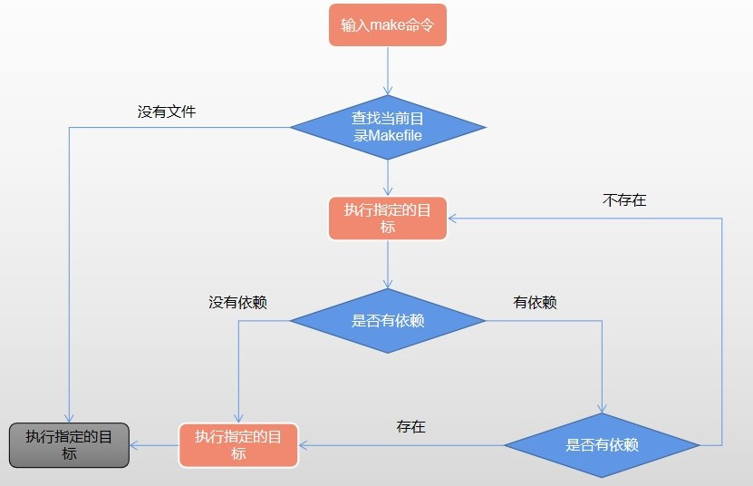

# Makefile Base Tutorial

一个工程中的源文件不计其数，其按类型、功能、模块分别放在若干个目录中，makefile定义了一系列的规则来指定哪些文件需要先编译，哪些文件需要后编译，哪些文件需要重新编译，甚至于进行更复杂的功能操作，因为 makefile就像一个Shell脚本一样，也可以执行操作系统的命令。


# 1.示例代码

add.c

```c
#include "add.h"

int add(int a, int b)
{
    return a + b;
}
```

add.h

```c
#ifndef __ADD_H__
#define __ADD_H__

int add(int a, int b);

#endif /* __ADD_H__ */
```

sub.c

```c
#include "sub.h"

int sub(int a, int b)
{
    return a - b;
}
```

sub.h

```c
#ifndef __SUB_H__
#define __SUB_H__

int sub(int a, int b);

#endif /* __SUB_H__ */
```

main.c

```c
#include <stdio.h>
#include "add.h"
#include "sub.h"

int main()
{
    int a = 1, b = 2;
    
    printf("a + b = %d.\n", add(a, b));
    printf("a - b = %d.\n", sub(a, b));
    
    return 0;
}
```

编译如下：

```bash
$ gcc add.c sub.c main.c -o main
```

运行如下：

```bash
$ ./main
a + b = 3.
a - b = -1.
```


# 2.Makefile基础

简单实例:

```makefile
all:
    @echo "hello world."
    echo "nihao world."
```

加@符和不加@符输出不同，加@只显示结果，不加@会把命令和结果都显示。

输出结果：

```bash
hello world.
echo "nihao world."
nihao world.
```

```bash
目标:依赖

Tab 命令
```

目标:一般是指要编译的目标，也可以是一个动作；
依赖：指执行当前目标所要依赖的先项，包括其它目标，某个具体文件或库等，一个目标可以有多个依赖；
命令：该目标下要执行的具体命令，可以没有，也可以有多条，多条时，每条命令一行；

make常用选项

```bash
make [-f file] [options] [target]

    # make默认在当前目录中寻找GNU Makefile，makefile的文件作为make的输入文件。
    -f 可以指定除上述文件名之外的文件作为输入文件；
    -v 显示版本号；
    -d Debug;
    -n 只输出命令，但并不执行，一般用来测试；
    -s 只执行命令，但不显示具体命令，此处可在命令中用@符抑制命令输出；
    -w 显示执行前、执行后的路径；
    -C dir 指定makefile所在的目录；
```

没有指定目标时，默认使用第一个目标；如果指定，则执行对应的命令。

```makefile
all:test1
    echo "hello world."

test1:
    echo "nihao world."
```

all依赖于test1，所以test1先执行，all后执行。执行结果：

```bash
nihao world.
hello world.
```

根据本节知识点，第1节的编译可改为Makefile如下：

```makefile
all：
    gcc add.c sub.c main.c -o main

clean:
    rm -rf main
```


# 3.GCC编译流程

直接从源码到编译出目标可执行文件

```bash
$ gcc main.c -o main
```

上述过程可细分为如下4个步骤:

1. 预处理，得到main.ii

```bash
$ gcc -E main.c > main.ii
```

2. 编译，得到main.s

```bash
$ gcc -S main.ii
```

3. 汇编，得到main.o

```bash
$ gcc -c main.s
```

4. 链接，得到可执行文件main

```bash
$ gcc main.o -c main
```

根据本节知识点，第2节的Makefile，优化如下：

```makefile
main:add.o sub.o main.o
    gcc add.o sub.o main.o -o main

add.o:add.c
    gcc -c add.c -o add.o

sub.o:sub.c
    gcc -c sub.c -o sub.o

main.o:main.c
    gcc -c main.c -o main.o

clean:
    rm -rf *.o main
```


# 4.变量

**系统变量**

```bash
$* 不包括扩展名的目标文件名称
$+ 所有的依赖文件，以空格分隔
$< 表示规则中的第一个条件
$? 所有时间戳比目标文件晚的依赖文件，以空格分隔
$@ 目标文件的完整名称
$^ 所有不重复的依赖文件，以空格分隔
$% 如果目标是归档成员，则该变量表示目标的归档成员名称
```

**系统常量(make -p可查看常量)**

```bash
AS 汇编程序的名称，默认为as
CC C编译器名称，默认为cc
CPP C预处理器名称，默认为cc -E
CXX C++编译器名称，默认为g++
RM 文件删除程序别名，默认rm -f
...
```

**自定义变量**

```bash
定义：变量名=变量值
使用：$(变量名)/${变量名}
```

根据本节知识点，第3节的Makefile，优化如下：

```makefile
CC=gcc
OBJ=add.o sub.o main.o
TARGET=main

$(TARGET):$(OBJ)
    $(CC) $^ -o $@

add.o:add.c
    $(CC) -c $^ -o $@

sub.o:sub.c
    $(CC) -c $^ -o $@

main.o:main.c
    $(CC) -c $^ -o $@

clean:
    $(RM) *.o $(TARGET)
```


# 5.伪目标和模式匹配

1. 伪目标

```makefile
.PHONY:clean
```

声明目标为伪目标之后，makefile将不会判断目标是否存在或该目录是否需要更新。

2. 模式匹配

// %通配符
%.o:%.cpp ---- .o依赖于对应的.cpp

// 获取当前目录下所有的.cpp文件
wildcard ---- $(wildcard ./*.cpp)

// 将对应的cpp文件名替换成.o文件名
patsubst ---- $(patsubst %.cpp, %.o, ./*.cpp)

根据本节知识点，第4节的Makefile，优化如下：

```makefile
.PHONY:clean

CC=gcc
OBJ=$(patsubst %.c, %.o, $(wildcard ./*.c))
TARGET=main

$(TARGET):$(OBJ)
    $(CC) $^ -o $@

%.o:%.c
    $(CC) -c $^ -o $@

clean:
    $(RM) *.o $(TARGET)
```

通过$(wildcard ./*.c)获取当前目录下的.c文件名，通过patsubst把.c文件名转换为.o文件名，%.o:%.c进行文件"目标:依赖"的通配。


# 6.运行流程




# 7.编译动态链接库

动态链接库：不会把代码编译到二进制文件中，而是在运行时才加载，所以只需要维护一个地址。

- -fPIC ---- 产生位置无关的代码
- -shared ---- 共享
- -l(小写L) ---- 指定动态库
- -I(大写i) ---- 指定头文件目录，默认当前目录
- -L ---- 手动指定库文件搜索目录，默认只链接共享目录

1. 编译动态库

```bash
$ gcc -shared -fPIC DynamicTest.c -o libDynamicTest.so
```

2. 链接动态库

```bash
$ gcc -lDynamicTest -L./ main.c -o main
```

3. 发布动态库

复制动态库到`/usr/lib`或者`/usr/local/lib`。

4. 手动指定动态库位置(Linux)

除了发布动态库之外，我们还可以手动指定动态库的位置，而不需要发布。

```bash
$ LD_LIBRARY_PATH=./
$ export LD_LIBRARY_PATH
```

5. 转换成Makefile

```makefile
CC=gcc
TARGET=main

$(TARGET):libDynamicTest.so
    $(CC) -lDynamicTest -L./ main.c -o $(TARGET)

libDynamicTest.so:
    $(CC) -shared -fPIC DynamicTest.c -o libDynamicTest.so

clean:
    $(RM) *.so $(TARGET)
```


# 8.编译静态链接库

1. 生成静态库

```bash
$ gcc -c StaticTest.cpp -o StaticTest.o
$ ar -r libStaticTest.a StaticTest.o
```

2. 使用静态库

```bash
$ gcc -lStaticTest -L./ main.cpp -o main
```

3. 转换成Makefile

```makefile
CC=gcc
TARGET=main

$(TARGET):libStaticTest

libStaticTest:
    $(CC) -c StaticTest.c -o StaticTest.o
    $(AR) -r libStaticTest.a StaticTest.o

clean:
    $(RM) *.o *.a $(TARGET)
```


# 9.公共头文件

Makefile中，都是先展开所有的变量，再调用指令

- "=" ---- 赋值，但是用终值，就是不管变量调用写在赋值前还是赋值后，调用时都是取终值;
- ":=" ---- 也是赋值，但只受当前行及之前的代码影响，而不受后面的赋值影响.

文件目录结构

```bash
.
├── 001
│   ├── Makefile
│   ├── a.c
│   ├── b.c
│   └── c.c
├── 002
│   ├── Makefile
│   ├── x.c
│   ├── y.c
│   └── z.c
└── Makefile
```

主./Makefile

```makefile
.PHONY:clean

$(TARGET):$(OBJ)
    $(CC) $^ -o $@

clean:
    $(RM) $(TARGET) $(OBJ)
```

001/Makefile

```makefile
TARGET=c
OBJ=a.o b.o c.o

include ../Makefile
```

002/Makefile

```makefile
TARGET=z
OBJ=x.o y.o z.o

include ../Makefile
```

执行001/Makefile，会调用主Makefile，并生成"c"可执行文件；执行002/Makefile，会调用主Makefile，并生成"z"可执行文件。


# 10.调用Shell命令

```makefile
FILE=abc

A:=$(shell ls ../)
B:=$(shell pwd)
C:=$(shell if [ ! -f $(FILE) ]; then touch abc; fi)

all:
    echo $(A)
    echo $(B)

clean:
    $(RM) $(FILE)
```


# 11.嵌套调用

文件目录结构

```bash
.
├── 001
│   ├── Makefile
│   ├── a.c
│   ├── b.c
│   └── c.c
├── 002
│   ├── Makefile
│   ├── x.c
│   ├── y.c
│   └── z.c
└── Makefile
```

主./Makefile

```makefile
.PHONY:001 002 clean

DIR=001 002

all:$(DIR)
    echo "hello world."

$(DIR):
    make -C $@

clean:
    echo $(shell for dir in $(DIR); do make -C $$dir clean; done)
```

001/Makefile

```makefile
.PHONY:clean

TARGET=c
OBJ=a.o b.o c.o

$(TARGET):$(OBJ)
    $(CC) $^ -o $@

clean:
    $(RM) $(TARGET) $(OBJ)
```

002/Makefile

```makefile
.PHONY:clean

TARGET=z
OBJ=x.o y.o z.o

$(TARGET):$(OBJ)
    $(CC) $^ -o $@

clean:
    $(RM) $(TARGET) $(OBJ)
```

运行主Makefile，则会自动执行001/Makefile和002/Makefile。


# 12.条件判断

- ifeq ---- 判断是否相等，相等返回true，不相等返回false；
- ifneq ---- 判断是否相等，不相等返回true，相等返回false；
- ifdef ---- 判断变量是否存在，存在返回true，不存在返回false；
- ifndef ---- 判断变量是否存在，不存在返回true，存在返回false；

```makefile
A:=123

RS1:=
RS2:=

# 判断变量A的值是否等于123
ifeq ($(A), 123)
    RS1:=yes
else
    RS1:=no
endif

# 判断变量A是否存在
ifdef A
    RS2:=yes
else
    RS2:=no
endif

all:
    echo $(RS1)
    echo $(RS2)
```


# 13.循环

```makefile
TARGET=a b c d

all:
    # $(shell for v in $(TARGET); do touch $$v.txt; done)
    touch $(foreach v, $(TARGET), $v.txt)

clean:
    echo $(shell for v in $(TARGET); do $(RM) $$v.txt; done)
```


# 14.自定义函数

1. 自定义函数，不是真正的函数，本质上是多行命令；

2. 自定义函数没有返回值。

```makefile
define FUNC1
    echo "hello world."
    echo $(1) $(2)
endef

all:
    $(call FUNC1, abc, def)
```


# 15.make install的实现

```makefile
TARGET=main
OBJ=main.c

$(TARGET):$(OBJ)
    $(CC) $^ -o $@

install:
    cp $(TARGET) /usr/local/bin

clean:
    $(RM) $(TARGET)
```
