# Android Version

# Tables

| Name          | Internal codename  | Version       | API level | Release date |
| ------------- | ------------------ | ------------- | --------- | ------------ |
| Android 1.0   | —                  | 1.0           | 1         | 2008.09.23   |
| Android 1.1   | Petit Four         | 1.1           | 2         | 2009.02.09   |
| Android 1.5   | Cupcake            | 1.5           | 3         | 2009.04.27   |
| Android 1.6   | Donut              | 1.6           | 4         | 2009.09.15   |
| Android 2.0   | Eclair             | 2.0           | 5         | 2009.10.27   |
| Android 2.0.1 | Eclair             | 2.0.1         | 6         | 2009.12.03   |
| Android 2.1   | Eclair             | 2.1           | 7         | 2010.01.11   |
| Android 2.2   | Froyo              | 2.2 – 2.2.3   | 8         | 2010.05.20   |
| Android 2.3   | Gingerbread        | 2.3 – 2.3.2   | 9         | 2010.12.06   |
| Android 2.3.3 | Gingerbread        | 2.3.3 – 2.3.7 | 10        | 2011.02.09   |
| Android 3.0   | Honeycomb          | 3.0           | 11        | 2011.02.22   |
| Android 3.1   | Honeycomb          | 3.1           | 12        | 2011.05.10   |
| Android 3.2   | Honeycomb          | 3.2 – 3.2.6   | 13        | 2011.07.15   |
| Android 4.0   | Ice Cream Sandwich | 4.0 – 4.0.2   | 14        | 2011.10.18   |
| Android 4.0.3 | Ice Cream Sandwich | 4.0.3 – 4.0.4 | 15        | 2011.12.16   |
| Android 4.1   | Jelly Bean         | 4.1 – 4.1.2   | 16        | 2012.07.09   |
| Android 4.2   | Jelly Bean         | 4.2 – 4.2.2   | 17        | 2012.11.13   |
| Android 4.3   | Jelly Bean         | 4.3 – 4.3.1   | 18        | 2013.07.24   |
| Android 4.4   | KitKat             | 4.4 – 4.4.4   | 19        | 2013.10.31   |
| Android 4.4W  | KitKat             | 4.4W – 4.4W.2 | 20        | 2014.06.25   |
| Android 5.0   | Lollipop           | 5.0 – 5.0.2   | 21        | 2014.11.04   |
| Android 5.1   | Lollipop           | 5.1 – 5.1.1   | 22        | 2015.03.02   |
| Android 6.0   | Marshmallow        | 6.0 – 6.0.1   | 23        | 2015.10.02   |
| Android 7.0   | Nougat             | 7.0           | 24        | 2016.08.22   |
| Android 7.1   | Nougat             | 7.1 – 7.1.2   | 25        | 2016.10.04   |
| Android 8.0   | Oreo               | 8.0           | 26        | 2017.08.21   |
| Android 8.1   | Oreo               | 8.1           | 27        | 2017.12.05   |
| Android 9     | Pie                | 9             | 28        | 2018.08.06   |
| Android 10    | Quince Tart        | 10            | 29        | 2019.09.03   |
| Android 11    | Red Velvet Cake    | 11            | 30        | 2020.09.08   |
| Android 12    | Snow Cone          | 12            | 31        | 2021.10.04   |
| Android 12L   | Snow Cone v2       | 12.1          | 32        | 2022.03.07   |
| Android 13    | Tiramisu           | 13            | 33        | 2022.08.15   |
| Android 14    | Upside Down Cake   | 14            | 34        | 2023.10.04   |
| Android 15    | Vanilla Ice Cream  | 15 DP2        | V DP2     | 2024.03.21   |

# Images

- Android 1.5 (API 3):

--------

- Android 1.6 (API 4):

--------

- Android 2.1 (API 7):

--------

- Android 2.2 (API 8):

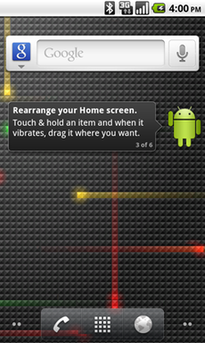

--------

- Android 2.3 (API 9):

--------

- Android 3.0 (API 11):

--------

- Android 4.0 (API 14):

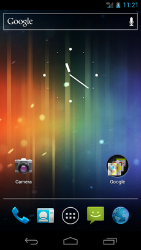

--------

- Android 4.1 (API 16):

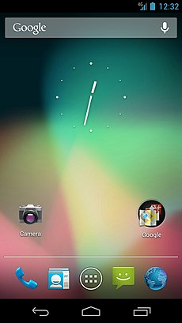

--------

- Android 4.4 (API 19):

--------

- Android 6.0 (API 23):

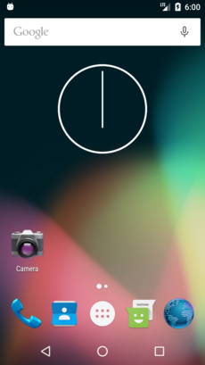

--------

- Android 7.0 (API 24):

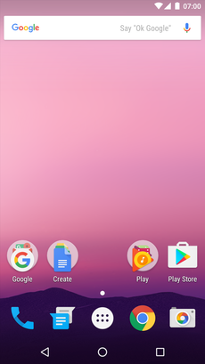

--------

- Android 7.1 (API 25):

--------

- Android 8.0 (API 26):

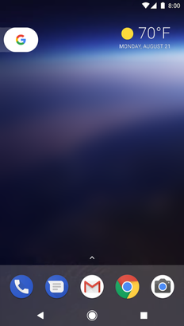

--------

- Android 8.1 (API 27):

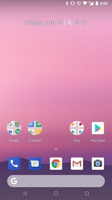

--------

- Android 9 (API 28):

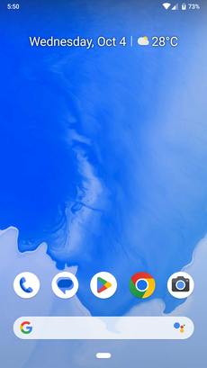

--------

- Android 10 (API 29):

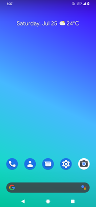

--------

- Android 11 (API 30):

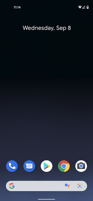

--------

- Android 13 (API 33):

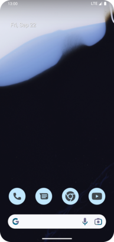
