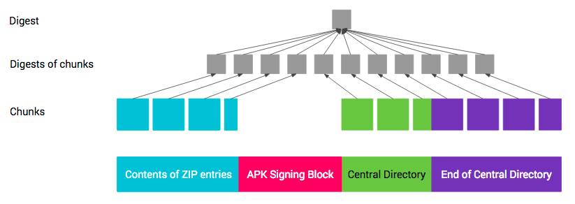

# Android Application Sign

# 1. 应用签名 

通过应用签名，开发者可以标识应用创作者并更新其应用，而无需创建复杂的接口和权限。在 Android 平台上运行的每个应用都必须有开发者的签名。 Google Play 或 Android 设备上的软件包安装程序会拒绝没有获得签名就尝试安装的应用。

在 Google Play 上，应用签名可以将 Google 对开发者的信任和开发者对自己的应用的信任联系在一起。这样一来，开发者就知道自己的应用是以未经修改的形式提供给 Android 设备，并且可以对其应用的行为负责。

在 Android 上，应用签名是将应用放入其应用沙盒的第一步。已签名的应用证书定义了哪个用户 ID 与哪个应用相关联；不同的应用要以不同的用户 ID 运行。应用签名可确保一个应用无法访问任何其他应用的数据，通过明确定义的 IPC 进行访问时除外。

当应用（APK 文件）安装到 Android 设备上时，软件包管理器会验证 APK 是否已经过适当签名（已使用 APK 中包含的证书签名）。如果该证书（或更准确地说，证书中的公钥）与设备上的任何其他 APK 使用的签名密钥一致，那么这个新 APK 就可以选择在清单中指定它将与其他以类似方式签名的 APK 共用一个 UID。

应用可以由第三方（OEM、运营商、其他应用市场）签名，也可以自行签名。Android 提供了使用自签名证书进行代码签名的功能，而开发者无需外部协助或许可即可生成自签名证书。 应用并非必须由核心机构签名。Android 目前不对应用证书进行 CA 认证。

应用还可以在“签名”保护级别声明安全权限，以便只有使用同一个密钥签名的应用可以获得此仅限，同时让这些应用可以各自维持单独的 UID 和应用沙盒。通过共用 UID 功能，可以与共用的应用沙盒建立更紧密的联系，这是因为借助该功能，使用同一个开发者密钥签名的两个或更多应用可以在其清单中声明共用的 UID。


## 1.1 APK 签名方案

Android 支持以下三种应用签名方案：

- v1 方案：基于 JAR 签名。
- v2 方案：APK 签名方案 v2（在 Android 7.0 中引入）。
- v3 方案：APK 签名方案 v3（在 Android 9 中引入）。

为了最大限度地提高兼容性，请按照 v1、v2、v3 的先后顺序采用所有方案对应用进行签名。与只通过 v1 方案签名的应用相比，还通过 v2+ 方案签名的应用能够更快速地安装到 Android 7.0 及更高版本的设备上。更低版本的 Android 平台会忽略 v2+ 签名，这就需要应用包含 v1 签名。

**JAR 签名（v1 方案）**

从一开始，APK 签名就是 Android 的一个有机部分。该方案基于签名的 JAR。如需详细了解如何使用该方案，请参阅介绍如何为您的应用签名的 Android Studio 文档。

v1 签名不保护 APK 的某些部分，例如 ZIP 元数据。APK 验证程序需要处理大量不可信（尚未经过验证）的数据结构，然后会舍弃不受签名保护的数据。这会导致相当大的受攻击面。此外，APK 验证程序必须解压所有已压缩的条目，而这需要花费更多时间和内存。为了解决这些问题，Android 7.0 中引入了 APK 签名方案 v2。

**APK 签名方案 v2 和 v3（v2+ 方案）**

搭载 Android 7.0 及更高版本的设备支持 APK 签名方案 v2（v2 方案）及更高版本的方案（在 Android 9 中，v2 方案已更新为 v3 方案，以便在签名分块中包含其他信息，但在其他方面保持相同的工作方式）。该方案会对 APK 的内容进行哈希处理和签名，然后将生成的“APK 签名分块”插入到 APK 中。如需详细了解如何在应用中使用 v2+ 方案，请参阅 APK 签名方案 v2。

在验证期间，v2+ 方案会将 APK 文件视为 blob，并对整个文件进行签名检查。对 APK 进行的任何修改（包括对 ZIP 元数据进行的修改）都会使 APK 签名作废。这种形式的 APK 验证不仅速度要快得多，而且能够发现更多种未经授权的修改。

新的签名格式向后兼容，因此，使用这种新格式签名的 APK 可在更低版本的 Android 设备上进行安装（会直接忽略添加到 APK 的额外数据），但前提是这些 APK 还带有 v1 签名。


图 1. APK 签名验证过程

验证程序会对照存储在“APK 签名分块”中的 v2+ 签名对 APK 的全文件哈希进行验证。该哈希涵盖除“APK 签名分块”（其中包含 v2+ 签名）之外的所有内容。在“APK 签名分块”以外对 APK 进行的任何修改都会使 APK 的 v2+ 签名作废。v2+ 签名被删除的 APK 也会被拒绝，因为 v1 签名指明相应 APK 带有 v2 签名，所以 Android 7.0 及更高版本会拒绝使用 v1 签名验证 APK。

如需关于 APK 签名验证过程的详细信息，请参阅 APK 签名方案 v2 的“验证”部分。


# 2. APK 签名方案 v2 

APK 签名方案 v2 是一种全文件签名方案，该方案能够发现对 APK 的受保护部分进行的所有更改，从而有助于加快验证速度并增强完整性保证。

使用 APK 签名方案 v2 进行签名时，会在 APK 文件中插入一个 APK 签名分块，该分块位于“ZIP 中央目录”部分之前并紧邻该部分。在“APK 签名分块”内，v2 签名和签名者身份信息会存储在 APK 签名方案 v2 分块中。


图 1. 签名前和签名后的 APK

APK 签名方案 v2 是在 Android 7.0 (Nougat) 中引入的。为了使 APK 可在 Android 6.0 (Marshmallow) 及更低版本的设备上安装，应先使用 JAR 签名功能对 APK 进行签名，然后再使用 v2 方案对其进行签名。


## 2.1 APK 签名分块

为了保持与 v1 APK 格式向后兼容，v2 及更高版本的 APK 签名会存储在“APK 签名分块”内，该分块是为了支持 APK 签名方案 v2 而引入的一个新容器。在 APK 文件中，“APK 签名分块”位于“ZIP 中央目录”（位于文件末尾）之前并紧邻该部分。

该分块包含多个“ID-值”对，所采用的封装方式有助于更轻松地在 APK 中找到该分块。APK 的 v2 签名会存储为一个“ID-值”对，其中 ID 为 0x7109871a。

**格式**

“APK 签名分块”的格式如下（所有数字字段均采用小端字节序）：

- size of block，以字节数（不含此字段）计 (uint64)

- 带 uint64 长度前缀的“ID-值”对序列：

    - ID (uint32)

    - value（可变长度：“ID-值”对的长度 - 4 个字节）

- size of block，以字节数计 - 与第一个字段相同 (uint64)

- magic“APK 签名分块 42”（16 个字节）

在解析 APK 时，首先要通过以下方法找到“ZIP 中央目录”的起始位置：在文件末尾找到“ZIP 中央目录结尾”记录，然后从该记录中读取“中央目录”的起始偏移量。通过 magic 值，可以快速确定“中央目录”前方可能是“APK 签名分块”。然后，通过 size of block 值，可以高效地找到该分块在文件中的起始位置。

在解译该分块时，应忽略 ID 未知的“ID-值”对。


## 2.2 APK 签名方案 v2 分块

APK 由一个或多个签名者/身份签名，每个签名者/身份均由一个签名密钥来表示。该信息会以“APK 签名方案 v2 分块”的形式存储。对于每个签名者，都会存储以下信息：

- （签名算法、摘要、签名）元组。摘要会存储起来，以便将签名验证和 APK 内容完整性检查拆开进行。
- 表示签名者身份的 X.509 证书链。
- 采用键值对形式的其他属性。

对于每位签名者，都会使用收到的列表中支持的签名来验证 APK。签名算法未知的签名会被忽略。如果遇到多个支持的签名，则由每个实现来选择使用哪个签名。这样一来，以后便能够以向后兼容的方式引入安全系数更高的签名方法。建议的方法是验证安全系数最高的签名。

**格式**

“APK 签名方案 v2 分块”存储在“APK 签名分块”内，ID 为 0x7109871a。

“APK 签名方案 v2 分块”的格式如下（所有数字值均采用小端字节序，所有带长度前缀的字段均使用 uint32 值表示长度）：

- 带长度前缀的 signer（带长度前缀）序列：

    - 带长度前缀的 signed data：

        - 带长度前缀的 digests（带长度前缀）序列：

            - signature algorithm ID (uint32)

            - （带长度前缀）digest - 请参阅受完整性保护的内容

        - 带长度前缀的 X.509 certificates 序列：

            - 带长度前缀的 X.509 certificate（ASN.1 DER 格式）

        - 带长度前缀的 additional attributes（带长度前缀）序列：

            - ID (uint32)

            - value（可变长度：附加属性的长度 - 4 个字节）

    - 带长度前缀的 signatures（带长度前缀）序列：

        - signature algorithm ID (uint32)

        - signed data 上带长度前缀的 signature

    - 带长度前缀的 public key（SubjectPublicKeyInfo，ASN.1 DER 形式）

**签名算法 ID**

- 0x0101 - 采用 SHA2-256 摘要、SHA2-256 MGF1、32 个字节的盐且尾部为 0xbc 的 RSASSA-PSS 算法
- 0x0102 - 采用 SHA2-512 摘要、SHA2-512 MGF1、64 个字节的盐且尾部为 0xbc 的 RSASSA-PSS 算法
- 0x0103 - 采用 SHA2-256 摘要的 RSASSA-PKCS1-v1_5 算法。此算法适用于需要确定性签名的构建系统。
- 0x0104 - 采用 SHA2-512 摘要的 RSASSA-PKCS1-v1_5 算法。此算法适用于需要确定性签名的构建系统。
- 0x0201 - 采用 SHA2-256 摘要的 ECDSA 算法
- 0x0202 - 采用 SHA2-512 摘要的 ECDSA 算法
- 0x0301 - 采用 SHA2-256 摘要的 DSA 算法

Android 平台支持上述所有签名算法。签名工具可能只支持其中一部分算法。

支持的密钥大小和 EC 曲线：

- RSA：1024、2048、4096、8192、16384
- EC：NIST P-256、P-384、P-521
- DSA：1024、2048、3072


## 2.3 受完整性保护的内容

为了保护 APK 内容，APK 包含以下 4 个部分：

1. ZIP 条目的内容（从偏移量 0 处开始一直到“APK 签名分块”的起始位置）
2. APK 签名分块
3. ZIP 中央目录
4. ZIP 中央目录结尾


图 2. 签名后的各个 APK 部分

APK 签名方案 v2 负责保护第 1、3、4 部分的完整性，以及第 2 部分包含的“APK 签名方案 v2 分块”中的 signed data 分块的完整性。

第 1、3 和 4 部分的完整性通过其内容的一个或多个摘要实施保护，这些摘要存储在 signed data 分块中，而这些分块则通过一个或多个签名实施保护。

第 1、3 和 4 部分的摘要采用以下计算方式，类似于两级 Merkle 树。每个部分都会被拆分成多个大小为 1MB（220 个字节）的连续块。每个部分的最后一个块可能会短一些。每个块的摘要均通过字节 0xa5 的串联、块的长度（采用小端字节序的 uint32 值，以字节数计）和块的内容进行计算。顶级摘要通过字节 0x5a 的串联、块数（采用小端字节序的 uint32 值）以及块的摘要的串联（按照块在 APK 中显示的顺序）进行计算。摘要以分块方式计算，以便通过并行处理来加快计算速度。



图 3. APK 摘要

由于第 4 部分（ZIP 中央目录结尾）包含“ZIP 中央目录”的偏移量，因此该部分的保护比较复杂。当“APK 签名分块”的大小发生变化（例如，添加了新签名）时，偏移量也会随之改变。因此，在通过“ZIP 中央目录结尾”计算摘要时，必须将包含“ZIP 中央目录”偏移量的字段视为包含“APK 签名分块”的偏移量。


## 2.4 防回滚保护

攻击者可能会试图在支持对带 v2 签名的 APK 进行验证的 Android 平台上，将带 v2 签名的 APK 作为带 v1 签名的 APK 进行验证。为了防范此类攻击，带 v2 签名的 APK 如果还带 v1 签名，其 META-INF/*.SF 文件的主要部分中必须包含 X-Android-APK-Signed 属性。该属性的值是一组以英文逗号分隔的 APK 签名方案 ID（v2 方案的 ID 为 2）。在验证 v1 签名时，对于此组中验证程序首选的 APK 签名方案（例如，v2 方案），如果 APK 没有相应的签名，APK 验证程序必须要拒绝这些 APK。此项保护依赖于内容 META-INF/*.SF 文件受 v1 签名保护这一事实。请参阅 JAR 已签名的 APK 的验证部分。

攻击者可能会试图从“APK 签名方案 v2 分块”中删除安全系数较高的签名。为了防范此类攻击，对 APK 进行签名时使用的签名算法 ID 的列表会存储在通过各个签名保护的 signed data 分块中。


## 2.5 验证

在 Android 7.0 及更高版本中，可以根据 APK 签名方案 v2+ 或 JAR 签名（v1 方案）验证 APK。更低版本的平台会忽略 v2 签名，仅验证 v1 签名。


图 4. APK 签名验证过程（新步骤以红色显示）

APK 签名方案 v2 验证

1. 找到“APK 签名分块”并验证以下内容：

    a. “APK 签名分块”的两个大小字段包含相同的值。

    b. “ZIP 中央目录结尾”紧跟在“ZIP 中央目录”记录后面。

    c. “ZIP 中央目录结尾”之后没有任何数据。

2. 找到“APK 签名分块”中的第一个“APK 签名方案 v2 分块”。如果 v2 分块存在，则继续执行第 3 步。否则，回退至使用 v1 方案验证 APK。

3. 对“APK 签名方案 v2 分块”中的每个 signer 执行以下操作：

    a. 从 signatures 中选择安全系数最高的受支持 signature algorithm ID。安全系数排序取决于各个实现/平台版本。

    b. 使用 public key 并对照 signed data 验证 signatures 中对应的 signature。（现在可以安全地解析 signed data 了。）

    c. 验证 digests 和 signatures 中的签名算法 ID 列表（有序列表）是否相同。（这是为了防止删除/添加签名。）

    d. 使用签名算法所用的同一种摘要算法计算 APK 内容的摘要。

    e. 验证计算出的摘要是否与 digests 中对应的 digest 一致。

    f. 验证 certificates 中第一个 certificate 的 SubjectPublicKeyInfo 是否与 public key 相同。

4. 如果找到了至少一个 signer，并且对于每个找到的 signer，第 3 步都取得了成功，APK 验证将会成功。

注意：如果第 3 步或第 4 步失败了，则不得使用 v1 方案验证 APK。

**JAR 已签名的 APK 的验证（v1 方案）**

JAR 已签名的 APK 是一种标准的已签名 JAR，其中包含的条目必须与 META-INF/MANIFEST.MF 中列出的条目完全相同，并且所有条目都必须已由同一组签名者签名。其完整性按照以下方式进行验证：

1. 每个签名者均由一个包含 META-INF/<signer>.SF 和 META-INF/<signer>.(RSA|DSA|EC) 的 JAR 条目表示。

2. <signer>.(RSA|DSA|EC) 是具有 SignedData 结构的 PKCS #7 CMS ContentInfo，其签名通过 <signer>.SF 进行验证。

3. <signer>.SF 文件包含 META-INF/MANIFEST.MF 的全文件摘要和 META-INF/MANIFEST.MF 各个部分的摘要。需要验证 MANIFEST.MF 的全文件摘要。如果该验证失败，则改为验证 MANIFEST.MF 各个部分的摘要。

4. 对于每个受完整性保护的 JAR 条目，META-INF/MANIFEST.MF 都包含一个具有相应名称的部分，其中包含相应条目未压缩内容的摘要。所有这些摘要都需要验证。

5. 如果 APK 包含未在 MANIFEST.MF 中列出且不属于 JAR 签名一部分的 JAR 条目，APK 验证将会失败。

因此，保护链是每个受完整性保护的 JAR 条目的 <signer>.(RSA|DSA|EC) -> <signer>.SF -> MANIFEST.MF -> 内容。


# 3. APK 签名方案 v3 

Android 9 支持 APK 密钥轮替，这使应用能够在 APK 更新过程中更改其签名密钥。为了实现轮替，APK 必须指示新旧签名密钥之间的信任级别。为了支持密钥轮替，我们将 APK 签名方案从 v2 更新为 v3，以允许使用新旧密钥。v3 在 APK 签名分块中添加了有关受支持的 SDK 版本和 proof-of-rotation 结构体的信息。

注意：在 Android 11 发布之前，建议不要使用 APK 密钥轮替。开发者可以选择针对新安装应用使用 Google Play 的密钥升级。注册了 Play 应用签名的开发者可以通过 Play 管理中心请求升级。


## 3.1 APK 签名分块

为了保持与 v1 APK 格式的向后兼容性，v2 和 v3 APK 签名存储在“APK 签名分块”内，紧邻“ZIP 中央目录”前面。

v3 APK 签名分块的格式与 v2 相同。APK 的 v3 签名会存储为一个“ID-值”对，其中 ID 为 0xf05368c0。


## 3.2 APK 签名方案 v3 分块

v3 方案的设计与 v2 方案非常相似，它们采用相同的常规格式，并支持相同的签名算法 ID、密钥大小和 EC 曲线。

但是，v3 方案增添了有关受支持的 SDK 版本和 proof-of-rotation 结构体的信息。

**格式**

“APK 签名方案 v3 分块”存储在“APK 签名分块”内，ID 为 0xf05368c0。

“APK 签名方案 v3 分块”采用 v2 的格式：

- 带长度前缀的 signer（带长度前缀）序列：

    - 带长度前缀的 signed data：

        - 带长度前缀的 digests（带长度前缀）序列：

            - signature algorithm ID（4 个字节）

            - digest（带长度前缀）

        - 带长度前缀的 X.509 certificates 序列：

            - 带长度前缀的 X.509 certificate（ASN.1 DER 形式）

        - minSDK (uint32) - 如果平台版本低于此数字，应忽略该签名者。

        - maxSDK (uint32) - 如果平台版本高于此数字，应忽略该签名者。

        - 带长度前缀的 additional attributes（带长度前缀）序列：

            - ID (uint32)

            - value（可变长度：附加属性的长度 - 4 个字节）

            - ID - 0x3ba06f8c

            - value - Proof-of-rotation 结构体

    - minSDK (uint32) - 签名数据部分中 minSDK 值的副本 - 用于在当前平台不在相应范围内时跳过对此签名的验证。必须与签名数据值匹配。

    - maxSDK (uint32) - 签名数据部分中 maxSDK 值的副本 - 用于在当前平台不在相应范围内时跳过对此签名的验证。必须与签名数据值匹配。

    - 带长度前缀的 signatures（带长度前缀）序列：

        - signature algorithm ID (uint32)

        - signed data 上带长度前缀的 signature

    - 带长度前缀的 public key（SubjectPublicKeyInfo，ASN.1 DER 形式）


## 3.3 Proof-of-rotation 和 self-trusted-old-certs 结构体

proof-of-rotation 结构体允许应用轮替其签名证书，而不会使这些证书在与这些应用通信的其他应用上被屏蔽。为此，应用签名需包含两个新数据块：

- 告知第三方，应用的签名证书可信（只要其先前证书可信）的断言

- 应用的旧签名证书（应用本身仍信任这些证书）

签名数据部分中的 proof-of-rotation 属性包含一个单链表，其中每个节点都包含用于为之前版本的应用签名的签名证书。此属性旨在包含概念性 proof-of-rotation 和 self-trusted-old-certs 数据结构。该单链表按版本排序，最旧的签名证书对应于根节点。在构建 proof-of-rotation 数据结构时，系统会让每个节点中的证书为列表中的下一个证书签名，从而为每个新密钥提供证据来证明它应该与旧密钥一样可信。

在构造 self-trusted-old-certs 数据结构时，系统会向每个节点添加标记来指示它在组中的成员资格和属性。例如，可能存在一个标记，指示给定节点上的签名证书可信，可获得 Android 签名权限。此标记允许由旧证书签名的其他应用仍被授予由使用新签名证书签名的应用所定义的签名权限。由于整个 proof-of-rotation 属性都位于 v3 signer 字段的签名数据部分中，因此用于为所含 APK 签名的密钥会保护该属性。

此格式排除了多个签名密钥的情况和将不同祖先签名证书收敛到一个证书的情况（多个起始节点指向一个通用接收器）。

**格式**

proof-of-rotation 存储在“APK 签名方案 v3 分块”内，ID 为 0x3ba06f8c。其格式为：

- 带长度前缀的 levels（带长度前缀）序列：

    - 带长度前缀的 signed data（由上一个证书签名 - 如果存在上一个证书）

        - 带长度前缀的 X.509 certificate（ASN.1 DER 形式）

        - signature algorithm ID (uint32) - 上一级证书使用的算法

    - flags (uint32) - 这些标记用于指示此证书是否应该在 self-trusted-old-certs 结构体中，以及针对哪些操作。

    - signature algorithm ID (uint32) - 必须与下一级签名数据部分中的相应 ID 一致。

    - 上述 signed data 上带长度前缀的 signature

**多个证书**

Android 目前将使用多个证书签名的 APK 视为具有与所含证书不同的签名身份。因此，签名数据部分中的 proof-of-rotation 属性构成了一个有向无环图，最好将其视为单链表，其中给定版本的每组签名者都表示一个节点。这为 proof-of-rotation 结构体（下面的多签名者版本）带来了额外的复杂性。排序成为一个特别突出的问题。更重要的是，无法再单独为 APK 签名，因为 proof-of-rotation 结构必须让旧签名证书为新的证书集签名，而不是逐个签名。例如，如果希望由两个新密钥 B 和 C 签名的 APK 是由密钥 A 签名的，则它不能让 B 签名者仅包含 A 或 B 的签名，因为这是与 B 和 C 不同的签名身份。这意味着签名者必须在构建此类结构体之前进行协调。

多个签名者 proof-of-rotation 属性

- 带长度前缀的 sets（带长度前缀）序列：

    - signed data（由上一组证书签名 - 如果存在上一组证书）

        - 带长度前缀的 certificates 序列

            - 带长度前缀的 X.509 certificate（ASN.1 DER 形式）

        - signature algorithm IDs (uint32) 序列 - 上一组证书中的每个证书对应一个序列，且采用相同顺序。

    - flags (uint32) - 这些标记用于指示这组证书是否应该在 self-trusted-old-certs 结构体中，以及针对哪些操作。

    - 带长度前缀的 signatures（带长度前缀）序列：

        - signature algorithm ID (uint32) - 必须与签名数据部分中的相应 ID 一致

        - 上述 signed data 上带长度前缀的 signature

**proof-of-rotation 结构体中有多个祖先**

v3 方案也无法处理两个不同密钥轮替到同一个应用的同一签名密钥的情形。这不同于收购情形，在收购情形中，收购公司希望转移收购的应用以使用其签名密钥来共享权限。收购被视为受支持的用例，因为新应用将通过其软件包名称来区分，并且可以包含自己的 proof-of-rotation 结构体。不受支持的用例是，同一应用有两个不同的路径指向相同的证书，这打破了在密钥轮替设计中做出的许多假设。

**验证**

在 Android 9 及更高版本中，可以根据 APK 签名方案 v3、v2 或 v1 验证 APK。较旧的平台会忽略 v3 签名而尝试验证 v2 签名，然后尝试验证 v1 签名。


图 1. APK 签名验证过程

APK 签名方案 v3 验证

1. 找到“APK 签名分块”并验证以下内容：

    a. “APK 签名分块”的两个大小字段包含相同的值。

    b. “ZIP 中央目录”后面紧跟“ZIP 中央目录结尾”记录。

    c. “ZIP 中央目录结尾”之后没有任何数据。

2. 找到“APK 签名分块”中的第一个“APK 签名方案 v3 分块”。如果 v3 分块存在，则继续执行第 3 步。否则，回退至使用 v2 方案验证 APK。

3. 对“APK 签名方案 v3 分块”中的每个 signer（最低和最高 SDK 版本在当前平台的范围内）执行以下操作：
    a. 从 signatures 中选择安全系数最高的受支持 signature algorithm ID。安全系数排序取决于各个实现/平台版本。
    
    b. 使用 public key 并对照 signed data 验证 signatures 中对应的 signature。（现在可以安全地解析 signed data 了。）
    
    c. 验证签名数据中的最低和最高 SDK 版本是否与为 signer 指定的版本匹配。
    
    d. 验证 digests 和 signatures 中的签名算法 ID 列表（有序列表）是否相同。（这是为了防止删除/添加签名。）
    
    e. 使用签名算法所用的同一种摘要算法计算 APK 内容的摘要。
    
    f. 验证计算出的摘要是否与 digests 中对应的 digest 一致。
    
    g. 验证 certificates 中第一个 certificate 的 SubjectPublicKeyInfo 是否与 public key 相同。
    
    h. 如果 signer 存在 proof-of-rotation 属性，请验证结构体是否有效，以及此 signer 是否为列表中的最后一个证书。

4. 如果在当前平台范围内仅找到了一个 signer，并且对该 signer 成功执行第 3 步，则验证成功。

注意：如果第 3 步或第 4 步失败，则不得使用 v1 或 v2 方案验证 APK。

**验证**

如需测试您的设备能否正确支持 v3，请运行 cts/hostsidetests/appsecurity/src/android/appsecurity/cts/ 中的 PkgInstallSignatureVerificationTest.java CTS 测试。


# 4. APK 签名方案 v3.1 

## 4.1 概览

Android 13 支持 APK 签名方案 v3.1，即现有 APK 签名方案 v3 的改进版本。v3.1 方案解决了 APK 签名方案 v3 在轮替方面的一些已知问题。具体而言，v3.1 签名方案支持 SDK 版本定位功能，这会允许轮替定位到平台的更高版本。

v3.1 签名方案使用在 Android 12 或更低版本中无法识别的分块 ID。因此，平台会应用以下 signer 行为：

- 搭载 Android 13 或更高版本的设备使用 v3.1 分块中的轮替 signer。

- 搭载旧版 Android 的设备会忽略轮替 signer，而使用 v3 分块中的原始 signer。

尚未轮替其签名密钥的应用无需执行任何其他操作。每当这些应用选择轮替时，系统都会默认应用 v3.1 签名方案。


## 4.2 v3.1 签名分块

v3.1 签名分块将与 v3 签名分块具有相同内容，但前者会使用新的分块 ID，这些签名将仅可在搭载 Android 13 及更高版本的设备上可识别。这样，应用就能安全地轮替其签名密钥，而无需担心多目标 APK 会出问题，因为原始 signer 可用于在 v3 签名分块中为 APK 签名，而轮替 signer 可用于在 v3.1 签名分块中签名。这也使得平台可以在验证 v3.1 签名时，针对 v3 签名分块重复使用所有现有验证码。

默认情况下，每当签名配置中提供轮替密钥和谱系时，apksig 库都将使用 v3.1 签名分块。如果应用的 minSdkVersion 低于 Android 13，并且正在使用轮替密钥，还必须指定原始签名密钥，以便将其用于为 v3 签名分块中的 APK 签名。这类似于当前行为：如果 APK 定位到低于 Android 9 的版本，则必须指定原始 signer。

为了支持从特定 SDK 版本开始定位密钥轮替，apksig 库将提供新的 API，从而能够设置轮替的最低 SDK 版本。如果将低于 Android 13 的 SDK 版本指定为轮替支持的最低版本，系统将使用原始 v3 分块。仅当存在最低 SDK 版本设置为 Android 13 及更高版本的轮替时，才能使用 v3.1 签名分块。v3 签名分块将包含一个用于轮替最低 SDK 版本剥离保护的新属性。

| APK 包括谱系 | rotation-min-sdk-version 的值 | v3 签名分块 | v3.1 签名分块 |
| ----------- | ----------------------------- | ---------- | ------------  |
| 否          | 默认值或任意值（以下面的 x 表示）| 使用原始 signer 签名，定位到 Android 9 及更高版本 | 不存在 |
| 是          | 默认值 | 使用原始 signer 签名，定位到 Android 9 到 Android 12L 的任意版本 | 使用轮替 signer 签名，定位到 Android 13 及更高版本 |
| 是          | x < 33 (Android 13)  使用轮替 signer 签名，定位到 Android 9 及更高版本 | 不存在 |
| 是          | x >= 33 (Android 13)  使用原始 signer 签名，定位到 Android 9 到 Android (x-1) 的任意版本 | 使用轮替 signer 签名，定位到 Android x+ |


## 4.3 轮替相关问题

此平台中已解决以下轮替相关问题：

**Android 12 修复程序**

- 只有两个应用中任一应用的当前 signer 在签名谱系中，或者是另一个应用的当前 signer，平台才会向发起请求的应用授予签名权限；如果两个应用都遵循签名密钥最佳实践并轮替到不同的签名密钥，此机制可以防止向发起请求的应用授予签名权限。

- 平台的 APK 回滚功能无法回滚刚刚轮替其签名密钥的 APK，除非签名谱系中的上一个密钥具有回滚功能，但此功能会破坏轮替的目的，因为它允许上一个签名密钥为新软件包更新签名，并且回滚已轮替的密钥。

- 如果某个 APK 仅使用了轮替密钥进行签名，并且之后使用谱系中的原始密钥和轮替密钥对 APK 进行了更新，则谱系中的轮替密钥仅在搭载 Android 11 和更高版本的设备上显示。

**Android 11 修复程序**

- 未正确更新 PackageManager#checkSignatures 以检查两个软件包的原始签名密钥。这会导致使用原始签名密钥的插桩 APK 中断使用轮替签名密钥的应用的插桩。

- sharedUserId 下的软件包具有相同的签名谱系。每当安装或更新 sharedUiserId 中具有已更新签名谱系的应用时，该应用的谱系会替换 sharedUserId 的共享谱系。也就是说，如果应用先前的签名谱系为 A -> B，并且应用的 sharedUserId 中已将谱系更新为 B -> C，则 sharedUserId 谱系将替换为 B -> C。同样，除非更改签名谱系，否则无法更新谱系中上一个 signer 的功能。

推荐：按照最佳实践，建议至少每 2 年轮替一次应用的签名密钥。


## 4.4 v4 集成

v4 签名方案使用提供给 apksigner 的签名配置；如果提供了多个轮替签名配置，系统会使用最新的轮替签名配置。在推出 v3.1 之前，v3 仅包含这一最新轮替签名配置，以便 v4 能够按原样使用此配置；这样一来，v4 签名方案就能支持轮替，因为该版本在 SigningInfo 中使用轮替签名密钥。虽然 v4 SigningInfo 不包含完整的签名谱系，但能够从 v3 签名分块提取此信息，使平台能够访问任何签名查询的谱系。如果使用 v3.1 定位所提供的 rotation-min-sdk-version 的轮替，通用 v3 配置将包括原始签名配置和最新轮替签名配置。v4 签名方案的扩展已得到构建，以纳入 v3.1 分块中的每个签名配置的附加签名信息分块。


## 4.5 验证

如需测试 v3.1 的实现，请在 cts/hostsidetests/appsecurity/src/android/appsecurity/cts/ 中运行 PkgInstallSignatureVerificationTest.java CTS 测试。

如需详细了解测试，请参阅 v3 中的验证部分。


# 5. APK 签名方案 v4 

bookmark_border
Android 11 通过 APK 签名方案 v4 支持与流式传输兼容的签名方案。v4 签名基于根据 APK 的所有字节计算得出的 Merkle 哈希树。它完全遵循 fs-verity 哈希树的结构（例如，对盐进行零填充，以及对最后一个分块进行零填充。）Android 11 将签名存储在单独的 <apk name>.apk.idsig 文件中。v4 签名需要 v2 或 v3 签名作为补充。


## 5.1 文件格式

所有数字字段均采用小端字节序。所有字段占据的字节数均与其 sizeof() 相同，而不会添加隐式填充或对齐。

以下辅助结构体可简化相关定义。

```bash
template <class SizeT>
struct sized_bytes {
        SizeT size;
        byte bytes[size];
};
```

主文件内容：

```bash
struct V4Signature {
        int32 version; // only version 2 is supported as of now
        sized_bytes<int32> hashing_info;
        sized_bytes<int32> signing_info;
        sized_bytes<int32> merkle_tree;  // optional
};
```

关键术语：如果 v4 签名包含 Merkle 树，则称为 complete；如果不包含 Merkle 树，则为 stripped。

hashing_info 是用于哈希树生成及根哈希的参数：

```bash
struct hashing_info.bytes {
    int32 hash_algorithm;    // only 1 == SHA256 supported
    int8 log2_blocksize;     // only 12 (block size 4096) supported now
    sized_bytes<int32> salt; // used exactly as in fs-verity, 32 bytes max
    sized_bytes<int32> raw_root_hash; // salted digest of the first Merkle tree page
};
```

signing_info 为以下结构体：

```bash
struct signing_info.bytes {
    sized_bytes<int32> apk_digest;  // used to match with the corresponding APK
    sized_bytes<int32> x509_certificate; // ASN.1 DER form
    sized_bytes<int32> additional_data; // a free-form binary data blob
    sized_bytes<int32> public_key; // ASN.1 DER, must match the x509_certificate
    int32 signature_algorithm_id; // see the APK v2 doc for the list
    sized_bytes<int32> signature;
};
```

注意：signing_info 会作为二进制文件数据 blob 整体传递到 IncFS 驱动程序中。内核会提供一个 ioctl，以便与 hashing_info 一起检索。

- apk_digest 取自 APK 的 v3 签名分块；如果没有该分块，则取自 v2 分块（请参阅 apk_digest）
若要创建及验证 signature 代码，必须将以下数据序列化为二进制 blob 并将其作为签名数据传递到签名/验证算法中：

```bash
struct V4DataForSigning {
        int32 size;
        int64 file_size; // the size of the file that's been hashed.
        hashing_info.hash_algorithm;
        hashing_info.log2_blocksize;
        hashing_info.salt;
        hashing_info.raw_root_hash;
        signing_info.apk_digest;
        signing_info.x509_certificate;
        signing_info.additional_data;
};
```

merkle_tree 是 APK 的整个 Merkle 树，其计算方式如 fs-verity 文档中所述。

注意：此字段为可选字段，如果处理工具可获取整个 AKP，则签名中可以缺少此字段。然后，此工具需要重新计算该树。


## 5.2 生产方和使用方

如果您使用默认参数运行 v4 签名文件，apksigner Android SDK 工具现在会生成 v4 签名文件。您可以按照与其他签名方案一样的方式停用 v4 签名。它还可以验证 v4 签名是否有效。

运行 adb install --incremental 命令时，adb 会要求 .apk.idsig 文件存在于 .apk 旁边
默认情况下，它还会使用 .idsig 文件尝试进行增量安装；如果此文件缺失或无效，该命令会回退到常规安装。

创建安装会话后，PackageInstaller 中的新流式传输安装 API 会在将文件添加到会话时接受剥离的 v4 签名作为一项单独的参数。此时，signing_info 将作为整个 blob 传递到 IncFS 中。IncFS 从 blob 中提取根哈希。

提交安装会话时，PackageManagerService 会执行 ioctl 以从 IncFS 中检索 signing_info blob，对其进行解析并验证签名。

增量数据加载器组件应通过数据加载器原生 API 流式传输签名的 Merkle 树部分。
package 服务 shell 命令 install-incremental 会将剥离的 v4 签名文件（以 Base64 编码）作为添加的每个文件的一项参数加以接受。相应 Merkle 树必须发送到命令的 stdin 中。


## 5.3 apk_digest

apk_digest 是第一个可用的内容摘要（按顺序排列）：

1. V3、1MB 分块、SHA2-512 (CONTENT_DIGEST_CHUNKED_SHA512)、

2. V3、4KB 分块、SHA2-256 (CONTENT_DIGEST_VERITY_CHUNKED_SHA256)、

3. V3、1MB 分块、SHA2-256 (CONTENT_DIGEST_CHUNKED_SHA256)、

4. V2、SHA2-512、

5. V2、SHA2-256。

请参阅 APK 签名方案 v3 中的带长度前缀的签名的（带长度前缀）序列。


图 1：APK 验证流程 v4


## 5.4 验证和测试

使用功能单元测试和 CTS 验证实现。

- CtsIncrementalInstallHostTestCases

    - /android/cts/hostsidetests/incrementalinstall

**测试签名格式**

若要测试签名格式，请设置开发环境并运行以下手动测试：

```bash
$ atest PackageManagerShellCommandTest

PackageManagerShellCommandIncrementalTest
```

**使用 Android SDK（ADB 和 apksigner）测试签名格式**

若要使用 Android SDK 测试签名格式，请设置开发环境，并确保您已完成 IncFS 的实现。然后，在目标实体设备或模拟器上刷写相应 build。您需要生成或获取现有的 APK，然后创建调试签名密钥。最后，使用 build-tools 文件夹中的 v4 签名格式对 APK 进行签名和安装。

签名

```bash
$ ./apksigner sign --ks debug.keystore game.apk
```

安装

```bash
$ ./adb install game.apk
```

在哪里可以找到这些测试？

```bash
/android/cts/tests/tests/content/src/android/content/pm/cts/PackageManagerShellCommandIncrementalTest.java
```
