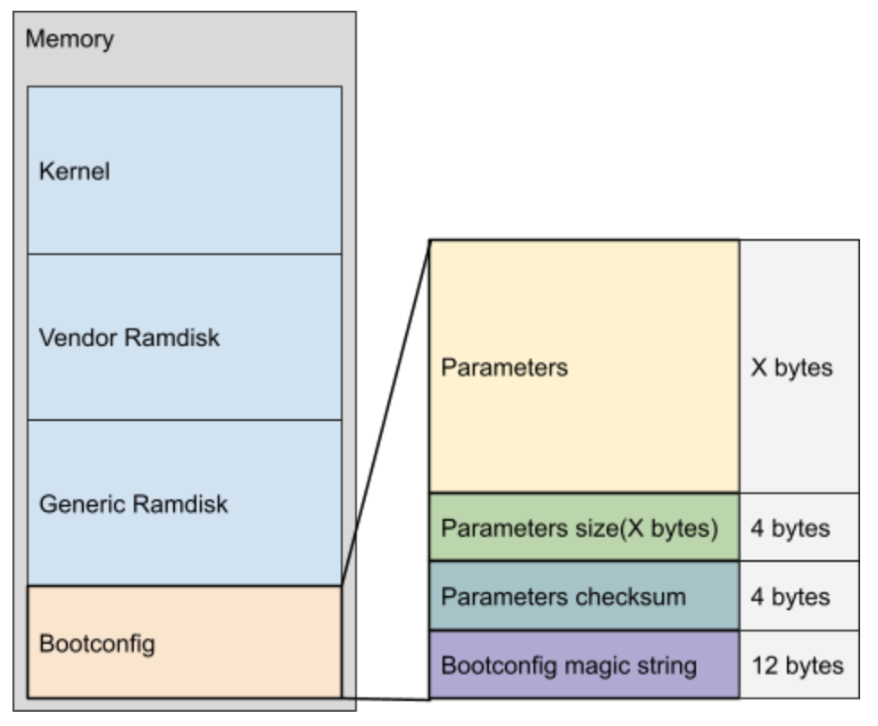
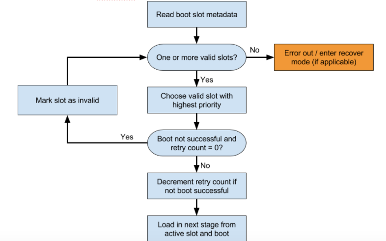

# Android Bootloader

# 1. 引导加载程序概览

引导加载程序是供应商专有的映像，负责在设备上启动内核。引导加载程序会监护设备状态，负责初始化可信执行环境 (TEE) 以及绑定其信任根。引导加载程序还会在将执行工作移到内核之前先验证 boot 和 recovery 分区的完整性。


## 1.1 引导加载程序流程示例

下面是引导加载程序流程的示例：

1. 加载并初始化内存。

2. 根据启动时验证流程验证设备。

3. 根据启动时验证流程验证启动分区，包括 boot、dtbo、init_boot 和 recovery。在执行此步骤的过程中，请检查启动映像头文件版本，并相应地解析该头文件。

4. 如果使用 A/B 更新，则确定要启动的当前槽位。

5. 确定是否应启动恢复模式。如需了解详情，请参阅支持 OTA 更新。

6. 加载启动映像，例如 boot.img、vendor_boot.img、init_boot.img 及其他专有供应商启动映像。这些启动映像包含内核和 ramdisk 映像。

    a. 将内核作为可自行执行的压缩二进制文件加载到内存中。内核将自身解压缩并开始执行到内存中。

    b. 将 ramdisk 和 bootconfig 部分加载到内存中以创建 initramfs。


## 1.2 与引导加载程序相关的其他功能

下面列出了您可以实现的其他与引导加载程序相关的功能：

- 设备树叠加层 (DTO)。 借助设备树叠加层，引导加载程序可以支持不同的硬件配置。DTO 会被编译到引导加载程序所使用的设备树 blob (DTB) 中。

- 内核映像虚拟地址随机化。引导加载程序支持对加载内核映像的虚拟地址进行随机化。如需对地址进行随机化，请在内核配置中将 RANDOMIZE_BASE 设置为 true。 引导加载程序必须通过在 /chosen/kaslr-seed 设备树节点中传递一个随机的 u64 值来提供熵。

- 启动时验证。借助启动时验证，引导加载程序可以确保所有已执行代码均来自可信来源。

- 启动配置。 启动配置在 Android 12 及更高版本中可用，是一种将配置详细信息从 build 和引导加载程序传递至操作系统的机制。 在 Android 12 之前，系统使用带有 androidboot 前缀的内核命令行参数。

- 无线下载 (OTA) 更新。正常使用的 Android 设备可以接收和安装系统、应用软件和时区规则的 OTA 更新。此功能会对引导加载程序实现产生影响。如需了解有关 OTA 的一般信息，请参阅 OTA 更新。如需详细了解引导加载程序的相关 OTA 实现，请参阅支持 OTA 更新。

- 版本绑定。 版本绑定将安全密钥绑定至操作系统和补丁级别版本。版本绑定可确保在旧版系统或 TEE 软件中发现漏洞的攻击者无法将设备回滚到易受攻击的版本，也无法使用在较新版本中创建的密钥。引导加载程序必须提供某些信息才能支持版本绑定。如需了解详情，请参阅 AVB 属性中的版本信息。


## 1.3 内核命令行

从以下位置串联内核命令行：

- 引导加载程序命令行：由引导加载程序确定的一组静态和动态参数

- 设备树：从 chosen/bootargs 节点

- defconfig：从 CONFIG_CMDLINE

- boot.img：从命令行（如需了解偏移量和大小，请参阅 system/core/mkbootimg/bootimg.h）

从 Android 12 开始，对于需要传递给 Android 用户空间的 androidboot.* 参数，我们可以使用 bootconfig 而非内核命令行。


# 2. 规范化启动原因

Android 9 对引导加载程序的启动原因规范进行了以下更改。


## 2.1 启动原因

引导加载程序使用专用的硬件和内存资源来确定设备重新启动的原因，然后将 androidboot.bootreason=<reason> 添加到用于启动设备的 Android 内核命令行中，以传达这一判定。然后，init 会转换此命令行，使其传播到 Android 属性 bootloader_boot_reason_prop (ro.boot.bootreason) 中。对于发布时搭载 Android 12 或更高版本（内核版本为 5.10 或更高版本）的设备中，androidboot.bootreason=<reason> 添加到了 bootconfig，而非内核命令行中。


## 2.2 启动原因规范

之前的 Android 版本中指定的启动原因格式如下：不使用空格，全部为小写字母，只有非常少的要求（例如报告 kernel_panic、watchdog、cold/warm/hard），并且允许其他特殊原因。这种宽松的规范导致出现了成百上千种自定义启动原因字符串（有时毫无意义），进而造成了难以管理的情况。到目前最新的 Android 版本发布之前，引导加载程序提交的近乎无法解析或毫无意义的内容急剧增加已经为 bootloader_boot_reason_prop 造成了合规性问题。

在开发 Android 9 版本中，Android 团队发现旧的 bootloader_boot_reason_prop 中内容会急剧增加，并且无法在系统运行时重写。因此，如需对启动原因规范进行任何改进，都必须与引导加载程序开发者进行互动交流，并对现有系统进行调整。为此，Android 团队采取了以下措施：

- 与引导加载程序开发者互动交流，鼓励他们：

    - 向 bootloader_boot_reason_prop 提供规范、可解析且可识别的原因。

    - 向 system/core/bootstat/bootstat.cpp kBootReasonMap 列表添加内容。

- 添加受控且可在系统运行时重写的 system_boot_reason_prop (sys.boot.reason) 源代码。只有少量的系统应用（如 bootstat 和 init）可重写此属性，不过，所有应用都可以通过获得 sepolicy 权限来读取它。

- 将启动原因告知用户，让他们等到 userdata 分区装载完毕后再信任系统启动原因属性 system_boot_reason_prop 中的内容。

为什么要等这么久？虽然 bootloader_boot_reason_prop 在启动过程的早期阶段就已可用，但 Android 安全政策根据需要对其进行了屏蔽，因为它表示不准确、不可解析且不合规范的信息。大多数情况下，只有对启动系统有深入了解的开发者才需要访问这些信息。只有在 userdata 分区装载完毕之后，才可以通过 system_boot_reason_prop 准确可靠地提取经过优化、可解析且合乎规范的启动原因 API。具体而言：

- 在 userdata 分区装载完毕之前，system_boot_reason_prop 将包含 bootloader_boot_reason_prop 中的值。

- 在 userdata 分区装载完毕之后，可以更新 system_boot_reason_prop，以使其符合要求或报告更准确的信息。

出于上述原因，Android 9 延长了可以正式获取启动原因之前需要等待的时间段，将其从启动时立即准确无误的状态（使用 bootloader_boot_reason_prop）更改为仅在 userdata 分区装载完毕之后才可用（使用 system_boot_reason_prop）。

Bootstat 逻辑依赖于信息更丰富且合规的 bootloader_boot_reason_prop。当该属性使用可预测的格式时，能够提高所有受控重新启动和关机情况的准确性，从而优化和扩展 system_boot_reason_prop 的准确性和含义。


## 2.3 规范化启动原因格式

在 Android 9 中，bootloader_boot_reason_prop 的规范化启动原因格式使用以下语法：

```bash
<reason>,<subreason>,<detail>…
```

格式设置规则如下：

- 小写

- 无空格（可使用下划线）

- 全部为可打印字符

- 以英文逗号分隔的 reason、subreason，以及一个或多个 detail。

    - 必需的 reason，表示设备为什么必须重新启动或关机且优先级最高的原因。

    - 选用的 subreason，表示设备为什么必须重新启动或关机的简短摘要（或重新启动设备/将设备关机的人员）。

    - 一个或多个选用的 detail 值。detail 可以指向某个子系统，以协助确定是哪个具体系统导致了 subreason。您可以指定多个 detail 值，这些值通常应按照重要程度排序。不过，也可以报告多个具有同等重要性的 detail 值。

如果 bootloader_boot_reason_prop 为空值，则会被视为非法（因为这会允许其他代理在事后添加启动原因）。

**原因要求**

为 reason（第一个跨度，位于终止符或英文逗号之前）指定的值必须是以下集合（分为内核原因、强原因和弱原因）之一：

- 内核集：

    - "watchdog"

    - "kernel_panic"

- 强集：

    - "recovery"

    - "bootloader"

- 弱集：

    - "cold"：通常表示完全重置所有设备，包括内存。

    - "hard"：通常表示硬件重置了状态，并且 ramoops 应保留持久性内容。

    - "warm"：通常表示内存和设备保持某种状态，并且 ramoops（请参阅内核中的 pstore 驱动程序）后备存储空间包含持久性内容。

    - "shutdown"

    - "reboot"：通常意味着 ramoops 状态和硬件状态未知。该值是与 cold、hard 和 warm 一样的通用值，可提供关于设备重置深度的提示。

引导加载程序必须提供内核集或弱集 reason，强烈建议引导加载程序提供 subreason（如果可以确定的话）。例如，电源键长按（无论是否有 ramoops 备份）的启动原因为 "reboot,longkey"。

第一个跨度 reason 不能是任何 subreason 或 detail 的组成部分。不过，由于用户空间无法产生内核集原因，因此可能会在弱集原因之后重复使用 "watchdog" 以及源代码的详细信息（例如 "reboot,watchdog,service_manager_unresponsive" 或 "reboot,software,watchdog"）。

启动原因应该无需专家级内部知识即可解读，并且（或者）应该能让人看懂并提供直观报告。示例："shutdown,vbxd"（糟糕）、"shutdown,uv"（较好）、"shutdown,undervoltage"（首选）。

**“原因-子原因”组合**

Android 保留了一组 reason-subreason 组合，在正常使用情况下不应过量使用这些组合；不过，如果组合能准确反映相关状况，则可根据具体情况加以使用。保留组合的示例包括：

- "reboot,userrequested"

- "shutdown,userrequested"

- "shutdown,thermal"（来自 thermald）

- "shutdown,battery"

- "shutdown,battery,thermal"（来自 BatteryStatsService）

- "reboot,adb"

- "reboot,shell"

- "reboot,bootloader"

- "reboot,recovery"

如需了解详情，请参阅 system/core/bootstat/bootstat.cpp 中的 kBootReasonMap 以及 Android 源代码库中的关联 git 变更日志记录。


## 2.4 报告启动原因

所有启动原因（无论是来自引导加载程序还是记录在规范化启动原因中）都必须记录在 system/core/bootstat/bootstat.cpp 的 kBootReasonMap 部分中。kBootReasonMap 列表包含各种合规原因和不合规的旧版原因。引导加载程序开发者应在此处仅登记新的合规原因（除非产品已发货且无法更改，否则不应登记不合规的原因）。

注意：虽然 system/core/bootstat/bootstat.cpp 包含一个 kBootReasonMap 部分，其中列出了大量旧版原因，但这些原因的存在并不意味着 reason 字符串已获准使用。该列表的一个子集内列出了合规原因；随着引导加载程序开发者不断登记更多合规原因并加以说明，这个子集预计将不断增大。

强烈建议使用 system/core/bootstat/bootstat.cpp 中的现有合规条目，如要使用不合规字符串，应先对其加以限制。请参阅以下指导原则：

- 允许从引导加载程序中报告 "kernel_panic"，因为 bootstat 或许能检查 kernel_panic signatures 的 ramoops，以便将子原因优化为规范的 system_boot_reason_prop。

- 不允许从引导加载程序中以 kBootReasonMap（如 "panic")）的形式报告不合规的字符串，因为这最终将导致无法优化 reason。

例如，如果 kBootReasonMap 包含 "wdog_bark"，则引导加载程序开发者应采取以下措施：

- 更改为 "watchdog,bark"，并将其添加到 kBootReasonMap 中的列表内。

- 考虑 "bark" 对于不熟悉该技术的人来说意味着什么，并确定是否存在更有意义的 subreason。


## 2.5 验证启动原因合规性

目前，对于引导加载程序可能提供的所有启动原因，Android 没有提供能够准确触发或检查这些原因的主动 CTS 测试；合作伙伴仍然可以尝试运行被动测试来确定兼容性。

因此，要实现引导加载程序合规性，引导加载程序开发者需要自愿遵循上述规则和准则的精神。我们会敦促此类开发者为 AOSP（特别是 system/core/bootstat/bootstat.cpp）做贡献，并将这个机会作为一个讨论启动原因问题的论坛。


# 3. 启动映像标头

Android 9 在启动映像头文件中引入了一个版本字段，更新头文件的同时还可保持向后兼容性。引导加载程序必须检查该头文件版本字段并对头文件进行解析。如果设备：

- 发布时搭载 Android 13，则可以使用启动头文件版本 3 或 4。对于支持通用内核映像 (GKI) 架构的设备，版本 4 是主要启动映像，并且启动头文件中的 os_version 字段必须为零。设备引导加载程序应从 Android 启动时验证 (AVB) 属性中获取版本信息。

- 发布时搭载 Android 12，则可以使用启动头文件版本 3 或 4。对于支持通用内核映像 (GKI) 架构的设备，版本 4 是主要启动映像。

- 发布时搭载 Android 11，则可以使用启动头文件版本 3。对于支持通用内核映像 (GKI) 架构的设备，必须将此版本用于主要启动映像。

- 搭载的是 Android 10，则必须使用启动头文件版本 2。

- 搭载的是 Android 9，则必须使用启动头文件版本 1。

- 搭载的是 Android 8 及更低版本，则将其视为使用启动映像头文件版本 0。

对于所有搭载 Android 9 或更高版本的设备，供应商测试套件 (VTS) 会检查 boot/recovery 映像的格式，以确保启动映像头文件使用的版本正确无误。如需查看有关当前支持的所有启动映像头文件和供应商启动映像头文件的 AOSP 详细信息，请参阅 system/tools/mkbootimg/include/bootimg/bootimg.h。


## 3.1 实现启动映像头文件版本编号

mkbootimg 工具接受以下参数。

| 参数 | 说明 |
| ---- | ---- |
| header_version | 设置启动映像头文件版本。如果头文件版本为：1 或 2，启动映像支持 DTBO 恢复映像或 ACPIO 恢复映像。 3，启动映像不支持恢复映像。 |
| recovery_dtbo | 适用于使用 DTB 的架构。指定 DTBO 恢复映像的路径。对于无需恢复映像的 A/B 设备，此参数为可选参数。如果非 A/B 设备使用的 header_version 为：1 或 2，则设备可以指定此路径，也可以使用 recovery_acpio 部分指定 ACPIO 恢复映像的路径。3，则设备无法指定 DTBO 恢复映像。 |
| recovery_acpio | 适用于使用 ACPI（而非 DTB）的架构。指定 ACPIO 恢复映像的路径。对于不需要恢复映像的 A/B 设备，此参数为可选参数。如果非 A/B 设备使用的 header_version 为：1 或 2，则设备可以指定此路径，也可以使用 recovery_dtbo 部分指定 DTBO 恢复映像的路径。3，则设备无法指定 ACPIO 恢复映像。 |
| dtb | 启动/恢复映像中 DTB 映像的路径。 |
| dtb_offset | 在添加到 base 参数时，系统会提供最终设备树的实际加载地址。例如，如果 base 参数为 0x10000000 且 dtb_offset 参数为 0x01000000，启动映像头文件中的 dtb_addr_field 将填充为 0x11000000。 |

设备 BoardConfig.mk 使用 BOARD_MKBOOTIMG_ARGS 配置将 header version 添加到 mkbootimg 特定于主板的其他参数。例如：

```bash
BOARD_MKBOOTIMG_ARGS := --ramdisk_offset $(BOARD_RAMDISK_OFFSET) --tags_offset $(BOARD_KERNEL_TAGS_OFFSET) --header_version $(BOARD_BOOTIMG_HEADER_VERSION)
```

Android 构建系统使用 BoardConfig 变量 BOARD_PREBUILT_DTBOIMAGE 在创建恢复映像期间设置 mkbootimg 工具的 recovery_dtbo 参数。如需详细了解 Android 开源项目 (AOSP) 的变化，请查看与启动映像头文件版本编号相关的更改列表。


## 3.2 启动映像头文件版本 4

Android 12 在启动映像头文件版本 4 中提供了一个 boot_signature，可用于检查内核和 ramdisk 的完整性。该检查在 VtsSecurityAvbTest 中完成，对于使用 GKI 架构的设备来说是必须执行的。不过，特定于设备的启动时验证流程中不涉及 boot_signature，它仅用于 VTS 中。如需了解详情，请参阅 GKI boot.img 开发板配置和 GKI 启动时验证设置。

供应商启动映像头文件版本 4 支持多个供应商 ramdisk fragment。

启动映像头文件版本 4 采用以下格式。

```bash
struct boot_img_hdr
{
#define BOOT_MAGIC_SIZE 8
    uint8_t magic[BOOT_MAGIC_SIZE];

    uint32_t kernel_size;    /* size in bytes */
    uint32_t ramdisk_size;   /* size in bytes */

    uint32_t os_version;

    uint32_t header_size;    /* size of boot image header in bytes */
    uint32_t reserved[4];
    uint32_t header_version; /* offset remains constant for version check */

#define BOOT_ARGS_SIZE 512
#define BOOT_EXTRA_ARGS_SIZE 1024
    uint8_t cmdline[BOOT_ARGS_SIZE + BOOT_EXTRA_ARGS_SIZE];

    uint32_t signature_size; /* size in bytes */
};
```


## 3.3 启动映像头文件版本 3

Android 11 将启动映像头文件更新为版本 3，该版本移除了以下数据：

- 第二阶段引导加载程序。启动映像头文件中不再显示 second_size 和 second_addr 字段。具有第二阶段引导加载程序的设备必须将相应引导加载程序存储在自己的分区中。

- 恢复映像。指定恢复映像时需满足的要求已被废弃，且启动映像头文件中不再显示 recovery_dtbo_size、recovery_dtbo_offset、recovery_acpio_size 和 recovery_acpio_offset 字段。

    - A/B 设备使用了更新和恢复方案，因此无需指定 DTBO 或 ACPIO 恢复映像。

    - 如果非 A/B 设备需要指定恢复映像（DTBO 或 ACPIO），则应使用启动映像头文件版本 1 或 2。

- 设备树 blob (DTB)。DTB 存储在供应商启动分区中，因此启动映像头文件中不再显示 dtb_size 和 dtb_addr 字段（但供应商启动映像头文件中会显示）。

设备可以通过启动映像头文件版本 3 来满足通用内核映像 (GKI) 架构的要求，该架构统一了核心内核，并将启动所需的供应商模块移至 vendor_boot 分区（这意味着启动映像仅包含 GKI 组件）。如果设备：

- 使用 GKI（需要 android-4.19 或 android-5.4 内核）但不使用 A/B 更新机制，则可以使用启动映像版本 3（适用于启动映像）和启动映像版本 2（适用于恢复映像）指定恢复映像。

- 既不使用 GKI 也不使用 A/B 更新机制，则可以使用启动映像版本 1 指定恢复映像或将启动映像版本 2 同时用于启动映像和恢复映像。

启动映像头文件版本 3 采用以下格式。

```bash
struct boot_img_hdr
{
#define BOOT_MAGIC_SIZE 8
    uint8_t magic[BOOT_MAGIC_SIZE];

    uint32_t kernel_size;    /* size in bytes */
    uint32_t ramdisk_size;   /* size in bytes */

    uint32_t os_version;

    uint32_t header_size;    /* size of boot image header in bytes */
    uint32_t reserved[4];
    uint32_t header_version; /* offset remains constant for version check */

#define BOOT_ARGS_SIZE 512
#define BOOT_EXTRA_ARGS_SIZE 1024
    uint8_t cmdline[BOOT_ARGS_SIZE + BOOT_EXTRA_ARGS_SIZE];
};
```


## 3.4 启动映像头文件版本 2

Android 10 已将启动映像头文件更新为版本 2，且添加了 DTB 恢复映像的信息部分（映像大小和实际加载地址）。

启动映像头文件版本 2 采用以下格式。

```bash
struct boot_img_hdr
{
    uint8_t magic[BOOT_MAGIC_SIZE];
    uint32_t kernel_size;               /* size in bytes */
    uint32_t kernel_addr;               /* physical load addr */

    uint32_t ramdisk_size;              /* size in bytes */
    uint32_t ramdisk_addr;              /* physical load addr */

    uint32_t second_size;               /* size in bytes */
    uint32_t second_addr;               /* physical load addr */

    uint32_t tags_addr;                 /* physical addr for kernel tags */
    uint32_t page_size;                 /* flash page size we assume */
    uint32_t header_version;
    uint32_t os_version;
    uint8_t name[BOOT_NAME_SIZE];       /* asciiz product name */
    uint8_t cmdline[BOOT_ARGS_SIZE];
    uint32_t id[8];                     /* timestamp / checksum / sha1 / etc */
    uint8_t extra_cmdline[BOOT_EXTRA_ARGS_SIZE];
    uint32_t recovery_[dtbo|acpio]_size;    /* size of recovery image */
    uint64_t recovery_[dtbo|acpio]_offset;  /* offset in boot image */
    uint32_t header_size;               /* size of boot image header in bytes */
    uint32_t dtb_size;                  /* size of dtb image */
    uint64_t dtb_addr;                  /* physical load address */
};
```


## 3.5 启动映像头文件版本 1

Android 9 会将启动映像头文件的 unused 字段转换为头文件版本字段。搭载 Android 9 的设备必须使用头文件版本为 1 或更高（由 VTS 进行验证）的启动映像头文件。

启动映像头文件版本 1 采用以下格式。

```bash
struct boot_img_hdr
{
    uint8_t magic[BOOT_MAGIC_SIZE];
    uint32_t kernel_size;               /* size in bytes */
    uint32_t kernel_addr;               /* physical load addr */
    uint32_t ramdisk_size;              /* size in bytes */
    uint32_t ramdisk_addr;              /* physical load addr */

    uint32_t second_size;               /* size in bytes */
    uint32_t second_addr;               /* physical load addr */

    uint32_t tags_addr;                 /* physical addr for kernel tags */
    uint32_t page_size;                 /* flash page size we assume */
    uint32_t header_version;
    uint32_t os_version;
    uint8_t name[BOOT_NAME_SIZE];       /* asciiz product name */
    uint8_t cmdline[BOOT_ARGS_SIZE];
    uint32_t id[8];                     /* timestamp / checksum / sha1 / etc */
    uint8_t extra_cmdline[BOOT_EXTRA_ARGS_SIZE];
    uint32_t recovery_[dtbo|acpio]_size;    /* size of recovery image */
    uint64_t recovery_[dtbo|acpio]_offset;  /* offset in boot image */
    uint32_t header_size;               /* size of boot image header in bytes */
};
```

非 A/B 设备可以指定 DTB/ACPI 叠加层恢复映像，以减少无线下载 (OTA) 更新失败的次数。（A/B 设备不会出现这种问题，且无需指定叠加层映像。）您可以指定 DTBO 映像或 ACPIO 映像，但不能同时指定二者（因为它们所适用的架构有所不同）。要正确配置启动映像头文件：

- 使用 DTBO 恢复映像时，请添加 recovery_dtbo_size 和 recovery_dtbo_offset 字段（不要添加 recovery_acpio_size 和 recovery_acpio_offset 字段）。

- 使用 ACPIO 恢复映像时，请添加 recovery_acpio_size 和 recovery_acpio_offset 字段（不要添加 recovery_dtbo_size 和 recovery_dtbo_offset 字段）。

header_size 字段包含启动映像头文件大小。如果启动映像头文件版本为 1，那么除了 kernel、ramdisk 和 second sections 之外，id 字段还包含启动映像 recovery_[dtbo|acpio] 部分的 SHA-1 摘要。如需详细了解 recovery_[dtbo|acpio]_size 和 recovery_[dtbo|acpio]_offset 字段，请参阅恢复映像。


## 3.6 旧版启动映像头文件版本 0

如果设备搭载 Android 9 之前的版本且使用旧版启动映像头文件，则将其视为使用启动映像头文件版本 0。

```bash
struct boot_img_hdr
{
    uint8_t magic[BOOT_MAGIC_SIZE];
    uint32_t kernel_size;                /* size in bytes */
    uint32_t kernel_addr;                /* physical load addr */

    uint32_t ramdisk_size;               /* size in bytes */
    uint32_t ramdisk_addr;               /* physical load addr */

    uint32_t second_size;                /* size in bytes */
    uint32_t second_addr;                /* physical load addr */

    uint32_t tags_addr;                  /* physical addr for kernel tags */
    uint32_t page_size;                  /* flash page size we assume */
    uint32_t unused;
    uint32_t os_version;
    uint8_t name[BOOT_NAME_SIZE];        /* asciiz product name */
    uint8_t cmdline[BOOT_ARGS_SIZE];
    uint32_t id[8];                      /* timestamp / checksum / sha1 / etc */
    uint8_t extra_cmdline[BOOT_EXTRA_ARGS_SIZE];
};
```


# 4. 在 Android 12 中实现 bootconfig

在 Android 12 中，bootconfig 功能取代了 Android 11 及更低版本使用的 androidboot.* 内核 cmdline 选项。bootconfig 功能是一种将配置详细信息从 build 和引导加载程序传递给 Android 12 的机制。

此功能可用于将 Android 用户空间的配置参数与内核的配置参数分离开。将冗长的 androidboot.* 内核参数移至 bootconfig 文件中会在内核 cmdline 中腾出空间，并使其便于日后扩展之用。

内核和 Android 用户空间都必须支持 bootconfig。

- 首个提供此支持的版本：Android 12

- 首个提供此支持的内核版本：12-5.4.xx 内核

请为搭载 12-5.10.xx 内核版本的新设备实现 bootconfig 功能。如果是升级设备，就不需要实现此功能。


## 4.1 示例和源代码

在查看本部分的示例和源代码时，请注意 bootconfig 代码的格式与 Android 11 及更低版本中使用的内核 cmdline 格式只有细微不同。不过，以下差异对您使用这些代码非常重要：

- 必须以换行符转义序列 \n 分隔参数，而非以空格分隔。

**引导加载程序示例**

如需查看引导加载程序示例，请参阅 Cuttlefish U-boot 参考引导加载程序实现。下面列出了该参考实现中的两项提交内容。第一项将启动头文件版本支持升级到最新版本。在该示例中，第一项提交内容将版本支持更新（或升级）到下一个版本 (v4)。第二项提交内容执行了两项操作；它添加了 bootconfig 处理，并展示了如何在运行时添加参数：

- 将启动头文件版本支持升级到最新的 v4 版本。

- 添加了 bootconfig 处理。

**build 示例**

如需查看 build 示例，了解为使用供应商启动头文件 v4 构建 vendor_boot.img 而进行的 mkbootimg 变更，请参阅 mkbootimg changes for bootconfig。请参阅 Cuttlefish 变更，以执行以下操作：

- 使用（或升级到）供应商启动头文件版本 v4。

- 添加 bootconfig to the kernel cmdline and move selected parameters to bootconfig。


## 4.2 实现

合作伙伴必须为其引导加载程序增添支持，并将其构建时 androidboot.* 参数从内核 cmdline 移至 bootconfig 文件中。实现此变更的最佳方式是逐步实现；如需了解如何遵循逐步实现过程，请参阅逐步实现和验证部分。

如果您所做的变更需要在 /proc/cmdline 文件中搜索 androidboot.* 参数，请改为让其搜索 /proc/bootconfig 文件。ro.boot.* 属性是使用新的 bootconfig 值设置的，因此无需更改使用这些属性的代码。

**build 变更**

首先，将您的启动头文件版本升级到版本 4：

`- BOARD_BOOT_HEADER_VERSION := 3`

`+ BOARD_BOOT_HEADER_VERSION := 4`

添加 bootconfig 内核 cmdline 参数。这样，内核就会查找 bootconfig 部分：

`BOARD_KERNEL_CMDLINE += bootconfig`

bootconfig 参数是通过 BOARD_BOOTCONFIG 变量中的参数创建的，就像内核 cmdline 是通过 BOARD\_KERNEL\_CMDLINE 创建的一样。

任何 androidboot.* 参数都可以原样移动，类似于以下内容：

`- BOARD_KERNEL_CMDLINE += androidboot..selinux=enforcing`

`+ BOARD_BOOTCONFIG += androidboot..selinux=enforcing`

**引导加载程序的变更**

引导加载程序会先设置 initramfs，然后再跳转到内核。内核启动配置会搜索 bootconfig 部分，并预计此部分位于 initramfs, 末尾且包含预期的尾部。

引导加载程序会从供应商启动映像头文件中获取 vendor_boot.img 布局信息。



图 1. Android 12 bootconfig 内存分配

引导加载程序会在内存中创建 bootconfig 部分。bootconfig 部分包含以下各项的内存分配：

- 参数

- 4 个字节大小的 parameters size

- 4 个字节大小的 parameters checksum

- 12 个字节的 bootconfig 神奇字符串 (#BOOTCONFIG\n)

这些参数有两个来源：构建时已知的参数和构建时未知的参数。您必须添加未知参数。

构建时已知的参数会打包到 vendor_boot 映像中的 bootconfig 部分末尾。这部分的大小以字节形式存储在供应商启动头文件的 vendor_bootconfig_size 字段中。

构建时未知的参数只能在运行时从引导加载程序中得知。在应用 bootconfig 尾部之前，必须先将这些参数添加到 bootconfig 参数部分的末尾。

如果需要在应用 bootconfig 尾部之后添加任何参数，请覆盖尾部然后重新应用尾部。


## 4.3 逐步实现和验证

请按照本部分介绍的过程逐步实现 bootconfig 功能。在添加 bootconfig 参数时，不要改动内核 cmdline 参数。

重要提示：如果 bootconfig 函数加载失败且 androidboot.* 参数不在内核 cmdline 中，那么设备可能会无法启动。其中许多参数对 Android 启动非常重要。因此，Google 建议您逐步实现此功能，确保引导加载程序和 build 变更有效后再移除内核 cmdline 参数。

以下是逐步实现和验证过程的步骤：

1. 更改引导加载程序和 build，然后执行以下操作：

    a. 使用 BOARD_BOOTCONFIG 变量添加新的 bootconfig 参数。

    b. 保持内核 cmdline 参数不变，以便设备可以继续正常启动。这会让调试和验证都变得更容易。

2. 通过检查 /proc/bootconfig 的内容验证您的工作。验证能否在设备启动后看到新添加的参数。

3. 使用 BOARD_BOOTCONFIG 变量和引导加载程序，将 androidboot.* 参数从内核 cmdline 移到 bootconfig。

4. 验证每个参数是否都存在于 /proc/bootconfig 中且不在 /proc/cmdline 中。如果能够证实这一点，就表示您的实现成功了。

**OTA 升级和降级注意事项**

管理不同 Android 版本间或不同内核版本间的 OTA 升级和降级时，应特别注意。

Android 12 是首个支持 bootconfig 的版本。如果降级为低于此版本的任何版本，必须使用内核 cmdline 参数而非 bootconfig。

内核版本 12-5.4 及更高版本支持 bootconfig。如果降级为任何更低的版本（包括版本 11-5.4），必须使用内核 cmdline 参数。

从 Android 11 及更低版本升级到 Android 12 及更高版本可以继续使用内核 cmdline 参数。升级内核版本时同样如此。

**问题排查**

执行验证步骤时，如果未在 /proc/bootconfig 中看到预期参数，请检查 logcat 中的内核日志。如果内核支持 bootconfig，就一定会存在 bootconfig 的日志条目。

**日志输出示例**

```bash
$ adb logcat | grep bootconfig
02-24 17:00:07.610     0     0 I Load bootconfig: 128 bytes 9 nodes
```

如果您看到返回错误日志，就表示加载 bootconfig 时出现了问题。如需了解不同的错误类型，请查看 init/main.c。


# 5. 恢复映像

在非 A/B 设备上，恢复映像应包含设备树 blob (DTB) 或高级配置与电源接口 (ACPI) 叠加层映像的信息。当此类设备启动进入恢复模式时，引导加载程序可以加载与恢复映像兼容的叠加层映像。支持 A/B（无缝）更新的设备应将恢复用作启动，而非单独的恢复分区（如需了解详情，请参阅实现 A/B 更新）。

在不同的 Android 版本中，用于将恢复 DTBO/ACPIO 作为启动/恢复映像的一部分的选项有所不同。

| 版本 | 更新方案 | GKI 合规性 | 启动头文件版本（发布设备）| 启动头文件版本（升级设备）| 需要专用恢复映像 |
| ---- | ------- | ---------- | ---------------------- | ----------------------- | ------ |
| 11     | A/B、虚拟 A/B | 是     | 3*   | 不适用     | 否 |
|        | A/B、虚拟 A/B | 否     | 2、3 | 0、1、2、3 | 否 |
|        | 非 A/B        | 是     | 3    | 不适用     | 是 |
|        | 非 A/B        | 否     | 2、3 | 0、1、2、3 | 是 |
| 10 (Q) | A/B           | 不适用 | 2    | 0、1、2    | 否 |
|        | 非 A/B        | 不适用 | 2    | 0、1、2    | 是 |
| 9 (P)  | A/B           | 不适用 | 1    | 0、1       | 否 |
|        | 非 A/B        | 不适用 | 1    | 0、1       | 是 |
| 8 (O)  | A/B           | 不适用 | 不适用（视为 0）| 不适用（视为 0）| 否 |
|        | 非 A/B        | 不适用 | 不适用（视为 0）| 不适用（视为 0）| 是 |

搭载 Android 11 或更高版本并使用通用内核映像 (GKI) 的 A/B 设备必须使用主启动头文件版本 3 才能与供应商启动分区相兼容。

要点如下：

- A/B 设备不需要指定恢复映像，因为 A/B 更新使用两组分区（包括 boot 和 dtbo），且在更新期间在两者间切换，从而无需恢复映像。如有需要，A/B 设备仍然可以使用专用恢复映像。

- 发布时搭载 Android 11 或更高版本且使用启动头文件版本 3 的非 A/B 设备必须单独为恢复映像显式指定启动头文件版本 2。例如：

```bash
BOARD_RECOVERY_MKBOOTIMG_ARGS := --header_version 2
```

- 对于不支持设备树的架构，恢复映像可能包含 ACPIO 映像而不是 DTBO 映像。


## 5.1 关于 OTA 失败和恢复映像

为了防止非 A/B 设备上出现无线下载 (OTA) 失败的情况，恢复映像应该“自给自足”，不依赖于其他映像。在 OTA 更新期间，如果在叠加层映像更新后（但在完成全部更新之前）出现问题，设备会尝试启动进入恢复模式，以完成 OTA 更新。不过，由于叠加层分区已更新，恢复映像（尚未更新）可能会出现不匹配的情况。

为阻止恢复在更新过程中依赖于 DTBO/ACPIO 分区，搭载 Android 9 或更高版本的非 A/B 设备可以将包含来自叠加层映像的信息的恢复 DTBO/ACPIO 映像指定为启动映像格式的单独部分（必须使用启动头文件版本 1 或 2）。


## 5.2 启动映像更改

为允许恢复映像包含搭载 Android 9 或更高版本的非 A/B 设备上的恢复 DTBO 或 ACPIO，请按如下所示更新启动映像结构。

| 启动映像部分              | 页数                                                          |
| ------------------------ | ------------------------------------------------------------ |
| 启动头文件（1 页）         | 1                                                            |
| 内核（l 页）              | l = (kernel_size + page_size - 1) / page_size                |
| Ramdisk（m 页）           | m = (ramdisk_size + page_size - 1) / page_size               |
| 第二阶段引导加载程序（n 页）| n = (second_size + page_size - 1) / page_size                |
| 恢复 DTBO 或 ACPIO（o 页） | o = (recovery_[dtbo|acpio]_size + page_size - 1) / page_size |

如需详细了解用于指定启动映像头文件版本和叠加层映像路径的 mkbootimg 工具参数，请参阅启动映像头文件版本编号。


## 5.3 实现 DTBO

搭载 9 或更高版本的非 A/B 设备可以填充恢复映像的 recovery_dtbo 部分。如需在 BoardConfig.mk 设备的 recovery.img 中添加 recovery_dtbo 映像，请执行以下操作：

- 将 BOARD_INCLUDE_RECOVERY_DTBO 配置设置为 true：

```bash
BOARD_INCLUDE_RECOVERY_DTBO := true
```

- 扩展 BOARD_MKBOOTIMG_ARGS 变量以指定启动映像头文件版本：

```bash
BOARD_MKBOOTIMG_ARGS := --ramdisk_offset $(BOARD_RAMDISK_OFFSET) --tags_offset $(BOARD_KERNEL_TAGS_OFFSET) --header_version $(BOARD_BOOTIMG_HEADER_VERSION)
```

- 确保将 BOARD_PREBUILT_DTBOIMAGE 变量设置为 DTBO 映像的路径。Android 构建系统使用该变量在创建恢复映像期间设置 mkbootimg 工具的 recovery_dtbo 参数。

如果变量 BOARD_INCLUDE_RECOVERY_DTBO、BOARD_MKBOOTIMG_ARGS 和 BOARD_PREBUILT_DTBOIMAGE 均正确设置，Android 构建系统会将变量 BOARD_PREBUILT_DTBOIMAGE 指定的 DTBO 添加到 recovery.img 中。


## 5.4 实现 ACPIO

搭载 Android 9 或更高版本的非 A/B 设备可以使用 ACPIO 叠加层映像（而不是 DTBO 映像），并且可以填充恢复映像的 recovery_acpio 部分（而不是 recovery_dtbo 部分）。如需在 BoardConfig.mk 设备的 recovery.img 中添加 recovery_acpio 映像，请执行以下操作：

- 将 BOARD_INCLUDE_RECOVERY_ACPIO 配置设置为 true：

```bash
BOARD_INCLUDE_RECOVERY_ACPIO := true
```

- 扩展 BOARD_MKBOOTIMG_ARGS 变量以指定启动映像头文件版本。变量必须大于或等于 1，才能支持恢复 ACPIO。

```bash
BOARD_MKBOOTIMG_ARGS += --header_version $(BOARD_BOOTIMG_HEADER_VERSION)
```

- 确保将 BOARD_RECOVERY_ACPIO 变量设置为 ACPIO 映像的路径。Android 构建系统使用该变量在创建恢复映像期间设置 mkbootimg 工具的 recovery_acpio 参数。

如果变量 BOARD_INCLUDE_RECOVERY_ACPIO、BOARD_MKBOOTIMG_ARGS 和 BOARD_RECOVERY_ACPIO 均正确设置，Android 构建系统会将变量 BOARD_RECOVERY_ACPIO 指定的 ACPIO 添加到 recovery.img 中。


# 6. DTB 映像

Android 实现可以包含设备树 blob (DTB) 映像，供引导加载程序使用。DTB 映像的位置（以及用于指定 DTB 映像参数的选项）因 Android 版本而异。

- 在 Android 11 中，使用通用内核映像 (GKI) 的设备必须支持供应商启动分区，该映像包含从启动分区重新定位的所有供应商特定信息。由于 DTB 映像包含供应商特定数据，因此它现在已成为供应商启动分区的一部分。如需指定 DTB 映像参数，请参阅供应商启动头文件。

- 在 Android 10 中，设备可以在启动分区中添加 DTB 映像。如需指定 DTB 映像参数，请参阅在启动映像中添加 DTB 映像。

- 在 Android 9 及更低版本中，DTB 映像可以位于自己的分区中，也可以附加到内核 image.gz 以创建内核 + DTB 映像（随后传递给 mkbootimg 以创建 boot.img）。


## 6.1 DTB 映像格式

在 Android 10 及更高版本中，DTB 映像必须使用以下格式之一：

- 相互串联在一起的 DT blob。引导加载程序会使用每个 FDT 头文件中的 totalsize 字段来读取和解析相应的 blob。

- DTB/DTBO 分区。引导加载程序提供一种高效的方式来选择正确的 DT blob，具体方法是检查 dt_table_entry 结构体（包含 id、rev 和 custom 字段），该结构体可存放条目的硬件识别信息。如需了解详情，请参阅 DTB/DTBO 分区。


## 6.2 在启动映像中添加 DTB 映像

搭载 Android 10 的设备可以在启动映像中添加 DTB 映像。这样一来，Android 便无需支持将 DTB 映像附加到内核中的 image.gz 的脚本，并允许使用供应商测试套件 (VTS) 测试来验证（和标准化）DTB 的放置。

此外，对于非 A/B 设备，将 DTB 作为恢复映像的一部分（而不是将其放置在一个单独的分区中）更为安全，可防止出现由 OTA 中断引起的问题。在 OTA 期间，如果在 DTB 分区更新后（但在完成全部更新之前）出现问题，设备会尝试启动到恢复模式，以完成 OTA。不过，由于 DTB 分区已更新，恢复映像（尚未更新）可能会出现不匹配的情况。将 DTB 映像作为启动映像格式的一部分可使恢复映像“自给自足”（即不依赖于另一个分区），从而防止出现此类问题。

**启动映像结构**

搭载 Android 10 的设备可以添加使用以下启动映像结构的 DTB 映像。

| 启动映像部分              | 页数                                                  |
| ------------------------ | ---------------------------------------------------- |
| 启动头文件（1 页）         | 1                                                    |
| 内核（l 页）              | l = (kernel_size + page_size - 1) / page_size        |
| Ramdisk（m 页）           | m = (ramdisk_size + page_size - 1) / page_size       |
| 第二阶段引导加载程序（n 页）| n = (second_size + page_size - 1) / page_size        |
| 恢复 DTBO（o 页）         | o = (recovery_dtbo_size + page_size - 1) / page_size |
| DTB（p 页）               | p = (dtb_size + page_size - 1) / page_size           |

**DTB 映像路径**

对于搭载 Android 10 的设备，您可以使用 mkbootimg.py 工具和以下参数来指定 DTB 映像的路径。

| 参数      | 说明 |
| --------- | ---- |
| dtb       | 要添加到启动/恢复映像的 DTB 映像的路径。 |
|dtb_offset | 在添加到 base 参数时，系统会提供最终设备树的物理加载地址。例如，如果 base 参数为 0x10000000 且 dtb_offset 参数为 0x01000000，那么，启动映像头文件中的 dtb_addr_field 填充为 0x11000000。 |

必须使用板级配置变量 BOARD_PREBUILT_DTBIMAGE_DIR 来指定 DTB 映像的路径。如果目录 BOARD_PREBUILT_DTBIMAGE_DIR 中存在多个扩展名为 *.dtb 的文件，Android 构建系统会串联这些文件，以创建用于创建启动映像的最终 DTB 映像。

如需将参数 dtb 连同 BOARD_PREBUILT_DTBIMAGE_DIR 指定的目录中的 DTB 映像一起传递给 mkbootimg.py，就必须将板级配置变量 BOARD_INCLUDE_DTB_IN_BOOTIMG 设置为 true。例如：

```bash
BOARD_INCLUDE_DTB_IN_BOOTIMG := true
```

您可以将 dtb_offset 参数连同其他偏移量和头文件版本一起附加到板级配置变量 BOARD_MKBOOTIMG_ARGS。例如：

```bash
BOARD_MKBOOTIMG_ARGS := --ramdisk_offset $(BOARD_RAMDISK_OFFSET) --dtb_offset $(BOARD_DTB_OFFSET) --tags_offset $(BOARD_KERNEL_TAGS_OFFSET) --header_version $(BOARD_BOOTIMG_HEADER_VERSION)
```

**引导加载程序支持**

为了让 VTS 能够在搭载 Android 10 的设备上成功运行，引导加载程序必须支持更新后的启动映像，并且必须添加 androidboot.dtb_idx 内核命令行参数以指示所选设备树 (DT) 的索引。您只能指定一 (1) 个索引。例如，参数 androidboot.dtb_idx=N 将 N 报告为引导加载程序从启动映像中的一组 DTB 中选择的设备树的索引（从零开始）。


# 7. 支持 OTA 更新

为支持无线下载 (OTA) 更新，引导加载程序必须能够在启动期间访问恢复 RAM 磁盘。如果设备使用未经修改的 AOSP 恢复映像，引导加载程序会读取 misc 分区的前 32 个字节；如果数据与 boot-recovery 匹配，引导加载程序会启动到 recovery 映像。此方法可让所有待处理的恢复工作（例如，应用 OTA 或移除数据）继续完成。

如需详细了解恢复进程与引导加载程序进行通信时用到的处于刷写状态的块中的内容，请参阅 bootable/recovery/bootloader_message/bootloader_message.h。


## 7.1 使用 A/B 更新的设备

如需在使用 A/B 更新的设备上支持 OTA 更新，请确保设备引导加载程序符合以下条件。

**一般条件**

- 通过 OTA 更新的所有分区都应可以在主系统启动时更新（而不是在恢复期间更新）。

- 为启动 system 分区，引导加载程序会在内核命令行中传递以下值：ro root=/dev/[node] rootwait init=/init。

- Android 框架负责从 HAL 调用 markBootSuccessful。引导加载程序绝不应将分区标记为已成功启动。

**对启动控件 HAL 的支持**

引导加载程序必须支持 hardware/libhardware/include/hardware/boot_control.h) 中定义的 boot_control HAL。更新程序会查询启动控件 HAL，更新当前未使用的启动槽位，使用 HAL 更改活动槽位，并重新启动进入更新后的操作系统。如需了解详情，请参阅实现启动控件 HAL。

**对槽位的支持**

引导加载程序必须支持与分区和槽位相关的功能，包括：

- 分区名称必须包含一个后缀，用于标识哪些分区属于引导加载程序中的特定槽位。对于每个这样的分区，都有一个相应的变量 has-slot:partition base name，其值为 yes。槽位按字母顺序命名为 a、b、c 等，与后缀为 _a、_b、_c 的分区相对应。引导加载程序应通知操作系统使用命令行属性 androidboot.slot_suffix 启动的槽位。对于发布时搭载 Android 12 或更高版本的设备，此属性通过 bootconfig 进行设置。

- slot-retry-count 值将由启动控件 HAL 通过 setActiveBootSlot 回调或通过 fastboot set_active 命令重置为正值（通常为 3）。修改属于某个槽位的分区时，引导加载程序会清除“已成功启动”的分区并重置槽位的重试次数。

引导加载程序还应确定要加载的槽位。下图显示的是一个决策过程示例。



图 1. 引导加载程序槽位加载流程

1. 确定要尝试加载的槽位。不要尝试加载标记为 slot-unbootable 的槽位。此槽位应与 fastboot 返回的值一致，称为当前槽位。

2. 如果当前槽位未标记为 slot-successful 且具有 slot-retry-count = 0，请将当前槽位标记为 slot-unbootable。然后选择一个未标记为 unbootable 而是标记为 slot-successful 的其他槽位；此槽位现在是选定的槽位。如果没有当前槽位可用，系统会启动到恢复模式或向用户显示一条有意义的错误消息。

3. 选择相应的 boot.img，并在内核命令行上添加正确系统分区的路径。

4. 填充内核命令行 slot_suffix 参数。

5. 启动。如果未标记为 slot-successful，请减少 slot-retry-count。

fastboot 实用程序确定在运行任何 flash 命令时要刷写的分区。例如，运行 fastboot flash system system.img 命令会首先查询 current-slot 变量，然后将结果连接到系统，以生成应刷写的分区的名称（system_a 和 system_b 等）。

使用 fastboot set_active 命令或启动控件 HAL setActiveBootSlot 命令设置当前槽位时，引导加载程序应更新当前槽位，清除 slot-unbootable 和 slot-successful，并重置重试计数（这是清除 slot-unbootable 的唯一方法）。


## 7.2 不使用 A/B 更新的设备

如需在不使用 A/B 更新的设备上支持 OTA 更新（请参阅非 A/B 更新设备），请确保设备引导加载程序符合以下条件。

- recovery 分区应包含能够从某些受支持的分区（cache 和 userdata）读取系统映像并将其写入 system 分区的映像。

- 引导加载程序应支持直接重新启动进入恢复模式。

- 如果支持无线装置映像更新，recovery 分区还应能够刷写无线装置。这可通过以下两种方式之一来完成：

    - 引导加载程序刷写无线装置。在这种情况下，应该可以从恢复分区重新启动回引导加载程序以完成更新。

    - 恢复映像刷写无线装置。此功能可以作为二进制库或实用程序提供。


# 8. 锁定和解锁引导加载程序

默认情况下，大多数 Android 设备都附带一个已锁定的引导加载程序，这意味着用户无法刷写引导加载程序或设备分区。如果需要，您（以及启用了开发者选项的设备用户）可以解锁引导加载程序以刷写新映像。


## 8.1 解锁引导加载程序

如需解锁引导加载程序并允许重新刷写分区，请在设备上运行 fastboot flashing unlock 命令。设置完毕后，解锁模式会在重新启动后保留。

除非 get_unlock_ability 设置为 1，否则设备应拒绝 fastboot flashing unlock 命令。如果设为 0，用户需要启动进入主屏幕，依次转到“设置”>“系统”>“开发者选项”菜单，然后启用 OEM 解锁选项（此操作会将 get_unlock_ability 设置为 1）。设置完成后，此模式在系统重新启动和恢复出厂设置后将保持不变。

发送 fastboot flashing unlock 命令后，设备应提示用户，警告他们非官方映像可能存在问题。在用户确认收到警告后，设备应恢复出厂设置，以防止未经授权的数据访问。即使引导加载程序无法正确对设备执行重新格式化，也应重置设备。只有在恢复出厂设置后，才能设置持久标志，以便重新刷写设备。

所有尚未覆盖的 RAM 都应在 fastboot flashing unlock 过程中被重置。此措施可防止出现读取上次启动剩余 RAM 内容的攻击。同样，解锁的设备应在每次启动时清除 RAM（除非这样做会造成不可接受的延迟），但应保留供内核的 ramoops 使用的区域。


## 8.2 锁定引导加载程序

如需锁定引导加载程序并重置设备，请在设备上运行 fastboot flashing lock 命令。打算零售的设备应以锁定状态发货（让 get_unlock_ability 返回 0），确保攻击者不能通过安装新的系统或启动映像来入侵设备。


## 8.3 设置锁定/解锁属性

ro.oem_unlock_supported 属性应在构建时根据设备是否支持刷写解锁来设置。

- 如果设备支持刷写解锁，请将 ro.oem_unlock_supported 设置为 1。

- 如果设备不支持刷写解锁，请将 ro.oem_unlock_supported 设置为 0。

如果设备支持刷写解锁，引导加载程序应通过将内核命令行变量 androidboot.flash.locked 设置为 1（如果已锁定）或 0（如果已解锁）来指示锁定状态。在 Android 12 中，必须在 bootconfig 而不是在内核命令行中设置此变量。

对于支持 dm-verity 的设备，请使用 ro.boot.verifiedbootstate 将 ro.boot.flash.locked 的值设置为 0；如果启动时验证状态显示为橙色，此操作可解锁引导加载程序。


## 8.4 保护关键部分

设备应支持锁定和解锁关键部分（指将设备启动到引导加载程序所需的任何部分）。这些部分可能包括 fuse、传感器中枢的虚拟分区、第一阶段引导加载程序等。如需锁定关键部分，您必须采用一种机制，阻止设备上运行的代码（内核、恢复映像和 OTA 代码等）故意修改任何关键部分。如果设备处于锁定关键部分状态，OTA 应无法更新关键部分。

从锁定状态转换为解锁状态应需要与设备进行物理交互。此类交互的效果类似于运行 fastboot flashing unlock 命令，但要求用户按下设备上的实体按钮。设备不应允许在没有进行物理交互的情况下以程序化方式从 lock critical 状态转换为 unlock critical 状态，并且设备不应以 unlock critical 状态推出。


# 9. AVB 属性中的版本信息

为支持 Keymaster 版本绑定，设备引导加载程序应提供每个分区的操作系统 (OS) 版本和安全补丁级别。操作系统版本和安全补丁级别是 AVB 属性中的两个单独的键值对。例如：

- com.android.build.system.os_version -> '12'

- com.android.build.system.security_patch -> '2022-02-05'

- com.android.build.vendor.os_version -> '12'

- com.android.build.vendor.security_patch -> '2022-02-05'

- com.android.build.boot.os_version -> '12'

- com.android.build.boot.security_patch -> '2022-02-05'

设备引导加载程序可以通过 avb_property_lookup() 从 vbmeta 映像获取这些 AVB 属性。多个 vbmeta 映像可以通过 avb_slot_verify() 加载，并且会存储在 AvbSlotVerifyData** out_data 输出参数中。


## 9.1 版本信息的默认格式

默认情况下，Android 构建系统会分别为操作系统版本和安全补丁使用以下格式。

com.android.build.${partition}.os_version 的格式为 A[.B.C]，例如，“12”或“12.0.0”：

- A：主要版本

- B：次要版本，不存在时默认为零

- C：子次要版本，不存在时默认为零

com.android.build.${partition}.security_patch 的格式为 YYYY-MM-DD。

默认情况下，构建系统仅会为 system、system_ext 和 product 分区生成 com.android.build.${partition}.security_patch。设备制造商应为非系统分区设置 BOOT_SECURITY_PATCH、VENDOR_SECURITY_PATCH 等。例如，

- BOOT_SECURITY_PATCH := 2022-01-05 生成

    - com.android.build.boot.security_patch -> '2022-01-05'

- VENDOR_SECURITY_PATCH := 2022-02-05 生成

    - com.android.build.vendor.security_patch -> '2022-02-05'

如果设备制造商始终将所有分区更新为具有相同安全补丁级别的版本，可将 *_SECURITY_PATCH 设置为 $(PLATFORM_SECURITY_PATCH)。

- BOOT_SECURITY_PATCH := $(PLATFORM_SECURITY_PATCH)

- VENDOR_SECURITY_PATCH := $(PLATFORM_SECURITY_PATCH)


## 9.2 指定自定义版本信息

从 Android 13 开始，每个设备 build 都可以有一个设备引导加载程序可识别的自定义操作系统版本值。例如，

- SYSTEM_OS_VERSION := 12.0.0 生成

    - com.android.build.system.os_version -> '12.0.0'

- BOOT_OS_VERSION := a.b.c 生成

    - com.android.build.boot.os_version -> 'a.b.c'

- VENDOR_OS_VERSION := 12.0.1 生成

    - com.android.build.vendor.os_version -> '12.0.1'


## 9.3 启动映像头文件中过时的版本信息

从 Android 9 开始，Keymaster 版本绑定建议从 boot.img 头文件中移除 os_version。

作为对比，这里也介绍了从启动映像头文件中获取版本信息的过时用法。请注意，启动头文件中的 os_version 字段将操作系统版本和安全补丁级别合并成了一个 32 位无符号整数。此机制假定所有映像都将一起更新，而在 Treble 计划中分区模块化后，此假定已过时。

```bash
// Operating system version and security patch level.
// For version "A.B.C" and patch level "Y-M-D":
//   (7 bits for each of A, B, C; 7 bits for (Y-2000), 4 bits for M)
//   A = os_version[31:25]
//   B = os_version[24:18]
//   C = os_version[17:11]
//   Y = 2000 + os_version[10:4]
//   M = os-version[3:0]

uint32_t os_version;
```


# 10. 将 fastboot 移至用户空间

Android 10 及更高版本通过将 fastboot 实现从引导加载程序重新定位至用户空间，支持对分区大小进行调整。经过重定位之后，硬件抽象层 (HAL) 只需要实现 fastboot 的供应商特定部分，便可将代码移动和刷写到可维护且可测试的公共位置。此外，Android 12 及更高版本还支持通过一条新增的 fastboot 命令来刷写 ramdisk。


## 10.1 统一 fastboot 和 recovery

由于用户空间 fastboot 和 recovery 彼此类似，因此您可以将它们合并为一个分区或二进制文件。这样做的优势包括从整体上减少所占用的空间以及使用的分区数，并使 fastboot 和 recovery 能够共享彼此的内核和库。

为支持 fastbootd，引导加载程序必须实现 boot-fastboot 的一个新启动控制块 (BCB) 命令。如需进入 fastbootd 模式，引导加载程序应将 boot-fastboot 写入 BCB 消息的命令字段，并保持 BCB 的 recovery 字段不变（以重启中断的 recovery 任务）。status、stage 和 reserved 字段也保持不变。引导加载程序在 BCB 命令字段中发现 boot-fastboot 时，会加载并启动到恢复映像。然后，recovery 会解析 BCB 消息并切换到 fastbootd 模式。

**DB 命令**

本部分介绍了用于集成 fastbootd 的 adb 命令。该命令会返回不同的结果，具体取决于命令是由 system 还是由 recovery 来执行的。

| 命令 | 说明 |
| ---- | ---- |
| reboot fastboot | 重新启动到 fastbootd (system)。 直接进入 fastbootd，而不重新启动 (recovery)。 |

**fastboot 命令**

本部分介绍了用于集成 fastbootd 的 fastboot 命令，其中包括用于刷写和管理逻辑分区的新命令。有些命令会返回不同的结果，具体取决于命令是由引导加载程序还是由 fastbootd 来执行的。

| 命令  | 说明  |
| ----- | ----- |
| reboot recovery | 重新启动到 recovery（引导加载程序）。直接进入 recovery，而不重新启动 (fastbootd)。 |
| reboot fastboot | 重新启动到 fastbootd。 |
| getvar is-userspace | 返回 yes (fastbootd)。返回 no（引导加载程序）。|
| getvar is-logical:<partition> | 如果指定的分区是逻辑分区，则返回 yes，否则返回 no。 逻辑分区支持下面列出的所有命令。|
| getvar super-partition-name | 返回超级分区的名称。如果超级分区是 A/B 分区（通常并不是），则该名称会包含当前槽后缀。|
| create-logical-partition <partition> <size> | 创建具有指定名称和大小的逻辑分区。该名称不得为现有逻辑分区的名称。|
| delete-logical-partition <partition> | 删除指定的逻辑分区（有效擦除分区）。|
| resize-logical-partition <partition> <size> | 将逻辑分区的大小调整为新的大小，而不更改其内容。如果没有足够的空间来调整大小，则会失败。|
| update-super <partition> | 合并对超级分区元数据的更改。如果无法合并（例如，设备上的格式版本不受支持），则此命令将失败。可选的 wipe 参数会覆盖设备的元数据，而不是执行合并。|
| flash <partition> [ <filename> ] | 将文件写入刷写分区。设备必须处于解锁状态。|
| erase <partition> | 擦除分区（不要求安全擦除）。设备必须处于解锁状态。|
| getvar <variable> | all  显示引导加载程序变量或所有变量。如果变量不存在，则返回错误。|
| set_active <slot> | 将指定的 A/B 启动槽设置为 active。下次尝试启动时，system 将从指定的槽启动。对于 A/B 支持，槽是指可以单独从中启动的重复分区集。槽的名称为 a、b 等，通过向分区名称添加后缀 _a、_b 等加以区分。|
| reboot | 正常重新启动设备。|
| reboot-bootloader（或 reboot bootloader）| 将设备重新启动到引导加载程序。|
| fastboot fetch vendor_boot <out.img> | 在 Android 12 及更高版本中用于支持刷写供应商 ramdisk。获取整个分区的大小和分块的大小。获取每个分块的数据，然后将数据拼接成 <out.img>。如需了解详情，请参阅 fastboot fetch vendor_boot <out.img>。|
| fastboot flash vendor_boot:default <vendor-ramdisk.img> | 在 Android 12 及更高版本中用于支持刷写供应商 ramdisk。这是 flash 命令的一个特殊变体。它用于执行 fetch vendor_boot 映像函数，就好像调用了 fastboot fetch 一样。它刷写的新 vendor_boot 映像取决于启动头文件版本是版本 3 还是版本 4。如需了解详情，请参阅 fastboot flash vendor_boot:default <vendor-ramdisk.img>。|
| fastboot flash vendor_boot:<foo> <vendor-ramdisk.img> | 在 Android 12 及更高版本中用于支持刷写供应商 ramdisk。获取 vendor_boot 映像。如果供应商启动头文件为版本 3，则返回错误。如果为版本 4，则会查找正确的供应商 ramdisk 片段（如有）。它会将其替换为指定映像，重新计算大小和偏移量，并刷写新的 vendor_boot image。如需了解详情，请参阅 fastboot flash vendor_boot:<foo> <vendor-ramdisk.img> |


## 10.2 fastboot 和引导加载程序

引导加载程序会刷写 bootloader、radio 和 boot/recovery 分区，之后设备将启动到 fastboot（用户空间）并刷写所有其他分区。引导加载程序应支持以下命令。

| 命令            | 说明 |
| --------------- | ---- |
| download        | 下载映像以进行刷写。|
| flash recovery <image>/ flash boot <image>/ flash bootloader <image>/ | 刷写 recovery/boot 分区和引导加载程序。|
| reboot          | 重新启动设备。|
| reboot fastboot | 重新启动到 fastboot。|
| reboot recovery | 重新启动到 recovery。|
| getvar          | 获取刷写 recovery/启动映像所需的引导加载程序变量（例如 current-slot 和 max-download-size）。|
| oem <command>   | 由原始设备制造商 (OEM) 定义的命令。|

**动态分区**

引导加载程序不得允许刷写或清空动态分区，并且必须在尝试这些操作时返回错误。对于改装的动态分区设备，fastboot 工具（和引导加载程序）支持强制模式，以便在引导加载程序模式下直接刷写动态分区。例如，如果 system 是改装设备上的动态分区，那么，使用 fastboot --force flash system 命令可让引导加载程序（而不是 fastbootd）刷写该分区。

注意：强制模式旨在灵活进行出厂刷写。AOSP 不建议开发者使用此模式。

**关机模式充电**

如果设备支持关机模式充电，或者在通电时自动启动到特殊模式，fastboot oem off-mode-charge 0 命令的实现必须绕过这些特殊模式，以便设备像用户按了电源按钮一样启动。


## 10.3 fastboot OEM HAL

如需完全替换引导加载程序 fastboot，fastboot 必须处理所有现有的 fastboot 命令。其中很多命令都来自 OEM 并已形成文档，但需要自定义实现。也有很多 OEM 专用命令没有形成文档。为处理此类命令，fastboot HAL 会指定所需的 OEM 命令。OEM 也可以实现自己的命令。

fastboot HAL 的定义如下：

```bash
import IFastbootLogger;

/**
 * IFastboot interface implements vendor specific fastboot commands.
 */
interface IFastboot {
    /**
     * Returns a bool indicating whether the bootloader is enforcing verified
     * boot.
     *
     * @return verifiedBootState True if the bootloader is enforcing verified
     * boot and False otherwise.
     */
    isVerifiedBootEnabled() generates (bool verifiedBootState);

    /**
     * Returns a bool indicating the off-mode-charge setting. If off-mode
     * charging is enabled, the device autoboots into a special mode when
     * power is applied.
     *
     * @return offModeChargeState True if the setting is enabled and False if
     * not.
     */
    isOffModeChargeEnabled() generates (bool offModeChargeState);

    /**
     * Returns the minimum battery voltage required for flashing in mV.
     *
     * @return batteryVoltage Minimum battery voltage (in mV) required for
     * flashing to be successful.
     */
    getBatteryVoltageFlashingThreshold() generates (int32_t batteryVoltage);

    /**
     * Returns the file system type of the partition. This is only required for
     * physical partitions that need to be wiped and reformatted.
     *
     * @return type Can be ext4, f2fs or raw.
     * @return result SUCCESS if the operation is successful,
     * FAILURE_UNKNOWN if the partition is invalid or does not require
     * reformatting.
     */
    getPartitionType(string partitionName) generates (FileSystemType type, Result result);

    /**
     * Executes a fastboot OEM command.
     *
     * @param oemCmd The oem command that is passed to the fastboot HAL.
     * @response result Returns the status SUCCESS if the operation is
     * successful,
     * INVALID_ARGUMENT for bad arguments,
     * FAILURE_UNKNOWN for an invalid/unsupported command.
     */
    doOemCommand(string oemCmd) generates (Result result);

};
```


## 10.4 启用 fastbootd

如需在设备上启用 fastbootd，请执行以下操作：

1. 将 fastbootd 添加到 device.mk 中的 PRODUCT_PACKAGES：PRODUCT_PACKAGES += fastbootd。

2. 确保将 fastboot HAL、启动控制 HAL 和运行状况 HAL 打包为恢复映像的一部分。

3. 添加 fastbootd 所需的任何设备特定 SEPolicy 权限。例如，fastbootd 需要对设备特定分区进行写入访问，才能刷写该分区。此外，fastboot HAL 实现也可能需要设备特定权限。

如需验证用户空间 fastboot，请运行供应商测试套件 (VTS)。


## 10.5 刷写供应商 ramdisk

Android 12 及更高版本支持通过一条新增的 fastboot 命令从设备中提取整个 vendor_boot 映像，从而刷写供应商 ramdisk。该命令会提示主机端 fastboot 工具读取供应商启动头文件、重装映像并刷写新映像。

为了提取整个 vendor_boot 映像，Android 12 中为 fastboot 协议和该协议的 fastbootd 实现都添加了 fetch:vendor_boot 命令。请注意，fastbootd 的确实现了这一点，但引导加载程序本身可能没有实现。OEM 可以将 fetch:vendor_boot 命令添加到该协议的引导加载程序实现中。不过，如果在引导加载程序模式下无法识别该命令，那么在引导加载程序模式下刷写各供应商 ramdisk 就不能作为供应商支持的选项。

**引导加载程序的变更**

命令 getvar:max-fetch-size 和 fetch:name 在 fastbootd 中实现。如需支持在引导加载程序中刷写供应商 ramdisk，必须实现这两个命令。

**fastbootd 变更**

getvar:max-fetch-size 类似于 max-download-size。它用于指定设备在一个 DATA 响应中可以发送的大小上限。驱动程序不得提取大于此值的大小。

fetch:name[:offset[:size]] 用于对设备执行一系列检查。如果满足以下所有条件，fetch:name[:offset[:size]] 命令将返回数据：

- 设备运行的是可调试的 build。

- 设备已解锁（启动状态为橙色）。

- 提取的分区名称为 vendor_boot。

- size 值在 0 < size <= max-fetch-size 的范围内。

验证上述条件后，fetch:name[:offset[:size]] 将返回分区大小和偏移量。 请注意以下几点：

- fetch:name 相当于 fetch:name:0，相当于 fetch:name:0:partition_size。

- fetch:name:offset 相当于 fetch:name:offset:(partition_size - offset)

因此，fetch:name[:offset[:size]] = fetch:name:offset:(partition_size - offset)

如果未指定 offset 和/或 partition_size，系统将使用默认值，即 offset 使用 0，size 使用 partition_size - offset 计算出的值。

- 指定了偏移量，未指定大小：size = partition_size - offset

- 二者都未指定：二者都使用默认值，即 size = partition_size - 0。

例如，fetch:foo 会在偏移量 0 处提取整个 foo 分区。

**驱动程序变更**

fastboot 工具中添加了用于实现驱动程序变更的命令。每项命令都链接到其在 fastboot 命令表中的完整定义。

- fastboot fetch vendor_boot out.img

    - 调用 getvar max-fetch-size 可确定分块大小。

    - 调用 getvar partition-size:vendor_boot[_a] 可确定整个分区的大小。

    - 针对每个分块调用 fastboot fetch vendor_boot[_a]:offset:size。（分块大小大于 vendor_boot 大小，因此通常只有一个分块。）

    - 将数据拼接成 out.img。

- fastboot flash vendor_boot:default vendor-ramdisk.img

    这是 flash 命令的一个特殊变体。它用于提取 vendor_boot 映像，就好像调用了 fastboot fetch 一样。

    - 如果供应商启动头文件为版本 3，它会执行以下操作：

        - 将供应商 ramdisk 替换为指定映像。

        - 刷写新的 vendor_boot 映像。

    - 如果供应商启动头文件为版本 4，它会执行以下操作：

        - 将整个供应商 ramdisk 替换为指定映像，使指定映像成为 vendor_boot 映像中唯一的供应商 ramdisk 片段。

        - 重新计算供应商 ramdisk 表中的大小和偏移量。

        - 刷写新的 vendor_boot 映像。

- fastboot flash vendor_boot:foo vendor-ramdisk.img

    提取 vendor_boot image，就好像调用了 fastboot fetch 一样。

    - 如果供应商启动头文件为版本 3，它会返回错误。

    - 如果供应商启动头文件为版本 4，它会执行以下操作：

        - 查找名为 foo 的供应商 ramdisk 片段。如果找不到或有多个匹配项，就返回错误。

        - 将供应商 ramdisk 片段替换为指定映像。

        - 重新计算供应商 ramdisk 表中的每个大小和偏移量。

        - 刷写新的 vendor_boot 映像。

**mkbootimg**

在 Android 12 及更高版本中，default 为预留名称，不允许用于为供应商 ramdisk 片段命名。虽然 fastboot flash vendor_boot:default 语义保持不变，但您不得将您的 ramdisk 片段命名为 default。

**SELinux 更改**

为了支持刷写供应商 ramdisk，fastbootd.te 中做出了一项更改。
