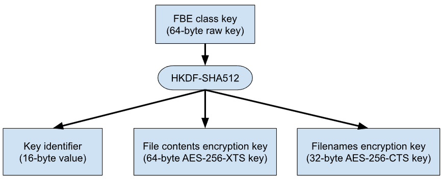
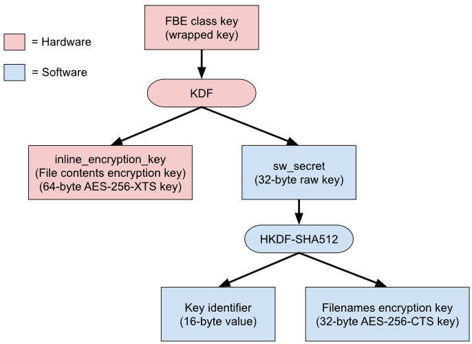

# Android Encryption

# 1. 加密 

加密是使用对称加密密钥对 Android 设备上的所有用户数据进行编码的过程。设备经过加密后，所有由用户创建的数据在存入磁盘之前都会自动加密，并且所有读取操作都会在将数据返回给调用进程之前自动解密数据。加密可确保未经授权方在尝试访问相应数据时无法进行读取。

Android 有两种设备加密方法，即文件级加密和全盘加密。


## 1.1 文件级加密

Android 7.0 及更高版本支持文件级加密。采用文件级加密时，可以使用不同的密钥对不同的文件进行加密，也可以对加密文件单独解密。支持文件级加密的设备还可以支持直接启动。该功能处于启用状态时，已加密设备在启动后将直接进入锁定屏幕，从而可让用户快速使用重要的设备功能，例如无障碍服务和闹钟。

引入文件级加密和可以将应用设为加密感知型应用的 API 后，应用可以在受限环境中运行。这意味着，应用可以在用户提供凭据之前运行，同时系统仍能保护私密用户信息。

**元数据加密**

Android 9 引入了对存在硬件支持的元数据加密的支持。采用元数据加密时，启动时出现的单个密钥会加密未通过 FBE 进行加密的任何内容（例如目录布局、文件大小、权限和创建/修改时间）。该密钥受到 Keymaster 的保护，而 Keymaster 受到启动时验证功能的保护。


## 1.2 全盘加密

注意：搭载 Android 10 及更高版本的新设备上不允许使用全盘加密。请在新设备上使用文件级加密。

Android 5.0 到 Android 9 支持全盘加密。全盘加密是使用单个密钥（由用户的设备密码加以保护）来保护设备的整个用户数据分区。在启动时，用户必须先提供其凭据，然后才能访问磁盘的任何部分。

虽然这种加密方式非常有利于确保安全性，但这也意味着当重新启动设备时，用户无法立即使用手机的大多数核心功能。由于此单个用户凭据的保护，系统无法访问用户的数据，所以闹钟等功能将无法运行，无障碍服务将无法使用，并且手机也无法接听电话。


# 2. 文件级加密 

Android 7.0 及更高版本支持文件级加密 (FBE)。采用文件级加密时，可以使用不同的密钥对不同的文件进行加密，也可以对加密文件单独解密。

本文介绍了如何在新设备上启用文件级加密，以及系统应用如何利用 Direct Boot API 尽可能为用户提供最佳、最安全的体验。

所有发布时搭载 Android 10 及更高版本的设备都必须使用文件级加密。

注意：在 Android 7.0-8.1 中，FBE 与可合并的存储设备不兼容，并且外部存储媒介（例如 SD 卡）只能用作传统存储设备。在 Android 9 及更高版本中，FBE 与可合并的存储设备兼容。


## 2.1 直接启动

借助文件级加密，Android 7.0 中引入了一项称为直接启动的新功能。该功能处于启用状态时，已加密设备在启动后将直接进入锁定屏幕。之前，在使用全盘加密 (FDE) 的已加密设备上，用户在访问任何数据之前都需要先提供凭据，以致于手机只能执行最基本的操作。例如，手机甚至无法接听电话，只能执行基本的紧急拨号操作，而且闹钟无法运行，无障碍服务也不可用。

引入文件级加密 (FBE) 和可以将应用设置为加密感知型应用的新 API 后，这些应用将能够在受限环境中运行。这意味着，应用可以在用户提供凭据之前运行，同时系统仍能保护私密用户信息。

在启用了 FBE 的设备上，每位用户均有两个可供应用使用的存储位置：

- 凭据加密 (CE) 存储空间，这是默认存储位置，只能在用户解锁设备后使用。

- 设备加密 (DE) 存储空间，该存储位置在直接启动模式下和用户解锁设备后均可使用。

注意：应尽可能将文件存储到 CE 存储空间。

这种分离能够使工作资料更加安全，因为这样一来，加密不再只基于启动密码，从而能够同时保护多位用户。

Direct Boot API 允许加密感知型应用访问上述任何一个存储空间。应用生命周期会发生一些变化，以便系统在以下情况下通知应用：用户的 CE 存储空间因用户在锁定屏幕上首次输入凭据而解锁时，或者在工作资料提供工作资料安全质询时。无论是否实现了 FBE，搭载 Android 7.0 的设备都必须支持这些新的 API 和生命周期。不过，如果没有启用 FBE，DE 和 CE 存储空间将始终处于解锁状态。

Android 开源项目 (AOSP) 中提供了 Ext4 和 F2FS 文件系统中的文件级加密的完整实现。在满足相关要求的设备上，只需启用该实现即可使用该功能。选择使用 FBE 的制造商可能想要了解基于所用系统芯片 (SoC) 优化该功能的方法。

AOSP 中的所有必要程序包均已更新为直接启动感知型程序包。不过，如果设备制造商使用的是这些应用的定制版本，则需要确保至少存在能够提供以下服务的直接启动感知型程序包：

- 电话服务和拨号器

- 用于在锁定屏幕中输入密码的输入法


## 2.2 示例和来源

Android 提供了文件级加密的参考实现，其中 vold (system/vold) 负责提供用于管理 Android 上的存储设备和存储卷的功能。添加 FBE 会为 vold 提供一些新命令，以便支持对多位用户的 CE 密钥和 DE 密钥进行密钥管理。除了为使用内核中的文件级加密功能而进行的核心更改外，许多系统程序包（包括锁定屏幕和 SystemUI）也经过了修改，以支持 FBE 和“直接启动”功能。其中包括：

- AOSP 拨号器 (packages/apps/Dialer)

- 桌面时钟 (packages/apps/DeskClock)

- LatinIME (packages/inputmethods/LatinIME)*

- “设置”应用 (packages/apps/Settings)*

- SystemUI (frameworks/base/packages/SystemUI)*

使用 defaultToDeviceProtectedStorage 清单属性的系统应用

通过在 AOSP 源代码树的框架或程序包目录中运行 mangrep directBootAware 命令，可以找到更多加密感知型应用和服务的示例。


## 2.3 依赖关系

为了安全地使用 AOSP 的 FBE 实现，设备需要满足以下依赖关系：

- 对 Ext4 加密或 F2FS 加密的内核支持。
- 基于 1.0 或更高版本 HAL 的 Keymaster 支持。不支持 Keymaster 0.3，因为它既不提供必要的功能，也不能保证为加密密钥提供充分保护。
- 必须在可信执行环境 (TEE) 中实现 Keymaster/Keystore 和 Gatekeeper，以便为 DE 密钥提供保护，从而使未经授权的操作系统（刷写到设备上的定制操作系统）无法直接请求 DE 密钥。
- 硬件信任根和启动时验证需要绑定到 Keymaster 初始化进程，以确保未经授权的操作系统无法获取 DE 密钥。


## 2.4 实现

最重要的一点是，应根据直接启动开发者文档将诸如闹钟、电话、无障碍功能等应用设为 android:directBootAware。

**内核支持**

Android 通用内核 3.18 及更高版本中提供对 Ext4 和 F2FS 加密的内核支持。如需在 5.1 版或更高版本的内核中启用此功能，请使用以下命令行：

```bash
CONFIG_FS_ENCRYPTION=y
```

对于较旧的内核，如果设备的 userdata 文件系统为 Ext4，就使用 CONFIG_EXT4_ENCRYPTION=y；如果设备的 userdata 文件系统为 F2FS，就使用 CONFIG_F2FS_FS_ENCRYPTION=y。

如果您的设备支持可合并的存储设备或者将对内部存储设备使用元数据加密，还要启用元数据加密所需的内核配置选项（如元数据加密文档中所述）。

除了对 Ext4 或 F2FS 加密提供功能支持之外，设备制造商还应启用加密加速，以便加快文件级加密的速度并改善用户体验。例如，在 ARM64 设备上，可以通过设置以下内核配置选项来启用 ARMv8 CE（加密扩展）加速：

```bash
CONFIG_CRYPTO_AES_ARM64_CE_BLK=y
CONFIG_CRYPTO_SHA2_ARM64_CE=y
```

为了进一步提高性能并降低能耗，设备制造商还可以考虑实现内嵌加密硬件，用于在数据往返于存储设备的途中对数据进行加密/解密。Android 通用内核（4.14 版及更高版本）包含一个框架，允许在提供硬件和供应商驱动程序支持的情况下使用内嵌加密。可以通过设置以下内核配置选项来启用内嵌加密框架：

```bash
CONFIG_BLK_INLINE_ENCRYPTION=y
CONFIG_FS_ENCRYPTION=y
CONFIG_FS_ENCRYPTION_INLINE_CRYPT=y
```

如果您的设备使用基于 UFS 的存储设备，则还应启用：

```bash
CONFIG_SCSI_UFS_CRYPTO=y
```

如果您的设备使用基于 eMMC 的存储设备，则还应启用：

```bash
CONFIG_MMC_CRYPTO=y
```

**启用文件级加密**

如需在设备上启用文件级加密 (FBE)，就必须在内部存储设备 (userdata) 上启用 FBE。这也会自动为可合并的存储设备启用 FBE；但是，如有必要，可以覆盖可合并的存储设备的加密格式。

**内部存储设备**

通过将 fileencryption=contents_encryption_mode[:filenames_encryption_mode[:flags]] 选项添加到 userdata 的 fstab 行 fs_mgr_flags 列，可启用 FBE。此选项用于定义内部存储设备的加密格式。它最多包含三个以英文冒号分隔的参数：

- contents_encryption_mode 参数指定将哪种加密算法用于加密文件内容，可为 aes-256-xts 或 adiantum。从 Android 11 开始，它也可以留空以指定默认算法，即 aes-256-xts。

- filenames_encryption_mode 参数指定将哪种加密算法用于加密文件名，可为 aes-256-cts、aes-256-heh、adiantum 或 aes-256-hctr2。如果不指定，则当 contents_encryption_mode 为 aes-256-xts 时该参数默认为 aes-256-cts，当 contents_encryption_mode 为 adiantum 时该参数默认为 adiantum。

- Android 11 中新增的 flags 参数是以 + 字符分隔的一个标记列表。支持以下标记：

    - v1 标记用于选择第 1 版加密政策；v2 标记用于选择第 2 版加密政策。第 2 版加密政策使用更安全、更灵活的密钥派生函数。如果设备搭载的是 Android 11 或更高版本（由 ro.product.first_api_level 确定），则默认选择第 2 版；如果设备搭载的是 Android 10 或更低版本，则默认选择第 1 版。

    - inlinecrypt_optimized 标记用于选择针对无法高效处理大量密钥的内嵌加密硬件进行了优化的加密格式。其具体做法是仅为每个 CE 或 DE 密钥派生一个文件内容加密密钥，而不是为每个文件派生一个。IV（初始化向量）的生成也会相应地进行调整。

    - emmc_optimized 标记与 inlinecrypt_optimized 类似，但它还选择了将 IV 限制为 32 位的 IV 生成方法。此标记应仅在符合 JEDEC eMMC v5.2 规范的内嵌加密硬件上使用，因此仅支持 32 位 IV。在其他内嵌加密硬件上，请改用 inlinecrypt_optimized。此标记一律不得在基于 UFS 的存储设备上使用；UFS 规范允许使用 64 位 IV。

    - 在支持硬件封装密钥的设备上，wrappedkey_v0 标记允许为 FBE 使用硬件封装的密钥。此标记只能与 inlinecrypt 装载选项以及 inlinecrypt_optimized 或 emmc_optimized 标记结合使用。

如果不使用内嵌加密硬件，则建议对大多数设备采用设置 fileencryption=aes-256-xts。如果使用的是内嵌加密硬件，则建议对大多数设备采用设置 fileencryption=aes-256-xts:aes-256-cts:inlinecrypt_optimized（或等效的 fileencryption=::inlinecrypt_optimized）。在没有采用任何形式的 AES 加速的设备上，可以设置 fileencryption=adiantum，从而用 Adiantum 代替 AES。

从 Android 14（AOSP 实验版）开始，AES-HCTR2 是采用加速加密指令的设备的首选文件名加密模式。不过，只有较新的 Android 内核支持 AES-HCTR2。在未来的 Android 版本中，AES-HCTR2 计划成为文件名加密的默认模式。如果您的内核支持 AES-HCTR2，可以通过将 filenames_encryption_mode 设置为 aes-256-hctr2 来为其启用这种文件名加密模式。在最简单的情况下，可以使用 fileencryption=aes-256-xts:aes-256-hctr2 完成此操作。

在搭载 Android 10 或更低版本的设备上，也可以使用 fileencryption=ice 来指定使用 FSCRYPT_MODE_PRIVATE 文件内容加密模式。Android 通用内核未实现该模式，但供应商可使用自定义内核补丁程序实现该模式。该模式生成的磁盘格式因供应商而异。在搭载 Android 11 或更高版本的设备上，不允许再使用该模式，而必须使用标准加密格式。

注意：由于 fileencryption 选项指定了磁盘格式，因此无法通过 OTA 进行更改。

默认情况下，使用 Linux 内核的加密 API 完成文件内容加密。如果想改用内嵌加密硬件，也请添加 inlinecrypt 装载选项。例如，完整的 fstab 行可能如下所示：

```bash
/dev/block/by-name/userdata /data f2fs nodev,noatime,nosuid,errors=panic,inlinecrypt wait,fileencryption=aes-256-xts:aes-256-cts:inlinecrypt_optimized
```

注意：

- inlinecrypt 和 fileencryption 选项位于不同的列中，因为 inlinecrypt 是文件系统装载选项，而 fileencryption 是 Android 用户空间的标记。

- 如果您的内嵌加密硬件正常工作且未设置 wrappedkey_v0 标记，则可以随时添加或移除 inlinecrypt 装载选项，而无需擦除设备。换句话说，除非启用了硬件封装的密钥，否则 inlinecrypt 只会影响实现，不会影响磁盘格式。应该在开发过程中对移除 inlinecrypt 进行测试，以验证内嵌加密硬件是否正常工作。

**可合并的存储设备**

从 Android 9 开始，FBE 和可合并的存储设备可以一起使用。

为 userdata 指定 fileencryption fstab 选项也会自动为可合并的存储设备启用 FBE 和元数据加密。但是，可以通过设置 PRODUCT_PROPERTY_OVERRIDES 中的属性来覆盖可合并的存储设备上的 FBE 和/或元数据加密格式。

在搭载 Android 11 或更高版本的设备上，请使用以下属性：

- ro.crypto.volume.options（Android 11 中新增的属性），用于为可合并的存储设备选择 FBE 加密格式。其语法与 fileencryption fstab 选项的参数相同，并且使用相同的默认值。请参阅上文关于 fileencryption 的建议，了解此处应使用什么设置。

- ro.crypto.volume.metadata.encryption 用于为可合并的存储设备选择元数据加密格式。请参阅元数据加密文档。

在搭载 Android 10 或更低版本的设备上，请使用以下属性：

- ro.crypto.volume.contents_mode，用于选择内容加密模式。这相当于 ro.crypto.volume.options 的第一个以英文冒号分隔的字段。

- ro.crypto.volume.filenames_mode，用于选择文件名加密模式。这相当于 ro.crypto.volume.options 的第二个以英文冒号分隔的字段，但在搭载 Android 10 或更低版本的设备上默认设置为 aes-256-heh。在大多数设备上，需要将其明确替换为 aes-256-cts。

- ro.crypto.fde_algorithm 和 ro.crypto.fde_sector_size 用于为可合并的存储设备选择元数据加密格式。请参阅元数据加密文档。

注意：在搭载 Android 10 或更低版本的设备上，可合并的存储设备上的默认文件名加密模式对于大多数设备都无效，并且与内部存储设备上的默认模式不同。因此，在此类设备上必须明确进行替换，通常替换为 aes-256-cts。

**与 Keymaster 集成**

Keymaster HAL 应作为 early_hal 类的一部分启动。这是因为 FBE 要求 Keymaster 在 post-fs-data 启动阶段（即 vold 设置初始密钥时）准备好处理请求。

**排除目录**

init 会将系统 DE 密钥应用于 /data 的所有顶级目录，但必须采用非加密格式的目录除外：即本身就包含系统 DE 密钥的目录，以及包含用户 CE 或 DE 目录的目录。加密密钥以递归方式应用，且无法由子目录替换。

在 Android 11 及更高版本中，init 应用于目录的密钥可以通过 init 脚本中 mkdir 命令的 encryption=<action> 实参来控制。<action> 的可能值记录在 Android init 语言自述文件中。

在 Android 10 中，init 加密操作已硬编码到以下位置：

```bash
/system/extras/libfscrypt/fscrypt_init_extensions.cpp
```

在 Android 9 及更早版本中，该位置如下：

```bash
/system/extras/ext4_utils/ext4_crypt_init_extensions.cpp
```

可以添加例外情况，以防止某些目录被加密。如果进行了此类修改，设备制造商应添加 SELinux 政策，以便仅向需要使用未加密目录的应用授予访问权限（应排除所有不可信的应用）。

目前已知唯一可接受的使用这种方法的情况是在支持旧版 OTA 功能方面。

**在系统应用中支持直接启动**

**将应用设为直接启动感知型应用**

为了实现系统应用的快速迁移，新增了两个可在应用级别设置的属性。defaultToDeviceProtectedStorage 属性仅适用于系统应用，directBootAware 属性则适用于所有应用。

```bash
<application
    android:directBootAware="true"
    android:defaultToDeviceProtectedStorage="true">
```

应用级别的 directBootAware 属性的含义是将相应应用中的所有组件均标记为加密感知型组件。

defaultToDeviceProtectedStorage 属性用于将默认的应用存储位置重定向到 DE 存储空间（而非 CE 存储空间）。使用此标记的系统应用必须仔细审核存储在默认位置的所有数据，并将敏感数据的路径更改为使用 CE 存储空间。使用此选项的设备制造商应仔细检查要存储的数据，以确保其中不含任何个人信息。

在这种模式下运行时，以下系统 API 可在需要时用于明确管理由 CE 存储空间支持的 Context（这些 API 与设备保护存储空间适用的同类 API 相对应）。

- Context.createCredentialProtectedStorageContext()

- Context.isCredentialProtectedStorage()

**支持多位用户**

多用户环境中的每位用户均会获得单独的加密密钥。每位用户均会获得两个密钥：一个 DE 密钥和一个 CE 密钥。用户 0 由于是特殊用户，因此必须先登录设备。这部分适用于使用设备管理功能的情况。

加密感知型应用按照以下方式在用户间互动：INTERACT_ACROSS_USERS 和 INTERACT_ACROSS_USERS_FULL 允许应用在设备上的所有用户间互动。不过，这些应用只能访问已解锁用户的 CE 加密目录。

应用或许能够在 DE 区域间自由互动，但一位用户已解锁并不意味着设备上的所有用户均已解锁。应用在尝试访问这些区域之前，应先检查解锁状态。

每个工作资料用户 ID 也会获得两个密钥：一个 DE 密钥和一个 CE 密钥。当满足工作挑战时，资料用户会被解锁，并且 Keymaster（在 TEE 中）可以提供资料的 TEE 密钥。

**处理更新**

恢复分区无法访问 userdata 分区中采用 DE 保护的存储空间。强烈建议实现 FBE 的设备使用 A/B 系统更新来支持 OTA 机制。由于可以在正常操作期间安装 OTA 更新，因此恢复分区无需访问已加密存储卷中的数据。

如果使用旧版 OTA 解决方案（该解决方案要求恢复分区访问 userdata 分区中的 OTA 文件），则需要执行以下操作：

1. 在 userdata 分区中创建一个顶级目录（例如 misc_ne）。

2. 将该顶级目录配置为非加密（请参阅排除目录）。

3. 在顶级目录中创建一个用于存放 OTA 更新包的目录。

4. 添加 SELinux 规则和文件环境，以便控制对该目录及其内容的访问。应当只有接收 OTA 更新的进程或应用能够对该目录进行读取和写入操作。任何其他应用或进程都不应具有访问该目录的权限。


## 2.5 验证

为了确保实现的 FBE 功能版本能够按预期工作，首先需要运行多个 CTS 加密测试，例如 DirectBootHostTest 和 EncryptionTest。

如果设备搭载的是 Android 11 或更高版本，请同时运行 vts_kernel_encryption_test：

```bash
atest vts_kernel_encryption_test
```

或：

```bash
vts-tradefed run vts -m vts_kernel_encryption_test
```

此外，设备制造商还可以执行以下手动测试。在启用了 FBE 的设备上进行以下手动测试：

- 检查 ro.crypto.state 是否存在

    - 确认 ro.crypto.state 是否已加密

- 检查 ro.crypto.type 是否存在

    - 确认 ro.crypto.type 是否已设置为 file

此外，测试人员可以在主用户已设置锁定屏幕的情况下启动一个 userdebug 实例。然后通过 adb shell 命令进入设备，并使用 su 获得 root 权限。确认 /data/data 中是否包含加密的文件名；如果没有，就表示存在问题。

我们还建议设备制造商探索如何在其设备或内核上运行针对 fscrypt 的上游 Linux 测试。这些测试是 xfstests 文件系统测试套件的一部分。不过，Android 不对这些上游测试提供官方支持。


## 2.6 AOSP 实现详情

本部分详细介绍了 AOSP 的文件级加密实现，并讲解了文件级加密的运作方式。设备制造商应该无需执行任何更改，即可在其设备上使用 FBE 和“直接启动”功能。

**fscrypt 加密**

AOSP 实现会用到内核中的“fscrypt”加密（受 ext4 和 f2fs 支持），并通常配置如下：

- 借助采用 XTS 模式的 AES-256 算法加密文件内容

- 借助采用 CBC-CTS 模式的 AES-256 算法加密文件名

Adiantum 加密也受支持。启用 Adiantum 加密后，文件内容和文件名都会使用 Adiantum 进行加密。

fscrypt 支持两种版本的加密政策：版本 1 和版本 2。 版本 1 已废弃；发布时搭载 Android 11 及更高版本的设备所适用的 CDD 要求仅与版本 2 兼容。版本 2 加密政策使用 HKDF-SHA512 从用户空间提供的密钥派生实际加密密钥。

如需详细了解 fscrypt，请参阅上游内核文档。

**存储类别**

下表列出了 FBE 密钥及其保护的目录的更多详细信息：

| 存储类别 | 说明 | 目录 |
| ------- | ---- | ---- |
| 系统 DE | 未与特定用户关联的设备加密数据 | /data/system、/data/app 以及 /data 的各种其他子目录 |
| 按启动 | 无需在重新启动后保留的临时系统文件 | /data/per_boot |
| 用户 CE（内部） | 内部存储设备中按用户的凭据加密数据 | /data/data（/data/user/0 的别名）; /data/media/${user_id}; /data/misc_ce/${user_id}; /data/system_ce/${user_id}; /data/user/${user_id}; /data/vendor_ce/${user_id} |
| 用户 DE（内部） | 内部存储设备中按用户的设备加密数据 | /data/misc_de/${user_id}; /data/system_de/${user_id}; /data/user_de/${user_id}; /data/vendor_de/${user_id} |
| 用户 CE（可合并） | 可合并的存储设备中按用户的凭据加密数据 | /mnt/expand/${volume_uuid}/media/${user_id}; /mnt/expand/${volume_uuid}/misc_ce/${user_id}; /mnt/expand/${volume_uuid}/user/${user_id} |
| 用户 DE（可合并） | 可合并的存储设备中按用户的设备加密数据 | /mnt/expand/${volume_uuid}/misc_de/${user_id}; /mnt/expand/${volume_uuid}/user_de/${user_id} |

**密钥存储和保护**

除了在每次启动时才使用的 FBE 密钥（系统根本不存储）之外，所有其他 FBE 密钥均由 vold 管理并加密存储在磁盘上。下表列出了各种 FBE 密钥的存储位置：

| 密钥类型 | 密钥位置 | 密钥位置的存储类别 |
| ------- | ------- | ----------------- |
| 系统 DE 密钥 | /data/unencrypted | 非加密 |
| 用户 CE（内部）密钥 | /data/misc/vold/user_keys/ce/${user_id} | 系统 DE |
| 用户 DE（内部）密钥 | /data/misc/vold/user_keys/de/${user_id} | 系统 DE |
| 用户 CE（可合并）密钥 | /data/misc_ce/${user_id}/vold/volume_keys/${volume_uuid} | 用户 CE（内部） |
| 用户 DE（可合并）键 | /data/misc_de/${user_id}/vold/volume_keys/${volume_uuid} | 用户 DE（内部） |

如上表所示，大多数 FBE 密钥都存储在由另一个 FBE 密钥加密的目录中。只有先解锁包含这些密钥的存储类别，才能解锁这些密钥。

此外，vold 还会对所有 FBE 密钥应用一层加密。除了用于内部存储设备的 CE 密钥之外，每个密钥都使用自己的 Keystore 密钥（该密钥不在 TEE 外部公开）以 AES-256-GCM 加密。这样一来，除非受信任的操作系统已启动（正如启动时验证所强制执行的那样），否则便无法解锁 FBE 密钥此外，Keystore 密钥还需要设置抗回滚，以便在 Keymaster 支持抗回滚的设备上也能安全地删除 FBE 密钥。为了在抗回滚不可用时能够尽力回退，系统使用存储在与密钥一起存储的 secdiscardable 文件中的 16384 个随机字节的 SHA-512 哈希作为 Keystore 密钥的应用 ID 标记。只有将这些字节全部恢复，才能恢复 FBE 密钥。

用于内部存储设备的 CE 密钥将获得更高级别的保护，以确保在未掌握用户的锁屏知识因素 (LSKF)（PIN 码、图案或密码）、安全密码重置令牌或重新启动时恢复操作的客户端密钥及服务器端密钥的情况下，CE 密钥无法解锁。只允许为工作资料和完全受管设备创建密码重置令牌。

为此，vold 会使用从用户的合成密码派生的 AES-256-GCM 密钥加密每个用于内部存储设备的 CE 密钥。合成密码是为每个用户随机生成的不可变的高熵加密密钥。system_server 中的 LockSettingsService 用于管理合成密码及其保护方式。

为了使用 LSKF 保护合成密码，LockSettingsService 首先会扩展 LSKF（方法是通过 scrypt 传递 LSKF，目标时间约为 25 毫秒且内存用量约为 2 MiB）。由于 LSKF 通常较短，因此该步骤通常无法提供多少安全性。主要的安全保障是下文所述的安全元件 (SE) 或由 TEE 强制执行的速率限制。

如果设备具有安全元件 (SE)，则 LockSettingsService 使用 Weaver HAL 将经过扩展的 LSKF 映射到存储在 SE 中的高熵随机密钥。然后，LockSettingsService 将对合成密码进行两次加密：第一次使用从经过扩展的 LSKF 和 Weaver 密钥派生的软件密钥，第二次使用未经身份验证绑定的 Keystore 密钥。这样即可对 LSKF 猜测施加 SE 强制速率限制。

如果设备没有 SE，则 LockSettingsService 会改为使用经过扩展的 LSKF 作为 Gatekeeper 密码。然后，LockSettingsService 将对合成密码进行两次加密：第一次使用从经过扩展的 LSKF 和 secdiscardable 文件的哈希派生的软件密钥，第二次使用经过身份验证绑定至 Gatekeeper 注册的 Keystore 密钥。这样即可对 LSKF 猜测施加 TEE 强制速率限制。

更改 LSKF 后，LockSettingsService 会删除与合成密码和旧 LSKF 的绑定相关的所有信息。在支持 Weaver 或可抗回滚的 Keystore 密钥的设备上，这样做可以保证安全地删除旧绑定。因此，即使用户没有 LSKF，系统也会应用此处所述的保护措施。


# 3. 全盘加密 

注意：只有搭载 Android 9 或更低版本的设备才能使用全盘加密，搭载 Android 10 或更高版本的设备必须改用文件级加密。Android 10-12 仅在从较低 Android 版本升级的设备上支持全盘加密。Android T（AOSP 实验版）完全取消了对全盘加密的支持。

全盘加密是使用密钥（密钥本身也经过加密）对 Android 设备上的所有用户数据进行编码的过程。设备经过加密后，所有由用户创建的数据在存入磁盘之前都会自动加密，并且所有读取操作都会在将数据返回给调用进程之前自动解密数据。

全盘加密是在 Android 4.4 版中引入的，不过 Android 5.0 中又引入了以下新功能：

- 新增了快速加密方式，这种加密方式只会对数据分区中已使用的分块进行加密，以免首次启动用时过长。目前只有 EXT4 和 F2FS 文件系统支持快速加密。

- 添加了 forceencrypt fstab 标记，以便在首次启动时进行加密。

- 添加了对解锁图案和无密码加密的支持。

- 添加了由硬件支持的加密密钥存储空间，该空间使用可信执行环境（TEE，例如 TrustZone）的签名功能。如需了解详情，请参阅存储已加密的密钥。

注意：对于升级到 Android 5.0 的设备，如果升级之后进行了加密，则可以通过恢复出厂设置还原到未加密状态。在首次启动时加密的新 Android 5.0 设备无法还原到未加密状态。


## 3.1 Android 全盘加密的运作方式

Android 全盘加密基于在块设备层运行的内核功能 dm-crypt。因此，这种加密方式适用于以块设备的形式呈现给内核的嵌入式多媒体卡 (eMMC) 和类似闪存设备。YAFFS 会直接与原始 NAND 闪存芯片交互，无法进行全盘加密。

全盘加密采用的是 128 位高级加密标准 (AES) 算法（搭配加密块链 (CBC) 和 ESSIV:SHA256）。对主密钥进行加密时使用的是 128 位 AES 算法（通过对 OpenSSL 库的调用实现）。对于该密钥，您必须使用 128 位或更多位（可以选择 256 位）。

注意：原始设备制造商 (OEM) 可以使用 128 位或更多位对主密钥进行加密。

Android 5.0 版中有以下 4 种加密状态：

- 默认

- PIN 码

- 密码

- 解锁图案

首次启动时，设备会创建一个随机生成的 128 位主密钥，然后会使用默认密码和存储的盐对其进行哈希处理。默认密码是“default_password”。不过，设备还会通过 TEE（例如 TrustZone）为生成的哈希签名。TEE 会使用相应签名的哈希来加密主密钥。

您可以在 Android 开源项目的 cryptfs.cpp 文件中找到定义的默认密码。

当用户在设备上设置 PIN 码/通行码或密码时，只有 128 位的密钥会被重新加密并存储起来（也就是说，更改用户 PIN 码/通行码/解锁图案不会导致重新加密用户数据）。请注意，受管理的设备可能有 PIN 码、解锁图案或密码限制。

加密操作由 init 和 vold 管理。init 负责调用 vold，然后 vold 会设置相关属性以触发 init 中的事件。系统的其他部分也会查看这些属性以执行各项任务，例如报告状态、提示输入密码，或有严重错误发生时提示恢复出厂设置。为了调用 vold 中的加密功能，系统会使用命令行工具 vdc 的 cryptfs 命令：checkpw、restart、enablecrypto、changepw、cryptocomplete、verifypw、setfield、getfield、mountdefaultencrypted、getpwtype、getpw 以及 clearpw。

若要加密、解密或清除 /data，/data 不得处于装载状态。但若要显示任何界面，框架都必须启动，而框架需要 /data 才能运行。为了解决这一冲突，/data 上会装载一个临时文件系统。通过该文件系统，Android 可以提示输入密码、显示进度或根据需要建议清除数据。不过，该文件系统会带来以下限制：要从临时文件系统切换到实际的 /data 文件系统，系统必须停止所有在临时文件系统中打开了文件的进程，并在实际的 /data 文件系统中重启这些进程。为此，所有服务都必须位于以下其中一个组内：core、main 和 late_start。

- core：启动后一直不会关闭。
- main：关闭，然后在用户输入磁盘密码后会重启。
- late_start：在 /data 未解密并装载之前，一直不会启动。

如需触发这些操作，请将 vold.decrypt 属性设置为各种字符串。如需结束和重启服务，请使用以下 init 命令：

- class_reset：停止相应服务，但允许通过 class_start 重启该服务。
- class_start：重启相应服务。
- class_stop：停止相应服务并添加 SVC_DISABLED 标记。 被停止的服务不会对 class_start 做出响应。


## 3.2 流程

有 4 种针对已加密设备的流程。每台设备只需加密一次，然后会遵循正常的启动流程。

- 对之前未加密的设备进行加密：

    - 使用 forceencrypt 加密新设备：首次启动时强制加密（从 Android L 开始）。

    - 加密现有设备：由用户启动加密（Android K 及更低版本）。

- 启动已加密的设备：

    - 启动无密码的已加密设备：启动未设置密码的已加密设备（适用于运行 Android 5.0 及更高版本的设备）。

    - 启动设有密码的已加密设备：启动设置了密码的已加密设备。

除了上述流程外，设备还可能无法加密 /data。 下文对上述每种流程进行了详细介绍。

**使用 forceencrypt 加密新设备**

这是 Android 5.0 设备首次启动时的普通流程。

1. 检测带有 forceencrypt 标记的未加密文件系统

    /data 未加密，但需要加密，因为 forceencrypt 强制要求进行此项加密。 卸载 /data。

2. 开始加密 /data

    vold.decrypt = "trigger_encryption" 会触发 init.rc，从而使 vold 对 /data 进行无密码加密。（因为这应该是新设备，还没有设置密码。）

3. 装载 tmpfs

    vold 会装载一个 tmpfs /data（使用 ro.crypto.tmpfs_options 中的 tmpfs 选项），并会将 vold.encrypt_progress 属性设置为 0。vold 会准备 tmpfs /data 以便启动已加密的系统，并会将 vold.decrypt 属性设置为 trigger_restart_min_framework

4. 启动框架以显示进度

    由于设备上几乎没有要加密的数据，加密过程很快就会完成，因此实际上通常并不会显示进度条。如需详细了解进度界面，请参阅加密现有设备。

5. /data 加密后，关闭框架

    vold 会将 vold.decrypt 设置为 trigger_default_encryption，这会启动 defaultcrypto 服务。（这会启动以下流程来装载默认的已加密用户数据。）trigger_default_encryption 会检查加密类型，以了解 /data 加密是否使用了密码。由于 Android 5.0 设备在首次启动时加密，应该没有设置任何密码，因此我们要解密并装载 /data。

6. 装载 /data

    接下来，init 会使用从 ro.crypto.tmpfs_options（在 init.rc 中设置）中选取的参数在 tmpfs RAMDisk 中装载 /data。

7. 启动框架

将 vold 设置为 trigger_restart_framework，这会继续常规启动过程。

**加密现有设备**

当您加密之前搭载 Android K 或更低版本但已迁移至 L 的未加密设备时，则会发生该流程。

该流程由用户启动，在代码中称为“原地加密”。当用户选择对设备进行加密时，界面中将会提示用户确认电池是否已充满电并且交流电源适配器是否已插好，以便有充足的电量来完成加密过程。

警告：如果设备在完成加密之前耗尽电量并关机，文件数据将会处于部分加密状态。如果出现这种情况，必须将设备恢复出厂设置，而这将导致所有数据都丢失。

为了进行原地加密，vold 会启动一个循环来读取实际块设备中每个扇区的数据，然后将其写入到加密块设备。在读取每个扇区的数据以及将其写入到加密块设备之前，vold 都会先检查相应扇区是否处于使用状态。对于几乎没有什么数据的新设备来说，这种方式可以大大加快加密速度。

设备状态：设置 ro.crypto.state = "unencrypted" 并执行 on nonencrypted init 触发器以继续启动。

1. 检查密码

界面会使用 cryptfs enablecrypto inplace 命令调用 vold，其中passwd 是用户的锁定屏幕密码。

2. 关闭框架

    vold 会检查是否存在错误。如果无法加密，则返回 -1，并在日志中记录原因。如果可以加密，则会将 vold.decrypt 属性设置为 trigger_shutdown_framework。这会使 init.rc 停止 late_start 类和 main 类中的服务。

3. 创建加密页脚

4. 创建路径文件

5. 重新启动

6. 检测路径文件

7. 开始加密 /data

    接下来，vold 会设置加密映射，这将创建一个映射到实际块设备的虚拟加密块设备，但会在写入每个扇区的数据时对相应扇区进行加密，并在读取每个扇区的数据时对相应扇区进行解密。然后，vold 会创建并写出加密元数据。

8. 在加密时装载 tmpfs

    vold 会装载一个 tmpfs /data（使用 ro.crypto.tmpfs_options 中的 tmpfs 选项），并会将 vold.encrypt_progress 属性设置为 0。vold 会准备 tmpfs /data 以便启动已加密的系统，并会将 vold.decrypt 属性设置为 trigger_restart_min_framework。

9. 启动框架以显示进度

    trigger_restart_min_framework 会使 init.rc 启动 main 类中的服务。当框架看到 vold.encrypt_progress 已设置为 0 时，它会打开进度条界面，该界面每 5 秒查询一次该属性并更新进度条。加密循环会在已加密的分区比例每增加百分之一时更新一次 vold.encrypt_progress。

10. /data 加密后，更新加密页脚

    /data 成功加密后，vold 会清除元数据中的 ENCRYPTION_IN_PROGRESS 标记。

    当设备成功解锁后，接下来便会使用密码加密主密钥，并且会更新加密页脚。

    如果重新启动因某个原因失败了，vold 会将 vold.encrypt_progress 属性设置为 error_reboot_failed，并且界面中应显示一条消息，提示用户按某个按钮以重新启动。这种情况不应发生。

**启动采用默认加密的已加密设备**

当您启动无密码的已加密设备时，则会发生该流程。由于 Android 5.0 设备在首次启动时加密，应该没有设置任何密码，因此属于“默认加密”状态。

1. 检测无密码的已加密 /data

    通过检测会发现 Android 设备已加密，因为 /data 无法装载，并且设置了 encryptable 或 forceencrypt 标记之一。

    vold 会将 vold.decrypt 设置为 trigger_default_encryption，这会启动 defaultcrypto 服务。trigger_default_encryption 会检查加密类型，以了解 /data 加密是否使用了密码。

2. 解密 /data

    基于块设备创建 dm-crypt 设备，接下来便可以使用设备了。

3. 装载 /data

    然后，vold 会装载已解密的实际 /data 分区，并准备新的分区。它会将 vold.post_fs_data_done 属性设置为 0，接着将 vold.decrypt 设置为 trigger_post_fs_data。这会使 init.rc 运行其 post-fs-data 命令。这些命令会创建所有必要的目录或链接，然后将 vold.post_fs_data_done 设置为 1。

    当 vold 看到该属性中的 1 时，会将 vold.decrypt 属性设置为 trigger_restart_framework. 这会使 init.rc 再次启动 main 类中的服务，并启动 late_start 类中的服务（这是设备启动后首次启动这些服务）。

4. 启动框架

    现在，框架会使用已解密的 /data 启动其所有服务，接下来便可以使用系统了。

**启动未采用默认加密的已加密设备**

当您启动设有密码的已加密设备时，则会发生该流程。设备的密码可以是 PIN 码、解锁图案或密码。

1. 检测设有密码的已加密设备

    通过检测会发现 Android 设备已加密，因为设置了 ro.crypto.state = "encrypted" 标记

    由于 /data 是使用密码加密的，因此 vold 会将 vold.decrypt 设置为 trigger_restart_min_framework。

2. 装载 tmpfs

    init 会设置 5 个属性，以保存为 /data（包含从 init.rc 传入的参数）提供的初始装载选项。vold 会使用这些属性来设置加密映射：

    a. ro.crypto.fs_type

    b. ro.crypto.fs_real_blkdev

    c. ro.crypto.fs_mnt_point

    d. ro.crypto.fs_options

    e. ro.crypto.fs_flags （ASCII 码 8 位十六进制数字，以 0x 开头）

3. 启动框架以提示输入密码

    此时框架会启动并看到 vold.decrypt 已设置为 trigger_restart_min_framework。这让框架知道自己是在 tmpfs /data 磁盘中启动的，并且需要获取用户密码。

    不过，它首先需要确认磁盘是否已经过适当加密。它会向 vold 发送 cryptfs cryptocomplete 命令。如果加密已成功完成，vold 会返回 0；如果发生内部错误，则会返回 -1；如果加密未成功完成，则会返回 -2。vold 通过查看 CRYPTO_ENCRYPTION_IN_PROGRESS 标记的加密元数据来确定应返回的值。如果设置了此标记，则表示加密过程中断了，并且设备上没有可用的数据。如果 vold 返回错误，界面中应显示一条消息，提示用户重新启动设备并将其恢复出厂设置，并且界面中应为用户提供一个用于执行该操作的按钮。

4. 通过密码解密数据

    cryptfs cryptocomplete 成功后，框架会显示一个界面，提示用户输入磁盘密码。界面会通过向 vold 发送 cryptfs checkpw 命令来检查用户输入的密码。如果密码正确（通过以下方式判定：在临时位置成功装载已解密的 /data，然后将其卸载），vold 会将已解密块设备的名称保存在 ro.crypto.fs_crypto_blkdev 属性中，并向界面返回状态 0。如果密码不正确，则向界面返回 -1。

5. 停止框架

    界面会显示加密启动图形，然后使用 cryptfs restart 命令调用 vold。vold 会将 vold.decrypt 属性设置为 trigger_reset_main，这会使 init.rc 执行 class_reset main 命令。此命令会停止 main 类中的所有服务，以便卸载 tmpfs /data。

6. 装载 /data

    然后，vold 会装载已解密的实际 /data 分区，并准备新的分区（如果加密时采用了首次发布不支持的数据清除选项，则可能永远无法准备就绪）。它会将 vold.post_fs_data_done 属性设置为 0，接着将 vold.decrypt 设置为 trigger_post_fs_data。这会使 init.rc 运行其 post-fs-data 命令。这些命令会创建所有必要的目录或链接，然后将 vold.post_fs_data_done 设置为 1。当 vold 看到该属性中的 1 时，会将 vold.decrypt 属性设置为 trigger_restart_framework。这会使 init.rc 再次启动 main 类中的服务，并启动 late_start 类中的服务（这是设备启动后首次启动这些服务）。

7. 启动整个框架

    现在，框架会使用已解密的 /data 文件系统启动其所有服务，接下来便可以使用系统了。

**失败**

有一些原因可能会导致设备无法解密。设备会先按照一系列常规步骤启动：

1. 检测设有密码的已加密设备

2. 装载 tmpfs

3. 启动框架以提示输入密码

但在框架打开后，设备可能会遇到一些错误：

- 密码匹配但无法解密数据

- 用户输错密码的次数达到了 30 次

如果这些错误未解决，则会提示用户清除数据并恢复出厂设置：

如果 vold 在加密过程中检测到错误，并且任何数据都尚未被销毁，而框架处于打开状态，vold 会将 vold.encrypt_progress 属性设置为 error_not_encrypted。界面中会提示用户重新启动系统，并提醒他们加密过程并未开始。如果错误发生在框架关闭之后、进度条界面显示之前，vold 会重新启动系统。如果重新启动失败，则会将 vold.encrypt_progress 设置为 error_shutting_down 并返回 -1；但却无法捕获相应错误。这种情况不应发生。

如果 vold 在加密过程中检测到错误，则会将 vold.encrypt_progress 设置为 error_partially_encrypted 并返回 -1。随后，界面中应显示一条消息，告诉用户加密失败，并且界面中应为用户提供一个用于将设备恢复出厂设置的按钮。


## 3.3 存储已加密的密钥

已加密的密钥存储在加密元数据中。硬件支持是通过使用可信执行环境 (TEE) 的签名功能实现的。以前在加密主密钥时，需要使用通过对用户的密码和存储的盐应用 scrypt 生成的密钥。为了使该密钥能够抵御盒外攻击，我们通过使用存储的 TEE 密钥为生成的密钥签名，扩展了这种算法。然后，通过再次应用 scrypt，生成的签名会转变成具有适当长度的密钥。该密钥随后会用于加密和解密主密钥。存储该密钥的步骤如下：

1. 生成 16 个字节的随机磁盘加密密钥 (DEK) 和 16 个字节的盐。

2. 对用户密码和盐应用 scrypt，以生成 32 个字节的中间密钥 1 (IK1)。

3. 为 IK1 填充若干个零字节，以便达到绑定到硬件的私钥 (HBK) 的大小。 具体来说就是按照以下方式进行填充：00 || IK1 || 00..00；1 个零字节，32 个 IK1 字节，223 个零字节。

4. 使用 HBK 为已填充的 IK1 签名，以生成 256 个字节的 IK2。

5. 对 IK2 和盐（与第 2 步中使用的盐相同）应用 scrypt，以生成 32 个字节的 IK3。

6. 将 IK3 的前 16 个字节用作 KEK，后 16 个字节用作 IV。

7. 使用 AES_CBC、密钥 KEK 和初始化矢量 IV 加密 DEK。


## 3.4 更改密码

当用户选择在设置中更改或移除密码时，界面会向 vold 发送 cryptfs changepw 命令，然后 vold 会使用新密码重新加密磁盘主密钥。


## 3.5 加密属性

vold 和 init 之间通过设置属性进行通信。下面列出了可用的加密属性。

**vold 属性**

| 属性 | 说明 |
| ---- | --- |
| vold.decrypt trigger_encryption | 以无密码方式加密云端硬盘。 |
| vold.decrypt trigger_default_encryption | 检查云端硬盘是否采用了无密码加密。如果是，则解密并装载云端硬盘；如果不是，则将 vold.decrypt 设置为 trigger_restart_min_framework。 |
| vold.decrypt trigger_reset_main | 由 vold 设置，用于关闭提示输入磁盘密码的界面。 |
| vold.decrypt trigger_post_fs_data | 由 vold 设置，用于准备具有必要目录等内容的 /data。 |
| vold.decrypt trigger_restart_framework | 由 vold 设置，用于启动实际框架和所有服务。 |
| vold.decrypt trigger_shutdown_framework | 由 vold 设置，用于关闭整个框架以开始加密。 |
| vold.decrypt trigger_restart_min_framework | 由 vold 设置，用于启动加密进度条界面或提示输入密码，具体取决于 ro.crypto.state 的值。 |
| vold.encrypt_progress | 框架启动时，如果设置了此属性，则会进入进度条界面模式。 |
| vold.encrypt_progress 0 to 100 | 进度条界面中应按照设置显示百分比值。 |
| vold.encrypt_progress error_partially_encrypted | 进度条界面中应显示一条消息，告诉用户加密失败，并且界面中应为用户提供一个用于将设备恢复出厂设置的按钮。 |
| vold.encrypt_progress error_reboot_failed | 进度条界面中应显示一条消息，告诉用户加密已完成，并且界面中应为用户提供一个用于重新启动设备的按钮。此错误不应发生。 |
| vold.encrypt_progress error_not_encrypted | 进度条界面中应显示一条消息，告诉用户发生错误，没有已加密的数据或数据已丢失，并且界面中应为用户提供一个用于重新启动系统的按钮。 |
| vold.encrypt_progress error_shutting_down | 进度条界面未运行，因此不清楚谁将响应此错误。在任何情况下，都不应发生此错误。 |
| vold.post_fs_data_done 0 | 由 vold 在将 vold.decrypt 设置为 trigger_post_fs_data 的前一刻设置。 |
| vold.post_fs_data_done 1 | 由 init.rc 或 init.rc 在完成 post-fs-data 任务之后立即设置。 |

**init 属性**

| 属性 | 说明 |
| ---- | --- |
| ro.crypto.fs_crypto_blkdev | 由 vold 命令 checkpw 设置，供 vold 命令 restart 以后使用。 |
| ro.crypto.state unencrypted | 由 init 设置，用于说明相应系统正在未加密的 /data ro.crypto.state encrypted 中运行。由 init 设置，用于说明相应系统正在已加密的 /data 中运行。 |
| ro.crypto.fs_type; ro.crypto.fs_real_blkdev; ro.crypto.fs_mnt_point; ro.crypto.fs_options; ro.crypto.fs_flags | 这 5 个属性由 init 在尝试装载 /data（包含从 init.rc 传入的参数）时设置。vold 会使用这些属性来设置加密映射。 |
| ro.crypto.tmpfs_options | 由 init.rc 设置，包含 init 在装载 tmpfs /data 文件系统时应使用的选项。 |


## 3.6 init 操作

```bash
on post-fs-data
on nonencrypted
on property:vold.decrypt=trigger_reset_main
on property:vold.decrypt=trigger_post_fs_data
on property:vold.decrypt=trigger_restart_min_framework
on property:vold.decrypt=trigger_restart_framework
on property:vold.decrypt=trigger_shutdown_framework
on property:vold.decrypt=trigger_encryption
on property:vold.decrypt=trigger_default_encryption
```


# 4. 元数据加密 

Android 7.0 及更高版本支持文件级加密 (FBE)。采用 FBE 时，可以使用不同的密钥对不同的文件进行加密，也可以对加密文件单独解密。这些密钥会用于加密文件内容和文件名。 采用 FBE 时，其他信息（例如目录布局、文件大小、权限和创建/修改时间）不会被加密。这些其他信息统称为“文件系统元数据”。

Android 9 引入了对元数据加密的支持。借助元数据加密，启动时即可用的单个密钥会加密所有未通过 FBE 加密的内容。该密钥受到 Keymaster 的保护，而 Keymaster 受到启动时验证功能的保护。

每当启用 FBE 时，可合并的存储设备上总是会启用元数据加密。 您还可以在内部存储设备上启用元数据加密。对于搭载 Android 11 或更高版本的设备，必须在内部存储设备上启用元数据加密。


## 4.1 内部存储设备上的实现

为了在新设备的内部存储设备中设置元数据加密，您首先需要设置 metadata 文件系统，更改 init 序列，然后在设备的 fstab 文件中启用元数据加密即可。

**前提条件**

元数据加密只能在数据分区首次进行格式化时设置。因此，该功能仅适用于新设备；OTA 不应更改此设置。

元数据加密要求在内核中启用 dm-default-key 模块。在 Android 11 及更高版本中，Android 通用内核 4.14 及更高版本支持 dm-default-key。此版本的 dm-default-key 使用一种独立于硬件和供应商的加密框架，名为“blk-crypto”。

如需启用 dm-default-key，请使用：

```bash
CONFIG_BLK_INLINE_ENCRYPTION=y
CONFIG_FS_ENCRYPTION_INLINE_CRYPT=y
CONFIG_DM_DEFAULT_KEY=y
```

dm-default-key 在可行情况下使用内嵌加密硬件（用于在数据往返于存储设备的途中对数据进行加密/解密）。您如果不使用内嵌加密硬件，则还需要启用内核加密 API 的回退机制：

```bash
CONFIG_BLK_INLINE_ENCRYPTION_FALLBACK=y
```

如果不使用内嵌加密硬件，您还应按照FBE 文档中的建议，启用任何基于 CPU 的可用加速。

在 Android 10 及更低版本中，Android 通用内核不支持 dm-default-key。因此，应由供应商实现 dm-default-key。

**设置元数据文件系统**

由于在元数据加密密钥可用之前，userdata 分区中的所有内容均无法读取，因此分区表必须留出一个名为“metadata 分区”的单独分区，用于存储保护该密钥的 Keymaster Blob。metadata 分区的大小应为 16MB。

fstab.hardware 必须为该分区上的元数据文件系统纳入一个条目，并将其装载到 /metadata（包括 formattable 标记），以确保在启动时对其进行格式化。f2fs 文件系统不适用于较小的分区；在较小分区中，我们建议您改为使用 ext4。例如：

```bash
/dev/block/bootdevice/by-name/metadata              /metadata          ext4        noatime,nosuid,nodev,discard                          wait,check,formattable
```

如需确保 /metadata 装载点存在，请在 BoardConfig-common.mk 中添加下面这行代码：

```bash
BOARD_USES_METADATA_PARTITION := true
```

**更改 init 序列**

在使用元数据加密时，必须在装载 /data 之前运行 vold。为了确保其尽早开始运行，请将以下节添加到 init.hardware.rc：

```bash
# We need vold early for metadata encryption
on early-fs
    start vold
```

Keymaster 必须在 init 尝试装载 /data 之前运行并准备就绪。

init.hardware.rc 应该已经包含一个 mount_all 指令，用于将 /data 本身装载到 on late-fs 节中。请在这行代码前面添加以下指令，以执行 wait_for_keymaster 服务：

```bash
on late-fs
   …
    # Wait for keymaster
    exec_start wait_for_keymaster

    # Mount RW partitions which need run fsck
    mount_all /vendor/etc/fstab.${ro.boot.hardware.platform} --late
```

**开启元数据加密**

最后，将 keydirectory=/metadata/vold/metadata_encryption 添加到 userdata 对应 fstab 条目的 fs_mgr_flags 列中。例如，完整的 fstab 行可能如下所示：

```bash
/dev/block/bootdevice/by-name/userdata              /data              f2fs        noatime,nosuid,nodev,discard,inlinecrypt latemount,wait,check,fileencryption=aes-256-xts:aes-256-cts:inlinecrypt_optimized,keydirectory=/metadata/vold/metadata_encryption,quota,formattable
```

默认情况下，内部存储设备上的元数据加密算法为 AES-256-XTS。可以通过设置 metadata_encryption 选项（同样是在 fs_mgr_flags 列中）替换此算法：

- 在没有采用 AES 加速的设备上，可以通过设置 metadata_encryption=adiantum 启用 Adiantum 加密。

- 在支持硬件封装密钥的设备上，可以通过设置 metadata_encryption=aes-256-xts:wrappedkey_v0（或等效的 metadata_encryption=:wrappedkey_v0，因为默认算法为 aes-256-xts）实现元数据加密密钥的硬件封装。

由于 Android 11 中 dm-default-key 的内核接口发生了变化，因此您还需要确保已在 device.mk 中为 PRODUCT_SHIPPING_API_LEVEL 设置了正确的值。例如，如果您的设备搭载 Android 11（API 级别 30），device.mk 应包含以下代码：

```bash
PRODUCT_SHIPPING_API_LEVEL := 30
```

您还可以设置以下系统属性，以强制使用新的 dm-default-key API（无论出厂 API 级别为何）：

```bash
PRODUCT_PROPERTY_OVERRIDES += \
    ro.crypto.dm_default_key.options_format.version=2
```


## 4.2 验证

如需验证元数据加密是否已启用并正常运行，请运行以下测试。另外，请注意下文所述的常见问题。

**测试**

首先，请运行以下命令，验证内部存储设备是否启用了元数据加密：

```bash
$ adb root
$ adb shell dmctl table userdata
```

输出的内容应类似于以下文本：

```bash
Targets in the device-mapper table for userdata:
0-4194304: default-key, aes-xts-plain64 - 0 252:2 0 3 allow_discards sector_size:4096 iv_large_sectors
```

如果您通过在设备的 fstab 中设置 metadata_encryption 选项替换默认加密设置，输出将与上述内容略有不同。例如，如果您启用了 Adiantum 加密，那么第三个字段将是 xchacha12,aes-adiantum-plain64，而不是 aes-xts-plain64。

接下来，运行 vts_kernel_encryption_test，验证元数据加密和 FBE 的正确性：

```bash
$ atest vts_kernel_encryption_test
```
或：

```bash
$ vts-tradefed run vts -m vts_kernel_encryption_test
```

**常见问题**

在调用 mount_all（用于装载已对元数据加密的 /data 分区）时，init 会执行 vdc 工具。vdc 工具会通过 binder 连接到 vold，以设置元数据加密的设备并装载分区。在此调用期间，init 会被拦截，并且在 mount_all 完成之前，尝试读取或设置 init 属性的操作也会被拦截。 在此阶段，如果读取或设置某个属性时 vold 的任何一部分工作遭到直接或间接拦截，就会导致死锁。请务必确保 vold 能够完成读取密钥、与 Keymaster 交互以及装载数据目录的工作，而无需与 init 进一步交互。

Keymaster 如果在 mount_all 运行时没有完全启动，在从 init 读取到某些属性之前，都不会响应 vold，从而导致上述死锁。按照相关规定将 exec_start wait_for_keymaster 放置在相关的 mount_all 调用之前，可确保 Keymaster 提前完全运行，从而避免此类死锁。


## 4.3 可合并的存储设备上的配置

从 Android 9 起，每当启用 FBE 时，可合并的存储设备上总是会启用元数据加密，即使内部存储设备上未启用元数据加密也是如此。

在 AOSP 中，可合并的存储设备上有两种元数据加密实现：一种是基于 dm-crypt 的已废弃加密实现，另一种是基于 dm-default-key 的较新加密实现。为了确保为您的设备选择正确的实现，请确保已在 device.mk 中为 PRODUCT_SHIPPING_API_LEVEL 设置了正确的值。例如，如果您的设备搭载 Android 11（API 级别 30），device.mk 应包含以下代码：

```bash
PRODUCT_SHIPPING_API_LEVEL := 30
```

您还可以设置以下系统属性，以强制使用新的卷元数据加密方法（以及新的默认 FBE 政策版本），而无论出厂 API 级别为何：

```bash
PRODUCT_PROPERTY_OVERRIDES += \
    ro.crypto.volume.metadata.method=dm-default-key \
    ro.crypto.dm_default_key.options_format.version=2 \
    ro.crypto.volume.options=::v2
```

**当前方法**

在搭载 Android 11 或更高版本的设备上，可合并的存储设备上的元数据加密会使用 dm-default-key 内核模块，就像在内部存储设备上一样。请参阅上文的前提条件，了解需要启用的内核配置选项。请注意，设备内部存储设备所运行的内嵌加密硬件，也许无法在可合并的存储设备上使用，因此可能需要 CONFIG_BLK_INLINE_ENCRYPTION_FALLBACK=y。

默认情况下，dm-default-key 卷元数据加密方法采用 AES-256-XTS 加密算法（搭配 4096 字节的加密扇区）。您可以通过设置 ro.crypto.volume.metadata.encryption 系统属性替换此算法。此属性的值采用与上述 metadata_encryption fstab 选项相同的语法。例如，在没有采用 AES 加速的设备上，可以通过设置 ro.crypto.volume.metadata.encryption=adiantum 启用 Adiantum 加密。

**旧版方法**

在搭载 Android 10 或更低版本的设备上，可合并的存储设备上的元数据加密会使用 dm-crypt 内核模块，而非 dm-default-key：

```bash
CONFIG_DM_CRYPT=y
```

与 dm-default-key 方法不同，dm-crypt 方法会使文件内容被加密两次：一次是使用 FBE 密钥，另一次是使用元数据加密密钥。这种双重加密会降低性能，并且不是实现元数据加密安全目标的必需条件，因为 Android 可确保 FBE 密钥至少和元数据加密密钥一样难以破解。供应商可以进行内核自定义以避免双重加密，具体来说就是实现 allow_encrypt_override 选项（当系统属性 ro.crypto.allow_encrypt_override 设置为 true 时，Android 会将该选项传递到 dm-crypt）。 Android 通用内核不支持这些自定义。

- 默认情况下，dm-crypt 卷元数据加密方法会采用 AES-128-CBC 加密算法（搭配 ESSIV 和 512 字节的加密扇区）。您可以通过设置以下系统属性（也用于 FDE）替换此配置：

- ro.crypto.fde_algorithm，用于选择元数据加密算法。选项包括 aes-128-cbc 和 adiantum。只有当设备没有采用 AES 加速时，才能使用 Adiantum。
ro.crypto.fde_sector_size，用于选择加密扇区大小。选项包括 512、1024、2048 和 4096。对于 Adiantum 加密，请使用 4096。


# 5. 启用 Adiantum 

Adiantum 是一种加密方法，专为搭载 Android 9 或更高版本且 CPU 缺少 AES 指令的设备而设计。如果您要推出的是启用了 ARMv8 加密扩展的 ARM 设备或启用了 AES-NI 的 x86 设备，则不应使用 Adiantum。AES 在这些平台上的运行速度更快。

对于缺少这些 AES CPU 指令的设备，Adiantum 可在您的设备上提供加密功能，且性能开销非常低。如需查看基准数据，请参阅 Adiantum 论文。如需查看可在您的硬件上运行的基准源代码，请参阅 GitHub 上的 Adiantum 源代码。

如需在搭载 Android 9 或更高版本的设备上启用 Adiantum，您需要更改内核和用户空间。


## 5.1 内核变更

Android 通用内核 4.9 及更高版本支持 Adiantum。

如果您的设备内核尚不支持 Adiantum，请择优挑选下列变更。如果您在挑选时遇到问题，使用全盘加密 (FDE) 的设备可以不安装 fscrypt: 补丁程序。

| 内核版本 | Crypto 和 fscrypt 补丁程序 | dm-crypt 补丁程序 |
| ------- | ------------------------- | ----------------- |
| 4.19    | 4.19 内核                  | dm-crypt 补丁程序 |
| 4.14    | 4.14 内核                  | dm-crypt 补丁程序 |
| 4.9     | 4.9 内核                   | dm-crypt 补丁程序 |

**在内核中启用 Adiantum**

在集成内核更改后，通过添加以下行来更改内核配置：

```bash
CONFIG_CRYPTO_ADIANTUM=y
CONFIG_DM_CRYPT=y
```

如果您的设备使用文件级加密 (FBE) 且内核版本为 5.1 或更高版本，请同时添加以下命令行：

```bash
CONFIG_FS_ENCRYPTION=y
```

如果您的设备使用文件级加密 (FBE) 且内核版本为 5.0 或更低版本，请同时添加以下命令行：

```bash
CONFIG_F2FS_FS_ENCRYPTION=y
```

如需确保在 32 位 ARM 内核上实现良好的性能，请为内核启用 NEON 指令：

```bash
CONFIG_CRYPTO_AES_ARM=y
CONFIG_CRYPTO_CHACHA20_NEON=y
CONFIG_CRYPTO_NHPOLY1305_NEON=y
CONFIG_KERNEL_MODE_NEON=y
```


## 5.2 用户空间变更

对于搭载 Android 10 或更高版本的设备，已实施 Adiantum 用户空间更改。

对于搭载 Android 9 的设备，请择优挑选以下更改：

- cryptfs：添加 Adiantum 支持

- cryptfs：允许设置 dm-crypt 扇区大小

- cryptfs：将 dm-crypt 设备大小向下舍入到加密扇区边界大小

- cryptfs：改进 dm-crypt 设备创建的日志记录

- libfscrypt：添加 Adiantum 支持

- fs_mgr_fstab：添加 Adiantum 支持


## 5.3 在您的设备中启用 Adiantum

**支持文件级加密的设备**

如需在设备的内部存储空间中启用 Adiantum 文件级加密，请为设备的 fstab 中的 userdata 分区设置适当的 fileencryption 选项：

```bash
fileencryption=adiantum
```

接下来，如果您的设备支持可合并的存储设备，则还要对可合并的存储设备启用 Adiantum 加密。为此，请在 PRODUCT_PROPERTY_OVERRIDES 中设置以下属性：

对于 Android 11 及更高版本：

```bash
ro.crypto.volume.options=adiantum
ro.crypto.volume.metadata.encryption=adiantum
```

对于 Android 9 和 10：

```bash
ro.crypto.volume.contents_mode=adiantum
ro.crypto.volume.filenames_mode=adiantum
ro.crypto.fde_algorithm=adiantum
ro.crypto.fde_sector_size=4096
```

重要提示：其中某些属性引用了 FDE，但却需要用于 FBE 设备上；这会影响元数据加密，在同时启用 FBE 的情况下，可合并的存储设备上总是会启用元数据加密。

注意：将 ro.crypto.fde_sector_size 设置为 4096 可以提高性能，但 Adiantum 无需此设置也可正常运行。
如需验证您的实现是否有效，请生成错误报告或运行以下命令：

```bash
$ adb root
$ adb shell dmesg
```

如果正确启用了 Adiantum，您应该会在内核日志中看到以下内容：

```bash
fscrypt: Adiantum using implementation "adiantum(xchacha12-neon,aes-arm,nhpoly1305-neon)"
```

注意：对于 ARM 设备，实现名称应完全匹配。如果您没有看到对 neon 的引用，则您的设备性能将受到负面影响。如需详细了解如何启用 NEON 指令，请参阅在内核中启用 Adiantum 部分。

从 Android 11 开始，您还可以在内部存储设备上使用 Adiantum 提供元数据加密。如需了解详情，请参阅元数据加密文档。

**支持全盘加密的设备**

注意：搭载 Android 10 及更高版本的新设备上不允许使用全盘加密。请在新设备上使用文件级加密。
如需启用 Adiantum 并提高其性能，请在 PRODUCT_PROPERTY_OVERRIDES 中设置以下属性：

```bash
ro.crypto.fde_algorithm=adiantum
ro.crypto.fde_sector_size=4096
```

将 fde_sector_size 设置为 4096 可以提高性能，但 Adiantum 无需此设置也可正常运行。如需使用此设置，userdata 分区必须以磁盘上 4096 字节对齐的偏移量开始。

在 fstab 中，对 userdata 设置以下选项：

```bash
forceencrypt
```

如需验证您的实现是否有效，请生成错误报告或运行以下命令：

```bash
$ adb root
$ adb shell dmesg
```
如果正确启用了 Adiantum，您应该会在内核日志中看到以下内容：

```bash
device-mapper: crypt: adiantum(xchacha12,aes) using implementation "adiantum(xchacha12-neon,aes-arm,nhpoly1305-neon)"
```

注意：对于 ARM 设备，实现名称应完全匹配。如果您没有看到对 neon 的引用，则您的设备性能将受到负面影响。如需详细了解如何启用 NEON 指令，请参阅在内核中启用 Adiantum 部分。


# 6. 硬件封装密钥 

与大多数磁盘和文件加密软件一样，Android 的存储加密传统上依赖于系统内存中存在的原始加密密钥，以便可以执行加密。即使通过专用硬件（而非软件）执行加密，软件通常仍需管理原始加密密钥。

传统上，这并不被认为是个问题，因为密钥在离线攻击期间不存在。离线攻击是存储加密旨在防范的主要攻击类型。但是，人们希望能够针对其他类型的攻击增强保护，例如冷启动攻击和（攻击者或许能在不全面入侵设备的情况下泄露系统内存的）在线攻击。

为解决此问题，Android 11 引入了对硬件封装密钥的支持，其中存在硬件支持。硬件封装密钥是仅专用硬件知晓的原始形式的存储密钥；软件只能查看并使用封装（加密）形式的密钥。此硬件必须能够生成和导入存储密钥、以临时形式和长期形式封装存储密钥、派生子密钥、直接将一个子密钥编程到内嵌加密引擎，以及向软件返回单独的子密钥。

注意：内嵌加密引擎（或内嵌加密硬件）是指对正在传入/传出存储设备的数据进行加密/解密的硬件。通常情况下，这是实现了相应 JEDEC 规范所定义的加密扩展项的 UFS 或 eMMC 主机控制器。


## 6.1 设计

本部分介绍了硬件封装密钥功能的设计，包括此功能所需的硬件支持。这里讨论的重点是文件级加密 (FBE)，但解决方案同样适用于元数据加密。

为避免在系统内存中需要用到原始加密密钥，一种方法是将其仅保留在内嵌加密引擎的密钥槽中。不过，这种方法存在一些问题：

- 加密密钥的数量可能会超过密钥槽数。

- 内嵌加密引擎只能用于加密/解密磁盘上的完整数据块。不过，对于 FBE 而言，软件仍需要能够执行其他加密工作，例如加密文件名和派生密钥标识符。软件仍需访问原始 FBE 密钥，才能执行这类其他工作。

为避免这些问题，存储密钥会变成硬件封装密钥，硬件封装密钥只能由专用硬件解封和使用。这样可以支持不限数量的密钥。此外，系统会修改密钥层次结构，并将其部分移至此硬件，从而可以将子密钥返回给软件，用于处理无法使用内嵌加密引擎的任务。

注意：从技术上来讲，您可以采用在相同处理器上运行的 TEE（可信执行环境）在软件中实现“硬件封装密钥”，而不是使用专用硬件。但是，我们目前不建议这样做，因为尚不清楚这样做是否可以提供足够的安全性优势来证明此功能的价值。具体来说，这可能无法防范冷启动攻击。

在固件中实现是可以接受的，但前提是运行固件的硬件与主处理器充分分离开。

**密钥层次结构**

可以利用 HKDF 等 KDF（密钥派生函数）从其他密钥派生密钥，从而生成密钥层次结构。

下图展示了不使用硬件封装密钥时 FBE 的典型密钥层次结构：



图 1. FBE 密钥层次结构（标准）

FBE 类密钥是 Android 传递给 Linux 内核以解锁一组特定加密目录（例如针对特定 Android 用户的凭据加密存储空间）的原始加密密钥。（在此内核中，这种密钥称为 fscrypt 主密钥）。内核会根据该密钥派生以下子密钥：

- 密钥标识符。此标识符不用于加密，而是作为一个值用于标识保护特定文件或目录的密钥。

- 文件内容加密密钥

- 文件名加密密钥

注意：上文假定使用了某项针对与内嵌加密引擎（inlinecrypt_optimized 或 emmc_optimized）配合使用而优化的加密设置。如果未使用其中某项设置，则会从 FBE 类密钥派生许多文件内容和文件名加密密钥（每个文件或目录一个），而不是仅派生一个。

下图则展示了使用硬件封装密钥时 FBE 的密钥层次结构：



图 2. FBE 密钥层次结构（使用硬件封装密钥）

与前一种情况相比，此密钥层次结构新增了一个额外级别，并且改变了文件内容加密密钥的位置。根节点仍代表由 Android 传递到 Linux 以解锁一组加密目录的密钥。但是，该密钥现在采用临时封装形式，并且必须传给专用硬件才能使用。该硬件必须实现两个获取一个临时封装密钥的接口：

- 第一个接口用于派生 inline_encryption_key 并将其直接编程到内嵌加密引擎的密钥槽。这样，软件无需访问原始密钥，即可加密/解密文件内容。在 Android 通用内核中，此接口与 blk_crypto_ll_ops::keyslot_program 操作相对应，此操作必须由存储驱动程序实现。

- 第二个接口用于派生并返回 sw_secret（“软件 Secret”，在某些地方也称为“原始 Secret”），后者作为一个密钥由 Linux 用于为文件内容加密之外的所有加密派生子密钥。在 Android 通用内核中，此接口与 blk_crypto_ll_ops::derive_sw_secret 操作相对应，此操作必须由存储驱动程序实现。

如需从原始存储密钥派生 inline_encryption_key 和 sw_secret，硬件必须使用强加密 KDF。此 KDF 必须遵循加密最佳实践；至少具有 256 位的安全性，也就是说，足以应对以后使用的任何算法。在派生每种类型的子密钥时，此 KDF 还必须使用不同的标签、上下文和/或应用特定信息字符串，以确保生成的子密钥经过加密隔离，也就是说，知道其中一个子密钥并不会泄露任何其他子密钥。原始存储密钥已是均匀随机密钥，因此不需要延伸密钥。

从技术上讲，可以使用任何满足安全要求的 KDF。但是，出于测试目的，需要在测试代码中重新实现相同的 KDF。目前，已审核并实现了一个 KDF；可以在 vts_kernel_encryption_test 的源代码中找到该 KDF。建议硬件使用此 KDF，此 KDF 使用 NIST SP 800-108“计数器模式的 KDF”，并将 AES-256-CMAC 作为 PRF。请注意，为确保兼容性，该算法的所有部分都必须完全相同，包括为每个子密钥选择的 KDF 上下文和标签。

**密钥封装**

为了满足硬件封装密钥的安全目标，定义了两种密钥封装：

- 临时封装：硬件会使用一个在每次启动时随机生成的、不在硬件外部直接公开的密钥来加密原始密钥。

- 长期封装：硬件使用一个不在硬件外部直接公开的、内置于硬件的唯一永久性密钥来加密原始密钥。

传递到 Linux 内核以解锁存储空间的所有密钥都是临时封装类型。这样，即便攻击者能够从系统内存中提取使用中的密钥，我们仍能确保该密钥在设备外部以及在重新启动后的设备上都无法使用。

同时，Android 仍然需要在磁盘上存储加密版本的密钥，以便一开始能够解锁密钥。原始密钥可达到此目的。不过，最好始终不让原始密钥出现在系统内存中，这样，即便在启动时提取了原始密钥，也永远无法提取到设备外使用。因此，定义了长期封装的概念。

注意：Android 存储在磁盘上的所有存储加密密钥都受一个单独的密钥封装层保护，该层在适用的情况下会将密钥解锁能力与设备的启动时验证状态及用户的锁屏知识因素（例如 PIN 码）关联。这个密钥封装层独立于前面讨论的长期密钥封装。 因此，当使用硬件封装密钥时，Android 存储在磁盘上的密钥会被封装两次：一次是使用硬件的长期密钥封装，另一次是使用 Android 的标准密钥封装。

为了支持对以这两种不同方式封装的密钥进行管理，硬件必须实现以下接口：

- 用于生成和导入存储密钥的接口，会以长期封装形式返回存储密钥。这些接口是通过 KeyMint 间接访问的，并且与 TAG_STORAGE_KEY KeyMint 标记相对应。 vold 使用“生成”功能来生成新的存储密钥以供 Android 使用，而 vts_kernel_encryption_test 则使用“导入”功能来导入测试密钥。

- 将长期封装的存储密钥转换为临时封装的存储密钥的接口。这与 convertStorageKeyToEphemeral KeyMint 方法相对应。vold 和 vts_kernel_encryption_test 都使用此方法解锁存储空间。
密钥封装算法是一种实现细节，但它应使用强 AEAD，例如采用随机 IV 的 AES-256-GCM。


## 6.2 需要的软件变更

AOSP 已有一个支持硬件封装密钥的基本框架。这包括用户空间组件中的支持（例如 vold）以及 blk-crypto、fscrypt 和 dm-default-key 中的 Linux 内核支持。

不过，需要做出一些特定于实现的变更。

**KeyMint 变更**

必须修改设备的 KeyMint 实现，以支持 TAG_STORAGE_KEY 并实现 convertStorageKeyToEphemeral 方法。

在 Keymaster 中，使用 exportKey，而不是 convertStorageKeyToEphemeral。

**Linux 内核变更**

必须修改设备内嵌加密引擎的 Linux 内核驱动程序，以支持硬件封装密钥。

对于 android14 及更高版本的内核，请在 blk_crypto_profile::key_types_supported 中设置 BLK_CRYPTO_KEY_TYPE_HW_WRAPPED，使 blk_crypto_ll_ops::keyslot_program 和 blk_crypto_ll_ops::keyslot_evict 支持编程/逐出硬件封装密钥，并实现 blk_crypto_ll_ops::derive_sw_secret。

对于 android12 和 android13 内核，请在 blk_keyslot_manager::features 中设置 BLK_CRYPTO_FEATURE_WRAPPED_KEYS，使 blk_ksm_ll_ops::keyslot_program 和 blk_ksm_ll_ops::keyslot_evict 支持编程/逐出硬件封装密钥，并实现 blk_ksm_ll_ops::derive_raw_secret。

对于 android11 内核，请在 keyslot_manager::features 中设置 BLK_CRYPTO_FEATURE_WRAPPED_KEYS，使 keyslot_mgmt_ll_ops::keyslot_program 和 keyslot_mgmt_ll_ops::keyslot_evict 支持编程/逐出硬件封装键，并实现 keyslot_mgmt_ll_ops::derive_raw_secret。


## 6.3 测试

虽然使用硬件封装密钥的加密比使用标准密钥的加密更难测试，但通过导入测试密钥并重新实现硬件所完成的密钥派生，还是可以进行测试的。这是在 vts_kernel_encryption_test 中实现的。要运行此测试，请运行以下命令：

```bash
atest -v vts_kernel_encryption_test
```

阅读测试日志，并确认硬件封装密钥测试用例（例如 FBEPolicyTest.TestAesInlineCryptOptimizedHwWrappedKeyPolicy 和 DmDefaultKeyTest.TestHwWrappedKey）没有因为未检测到对硬件封装密钥的支持而被跳过，因为在这种情况下测试结果仍然为“通过”。

注意：要使这些测试用例通过测试，硬件完成的密钥派生必须与测试预期的完全一致。此外，内嵌加密引擎对 AES-256-XTS 的使用必须正确无误；也就是说，磁盘上的每个加密数据块都必须使用预期的密钥和 IV（初始化向量）进行加密，包括对密钥和 IV 使用正确的字节序，以及使用正确的块间 IV 增量。

如果硬件使用其他 KDF（不推荐），则需要更改测试以支持该 KDF。


## 6.4 启用

设备能正常支持硬件封装密钥后，可以对设备的 fstab 文件进行以下更改，使 Android 将其用于 FBE 和元数据加密：

- FBE：将 wrappedkey_v0 标记添加到 fileencryption 参数中。例如，使用 fileencryption=::inlinecrypt_optimized+wrappedkey_v0。如需了解更多详情，请参阅 FBE 文档。

- 元数据加密：将 wrappedkey_v0 标记添加到 metadata_encryption 参数中。例如，使用 metadata_encryption=:wrappedkey_v0。如需了解更多详情，请参阅元数据加密文档。

注意：硬件封装密钥只能用于内部存储空间，不能用于可合并的存储设备。
