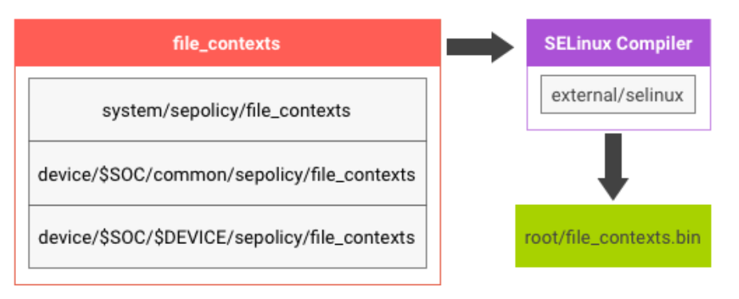
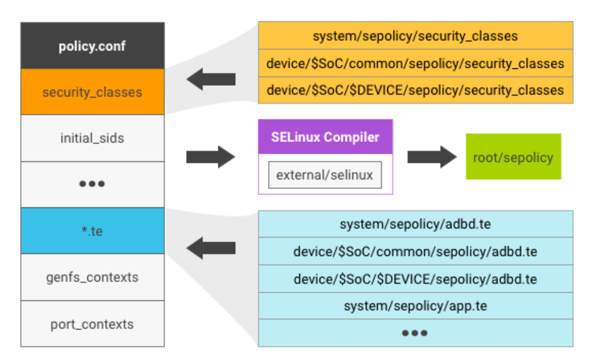
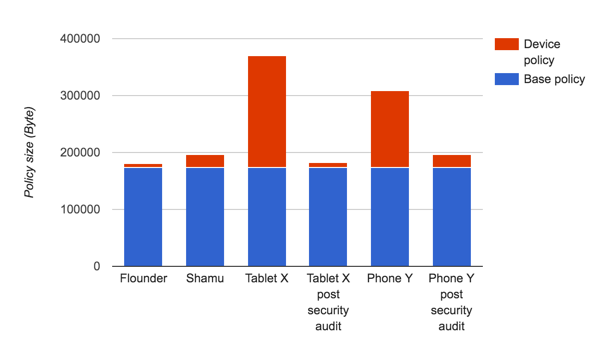

# Android SELinux

# 1. Android 中的安全增强型 Linux

作为 Android 安全模型的一部分，Android 使用安全增强型 Linux (SELinux) 对所有进程强制执行强制访问控制 (MAC)，甚至包括以 Root/超级用户权限运行的进程（Linux 功能）。很多公司和组织都为 Android 的 SELinux 实现做出了贡献。借助 SELinux，Android 可以更好地保护和限制系统服务、控制对应用数据和系统日志的访问、降低恶意软件的影响，并保护用户免遭移动设备上的代码可能存在的缺陷的影响。

SELinux 按照默认拒绝的原则运行：任何未经明确允许的行为都会被拒绝。SELinux 可按两种全局模式运行：

- 宽容模式：权限拒绝事件会被记录下来，但不会被强制执行。
- 强制模式：权限拒绝事件会被记录下来并强制执行。

Android 中包含 SELinux（处于强制模式）和默认适用于整个 AOSP 的相应安全政策。在强制模式下，非法操作会被阻止，并且尝试进行的所有违规行为都会被内核记录到 dmesg 和 logcat。开发时，您应该先利用这些错误信息对软件和 SELinux 政策进行优化，再对它们进行强制执行。如需了解详情，请参阅实现 SELinux。

此外，SELinux 还支持基于域的宽容模式。在这种模式下，可将特定域（进程）设为宽容模式，同时使系统的其余部分处于全局强制模式。简单来说，域是安全政策中用于标识一个进程或一组进程的标签，安全政策会以相同的方式处理所有具有相同域标签的进程。借助基于域的宽容模式，可逐步将 SELinux 应用于系统中越来越多的部分，还可以为新服务制定政策（同时确保系统的其余部分处于强制模式）。


## 1.1 背景

Android 安全模型部分基于应用沙盒的概念。每个应用都在自己的沙盒内运行。在 Android 4.3 之前的版本中，这些沙盒是通过为每个应用创建独一无二的 Linux UID（在应用安装时创建）来定义的。Android 4.3 及更高版本使用 SELinux 进一步定义 Android 应用沙盒的边界。

基于 Android 4.3（宽容模式）和 Android 4.4（部分强制模式），在 Android 5.0 及更高版本中，已全面强制执行 SELinux。通过此项变更，Android 已从对有限的一组关键域（installd、netd、vold 和 zygote）强制执行 SELinux 转为对所有域（超过 60 个）强制执行 SELinux。具体而言：

- 在 Android 5.x 及更高版本中，所有域均处于强制模式。
- init 以外的任何进程都不应在 init 域中运行。
- 出现任何常规拒绝事件（对于 block_device、socket_device、default_service），都表示设备需要一个特殊域。

Android 6.0 通过降低我们政策的宽容度强化了系统安全，从而实现更好的用户隔离和 IOCTL 过滤、降低可从设备/系统之外访问的服务面临的威胁、进一步强化 SELinux 域，以及高度限制对 /proc 的访问。

Android 7.0 更新了 SELinux 配置，以进一步锁定应用沙盒并缩小受攻击面。此版本还将单片式 mediaserver 堆栈拆分为较小的进程，以缩小其权限范围。如需了解详情，请参阅[利用更多的 Linux 内核防护功能保护 Android 系统](https://android-developers.googleblog.com/2016/07/protecting-android-with-more-linux.html)和[媒体堆栈安全强化](https://android-developers.googleblog.com/2016/05/hardening-media-stack.html)。

Android 8.0 更新了 SELinux 以便与 [Treble](https://source.android.com/devices/architecture?hl=zh-cn#hidl) 配合使用，后者可将较低级别的供应商代码与 Android 系统框架分离开来。此版本更新了 SELinux 政策以允许设备制造商和 SOC 供应商更新自己的政策部分、构建自己的映像（vendor.img、boot.img 等），然后更新这些映像而不受平台影响，反之亦然。

虽然可以在设备上运行更高/更新版本的平台（框架），但反之并不成立；供应商映像 (vendor.img/odm.img) 的版本不能高于平台 (system.img) 的版本。因此，较新版平台可能会带来 SELinux 兼容性问题，因为平台 SELinux 政策的版本要比该政策的供应商 SELinux 部分更新。Android 8.0 模型提供了一种[保持兼容性](https://source.android.com/security/selinux/compatibility?hl=zh-cn)的方法，以免进行不必要的同时 OTA。


## 1.2 其他资源

如需关于构建实用 SELinux 政策的帮助，请参阅以下资源：Android 不使用某些 SELinux 概念，在考虑外部文档时，请参阅明确性部分。

- [SELinux Notebooks](https://github.com/SELinuxProject/selinux-notebook)，SELinux 的最新参考文档。该文档进一步详细介绍了政策语言、每个关键字的含义以及安全上下文的计算方式。
- [有关强制执行 SELinux 政策的直观操作指南](https://opensource.com/business/13/11/selinux-policy-guide)
- [针对 Linux 的安全增强功能](https://events.static.linuxfound.org/sites/events/files/slides/abs2014_seforandroid_smalley.pdf)
- [安全增强 (SE) Android：在 Android 中引入灵活 MAC](http://www.cs.columbia.edu/~lierranli/coms6998-7Spring2014/papers/SEAndroid-NDSS2013.pdf)
- [将 SELinux 作为 Linux 安全模块实现](https://www.nsa.gov/resources/everyone/digital-media-center/publications/research-papers/assets/files/implementing-selinux-as-linux-security-module-report.pdf)
- [配置 SELinux 政策](https://www.nsa.gov/resources/everyone/digital-media-center/publications/research-papers/assets/files/configuring-selinux-policy-report.pdf)


# 2. SELinux 概念 

## 2.1 强制访问控制

安全增强型 Linux (SELinux) 是适用于 Linux 操作系统的强制访问控制 (MAC) 系统。作为 MAC 系统，它与 Linux 中用户非常熟悉的自主访问控制 (DAC) 系统不同。在 DAC 系统中，存在所有权的概念，即特定资源的所有者可以控制与该资源关联的访问权限。这种系统通常比较粗放，并且容易出现无意中提权的问题。MAC 系统则会在每次收到访问请求时都先咨询核心机构，再做出决定。

SELinux 已作为 Linux 安全模块 (LSM) 框架的一部分实现，该框架可识别各种内核对象以及对这些对象执行的敏感操作。其中每项操作要执行时，系统都会调用 LSM 钩子函数，以便根据不透明安全对象中存储的关于相应操作的信息来确定是否应允许执行相应操作。SELinux 针对这些钩子以及这些安全对象的管理提供了相应的实现，该实现可结合自己的政策来决定是否允许相应访问。

通过结合使用其他 Android 安全措施，Android 的访问控制政策能够大大降低遭到入侵的计算机和帐号可能蒙受的损失。Android 的自主访问控制和强制访问控制等工具可为您提供一种结构，确保您的软件仅以最低权限级别运行。这样可降低攻击造成的影响，并降低错误进程重写数据甚至是传输数据的可能性。

在 Android 4.3 及更高版本中，SELinux 开始为传统的自主访问控制 (DAC) 环境提供强制访问控制 (MAC) 保护功能。例如，软件通常情况下必须以 Root 用户帐号的身份运行，才能向原始块设备写入数据。在基于 DAC 的传统 Linux 环境中，如果 Root 用户遭到入侵，攻击者便可以利用该用户身份向每个原始块设备写入数据。不过，可以使用 SELinux 为这些设备添加标签，以便被分配了 Root 权限的进程可以只向相关政策中指定的设备写入数据。这样一来，该进程便无法重写特定原始块设备之外的数据和系统设置。

如需更多安全威胁示例以及使用 SELinux 解决安全威胁的方法，请参阅[用例](https://source.android.com/security/selinux/implement?hl=zh-cn#use_cases)。


## 2.2 强制执行级别

SELinux 可以在各种模式下实现：

- 宽容模式 - 仅记录但不强制执行 SELinux 安全政策。
- 强制模式 - 强制执行并记录安全政策。如果失败，则显示为 EPERM 错误。

在选择强制执行级别时只能二择其一，您的选择将决定您的政策是采取操作，还是仅允许您收集潜在的失败事件。宽容模式在实现过程中尤其有用。


## 2.3 类型、属性和规则

Android 依靠 SELinux 的类型强制执行 (TE) 组件来实施其政策。这表示所有对象（例如文件、进程或套接字）都具有相关联的类型。例如，默认情况下，应用的类型为 untrusted_app。对于进程而言，其类型也称为域。可以使用一个或多个属性为类型添加注解。属性可用于同时指代多种类型。

对象会映射到[类](https://android.googlesource.com/platform/system/sepolicy/+/refs/heads/master/private/security_classes)（例如文件、目录、符号链接、套接字），并且每个类的不同访问权限类型由[权限](https://android.googlesource.com/platform/system/sepolicy/+/refs/heads/master/private/access_vectors)表示。例如，file 类存在权限 open。虽然类型和属性作为 Android SELinux 政策的一部分会进行定期更新，但权限和类是静态定义的，并且作为新 Linux 版本的一部分也很少进行更新。

政策规则采用以下格式：allow source target:class permissions;，其中：

- source - 规则主题的类型（或属性）。谁正在请求访问权限？
- 目标 - 对象的类型（或属性）。对哪些内容提出了访问权限请求？
- 类 - 要访问的对象（例如，文件、套接字）的类型。
- 权限 - 要执行的操作（或一组操作，例如读取、写入）。

规则的一个示例如下：

```bash
allow untrusted_app app_data_file:file { read write };
```

这表示应用可以读取和写入带有 app_data_file 标签的文件。还有其他应用类型。例如，isolated_app 用于清单中含有 isolatedProcess=true 的应用服务。Android 对涵盖应用的所有类型使用名为 appdomain 的属性，而不是对这两种类型重复同一规则：

```bash
# Associate the attribute appdomain with the type untrusted_app.
typeattribute untrusted_app, appdomain;

# Associate the attribute appdomain with the type isolated_app.
typeattribute isolated_app, appdomain;

allow appdomain app_data_file:file { read write };
```

当编写的规则指定了某个属性名称时，该名称会自动扩展为列出与该属性关联的所有域或类型。一些重要属性包括：

- domain - 与所有进程类型相关联的属性
- file_type - 与所有文件类型相关联的属性。

**宏**

特别是对于文件访问权限，有很多种权限需要考虑。例如，read 权限不足以打开相应文件或对其调用 stat。为了简化规则定义，Android 提供了一组宏来处理最常见的情况。例如，若要添加 open 等缺少的权限，可以将上述规则改写为：

```bash
allow appdomain app_data_file:file rw_file_perms;
```

如需查看实用宏的更多示例，请参阅 global_macros 和 te_macros 文件。请尽可能使用宏，以降低因相关权限被拒而导致失败的可能性。

定义类型后，需要将其与所代表的文件或进程相关联。如需详细了解如何实现这种关联，请参阅实现 SELinux。如需详细了解规则，请参阅 SELinux Notebook。


## 2.4 安全上下文和类别

调试 SELinux 政策或为文件添加标签时（通过 file_contexts 或运行 ls -Z），您可能会遇到安全上下文（也称为标签）。例如 u:r:untrusted_app:s0:c15,c256,c513,c768。安全上下文的格式为：user:role:type:sensitivity[:categories]。您通常可以忽略上下文的 user、role 和 sensitivity 字段（请参阅[明确性](https://source.android.com/docs/security/features/selinux/concepts?hl=zh-cn#specificity)）。上一部分介绍了 type 字段。categories 是 SELinux 中[多级安全 (MLS)](https://github.com/SELinuxProject/selinux-notebook/blob/main/src/mls_mcs.md#multi-level-and-multi-category-security) 支持的一部分。从 Android S 开始，类别被用于：

- 分隔应用数据，使其不被其他应用访问。
- 分隔不同实际用户的应用数据。


## 2.5 明确性

Android 并不会使用 SELinux 提供的所有功能。阅读外部文档时，请记住以下几点：

- AOSP 中的大部分政策都是使用内核政策语言定义的。在使用通用中间语言 (CIL) 时，会存在一些例外情况。
- 不使用 SELinux 用户。唯一定义的用户是 u。必要时，系统会使用安全上下文的类别字段表示实际用户。
- 不使用 SELinux 角色和基于角色的访问权限控制 (RBAC)。定义并使用了两个默认角色：r（适用于主题）和 object_r（适用于对象）。
- 不使用 SELinux 敏感度。已始终设置好默认的 s0 敏感度。
- 不使用 SELinux 布尔值。一旦设备政策构建完成，该政策不再取决于设备状态。这简化了政策的审核和调试过程。


# 3. 实现 SELinux 

SELinux 被设置为“默认拒绝”模式，这表示，对于在内核中存在钩子的每一次访问，都必须获得政策的明确许可。这意味着政策文件中包含规则、类型、类、权限等方面的大量信息。关于 SELinux 的完整注意事项不在本文档的讨论范围之内，现在您必须要了解的是在启动新的 Android 设备时如何编写政策规则。目前有大量关于 SELinux 的信息可供您参考。关于建议的资源，请参阅支持文档。


## 3.1 关键文件

如需启用 SELinux，请集成最新的 Android 内核，然后整合 [system/sepolicy](https://android.googlesource.com/platform/system/sepolicy/) 目录中的文件。这些文件在编译后会包含 SELinux 内核安全政策，并涵盖上游 Android 操作系统。

通常情况下，您不能直接修改 system/sepolicy 文件，但您可以添加或修改自己的设备专用政策文件（位于 /device/manufacturer/device-name/sepolicy 目录中）。在 Android 8.0 及更高版本中，您对这些文件所做的更改只会影响供应商目录中的政策。如需详细了解 Android 8.0 及更高版本中的公共 sepolicy 分离，请参阅[在 Android 8.0 及更高版本中自定义 SEPolicy](https://source.android.com/security/selinux/customize?hl=zh-cn#android-o)。无论是哪个 Android 版本，您都仍需要修改以下文件：


**政策文件**

以 *.te 结尾的文件是 SELinux 政策源代码文件，用于定义域及其标签。您可能需要在 /device/manufacturer/device-name/sepolicy 中创建新的政策文件，但您应尽可能尝试更新现有文件。


**上下文的描述文件**

您可以在上下文的描述文件中为您的对象指定标签。

- file_contexts 用于为文件分配标签，并且可供多种用户空间组件使用。在创建新政策时，请创建或更新该文件，以便为文件分配新标签。如需应用新的 file_contexts，请重新构建文件系统映像，或对要重新添加标签的文件运行 restorecon。在升级时，对 file_contexts 所做的更改会在升级过程中自动应用于系统和用户数据分区。此外，您还可以通过以下方式使这些更改在升级过程中自动应用于其他分区：在以允许读写的方式装载相应分区后，将 restorecon_recursive 调用添加到 init.board.rc 文件中。
- genfs_contexts 用于为不支持扩展属性的文件系统（例如，proc 或 vfat）分配标签。此配置会作为内核政策的一部分进行加载，但更改可能对内核 inode 无效。要全面应用更改，您需要重新启动设备，或卸载并重新装载文件系统。此外，通过使用 context=mount 选项，您还可以为装载的特定系统文件（例如 vfat）分配特定标签。
- property_contexts 用于为 Android 系统属性分配标签，以便控制哪些进程可以设置这些属性。在启动期间，init 进程会读取此配置。
- service_contexts 用于为 Android Binder 服务分配标签，以便控制哪些进程可以为相应服务添加（注册）和查找（查询）Binder 引用。在启动期间，servicemanager 进程会读取此配置。
- seapp_contexts 用于为应用进程和 /data/data 目录分配标签。在每次应用启动时，zygote 进程都会读取此配置；在启动期间，installd 会读取此配置。
- mac_permissions.xml 用于根据应用签名和应用软件包名称（后者可选）为应用分配 seinfo 标记。随后，分配的 seinfo 标记可在 seapp_contexts 文件中用作密钥，以便为带有该 seinfo 标记的所有应用分配特定标签。在启动期间，system_server 会读取此配置。


**BoardConfig.mk makefile**

修改或添加政策文件和上下文的描述文件后，请更新您的 /device/manufacturer/device-name/BoardConfig.mk makefile 以引用 sepolicy 子目录和每个新的政策文件。如需详细了解 BOARD_SEPOLICY 变量，请参阅 system/sepolicy/README 文件。

```bash
BOARD_SEPOLICY_DIRS += \
        <root>/device/manufacturer/device-name/sepolicy

BOARD_SEPOLICY_UNION += \
        genfs_contexts \
        file_contexts \
        sepolicy.te
```

重新进行构建后，您的设备会启用 SELinux。现在，您可以根据您向 Android 操作系统添加的内容自定义 SELinux 政策（如自定义中所述），也可以验证现有设置（如验证中所述）。

在新政策文件和 BoardConfig.mk 更新部署到位后，新政策设置会自动内置到最终的内核政策文件中。如需详细了解如何在设备上构建 sepolicy，请参阅构建 sepolicy。


## 3.2 实现

如需开始使用 SELinux，请执行以下操作：

1. 在内核中启用 SELinux：CONFIG_SECURITY_SELINUX=y

2. 更改 kernel_cmdline 参数，以便：

```bash
BOARD_KERNEL_CMDLINE := androidboot.selinux=permissive
```

这仅适用于初始制定设备政策的情况。在拥有初始引导程序政策后，请移除此参数，以便将设备恢复强制模式，否则设备将无法通过 CTS 验证。

3. 以宽容模式启动系统，看看在启动时会遇到哪些拒绝事件：

在 Ubuntu 14.04 或更高版本中，请运行以下命令：

```bash
adb shell su -c dmesg | grep denied | audit2allow -p out/target/product/BOARD/root/sepolicy
```

在 Ubuntu 12.04 中，请运行以下命令：

```bash
adb pull /sys/fs/selinux/policy
adb logcat -b all | audit2allow -p policy
```

4. 评估与以下内容类似的警告的输出：init: Warning! Service name needs a SELinux domain defined; please fix!。如需查看相关说明和工具，请参阅验证。

5. 标识设备以及需要添加标签的其他新文件。

6. 为您的对象使用现有标签或新标签。查看 *_contexts 文件，了解之前是如何为内容添加标签的，然后根据对标签含义的了解分配一个新标签。这个标签最好是能够融入到政策中的现有标签，但有时也需要使用新标签，而且还需要提供关于访问该标签的规则。将您的标签添加到相应的上下文的描述文件中。

7. 标识应该拥有自己的安全域的域/进程。您可能需要为每一项分别编写一个全新的政策。例如，从 init 衍生的所有服务都应该有自己的安全域。以下命令有助于查看保持运行的服务（不过所有服务都需要如此处理）：

```bash
adb shell su -c ps -Z | grep init
```

```bash
adb shell su -c dmesg | grep 'avc: '
```

8. 查看 init.device.rc 以发现没有域类型的域。请在开发过程早期为其提供相应的域，以避免向 init 添加规则或将 init 访问权限与其自身政策中的访问权限混淆。

9. 设置 BOARD_CONFIG.mk 以使用 BOARD_SEPOLICY_* 变量。如需详细了解如何进行此项设置，请参阅 system/sepolicy 中的 README。

10. 检查 init.device.rc 和 fstab.device 文件，确保每一次使用 mount 都对应一个添加了适当标签的文件系统，或者指定了 context= mount 选项。

11. 查看每个拒绝事件，并创建 SELinux 政策来妥善处理每个拒绝事件。请参阅自定义中的示例。

建议从 AOSP 中的政策入手，然后在这些政策的基础上创建自己的自定义政策。要详细了解政策策略以及其中一些步骤，请参阅编写 SELinux 政策。


## 3.3 用例

下面列举了一些在开发软件以及制定关联的 SELinux 政策时需要注意的具体漏洞：

符号链接 - 由于符号链接以文件形式显示，因此系统通常将其作为文件进行读取，而这可能会导致漏洞。例如，某些特权组件（例如 init）会更改某些文件的权限，有时会使之极度开放。

这样一来，攻击者便可以将这些文件替换成指向其控制的代码的符号链接，从而重写任意文件。但如果您知道自己的应用绝不会遍历符号链接，则可以通过 SELinux 来禁止您的应用遍历符号链接。

系统文件 - 以应该只有系统服务器可以修改的一系列系统文件为例。由于 netd、init 和 vold 是以 Root 身份运行的，因此它们也可以访问这些系统文件。这样一来，如果 netd 遭到入侵，这些文件乃至系统服务器本身都可能遭到入侵。

借助 SELinux，您可以将这些文件标识为系统服务器数据文件。这样一来，系统服务器就是唯一对这些文件具有读写权限的域。即使 netd 遭到入侵，它也无法将域切换到系统服务器域并访问这些系统文件，就算它是以 Root 身份运行的也是如此。

应用数据 - 另一个示例是必须以 Root 身份运行但不应获得应用数据访问权限的一系列函数。这一项非常有用，因为它可以做出广泛的声明，例如禁止与应用数据无关的特定域访问互联网。

setattr - 对于 chmod 和 chown 等命令，您可以标识关联域可以在哪些文件中进行 setattr 操作。这样一来，便可以禁止对这些文件之外的任何文件进行这类更改，即使以 Root 身份进行也不例外。因此，应用可以对带 app_data_files 标签的文件运行 chmod 和 chown，但不能对带 shell_data_files 或 system_data_files 标签的文件运行这些命令。


# 4. 自定义 SELinux 

集成基本级别的 SELinux 功能并全面分析结果后，您可以添加自己的政策设置，以便涵盖对 Android 操作系统所做的自定义。这些政策必须仍然满足 [Android 兼容性计划](https://source.android.com/compatibility?hl=zh-cn)的要求，并且不得移除默认的 SELinux 设置。

制造商不得移除现有的 SELinux 政策，否则可能会破坏 Android SELinux 的实施方式及其管控的应用。这包括可能需要改进以遵守政策并正常运行的第三方应用。应用必须无需任何修改即可继续在启用了 SELinux 的设备上正常运行。

当开始自定义 SELinux 时，请注意：

- 为所有新的守护进程编写 SELinux 政策
- 尽可能使用预定义的域
- 为作为 init 服务衍生的所有进程分配域
- 在编写政策之前先熟悉相关的宏
- 向 AOSP 提交对核心政策进行的更改

同时，谨记下列禁忌：

- 不得创建不兼容的政策
- 不得允许对最终用户政策进行自定义
- 不得允许对移动设备管理 (MDM) 政策进行自定义
- 不得恐吓违反政策的用户
- 不得添加后门程序

如需查看具体要求，请参阅 Android 兼容性定义文档中的“内核安全功能”部分。

SELinux 采用白名单方法，这意味着只能授予政策中明确允许的访问权限。由于 Android 的默认 SELinux 政策已经支持 Android 开放源代码项目，因此您无需以任何方式修改 SELinux 设置。如果您要自定义 SELinux 设置，则应格外谨慎，以免破坏现有应用。要开始使用，请按下列步骤操作：

1. 使用最新的 Android 内核。
2. 采用最小权限原则。
3. 仅针对您向 Android 添加的内容调整 SELinux 政策。默认政策能够自动适用于 Android 开源项目代码库。
4. 将各个软件组件拆分成多个负责执行单项任务的模块。
5. 创建将这些任务与无关功能隔离开来的 SELinux 政策。
6. 将这些政策放在 /device/manufacturer/device-name/sepolicy 目录中的 *.te 文件内（te 是 SELinux 政策源代码文件使用的扩展名），然后使用 BOARD_SEPOLICY 变量将它们纳入到您的 build 中。
7. 先将新域设为宽容域。为此，可以在该域的 .te 文件中使用宽容声明。
8. 分析结果并优化域定义。
9. 当 userdebug 版本中不再出现拒绝事件时，移除宽容声明。

完成 SELinux 政策更改的集成工作后，请在开发工作流程中添加一个步骤，以确保向前兼容 SELinux。在理想的软件开发过程中，SELinux 政策只会在软件模型发生变化时才需要更改，而不会在实际的实施方式变化时更改。

当您开始自定义 SELinux 时，首先要审核自己向 Android 添加的内容。如果添加的是执行新功能的组件，则在开启强制模式之前，您需要先确认该组件是否符合 Android 的安全政策，以及原始设备制造商 (OEM) 制定的所有相关政策。

为了防止出现不必要的问题，与其过度限制和不兼容，不如过度宽泛和过度兼容，因为前者会导致设备功能损坏。不过，如果您的更改能够惠及其他人，则应将这些更改作为补丁程序提交至默认 SELinux 政策。如果相应补丁程序已应用于默认安全政策，您将不需要针对每个新的 Android 版本进行此项更改。


## 4.1 政策声明示例

SELinux 基于 M4 计算机语言，因此支持多种有助于节省时间的宏。

在以下示例中，所有域都被授予向 /dev/null 读写数据的权限以及从 /dev/zero 读取数据的权限。

```bash
# Allow read / write access to /dev/null
allow domain null_device:chr_file { getattr open read ioctl lock append write};

# Allow read-only access to /dev/zero
allow domain zero_device:chr_file { getattr open read ioctl lock };
```

此声明也可以通过 SELinux *_file_perms 宏编写（简短版）：

```bash
# Allow read / write access to /dev/null
allow domain null_device:chr_file rw_file_perms;

# Allow read-only access to /dev/zero
allow domain zero_device:chr_file r_file_perms;
```


## 4.2 政策示例

以下是一个完整的 DHCP 政策示例，我们将在下文中对其进行分析：

```bash
type dhcp, domain;
permissive dhcp;
type dhcp_exec, exec_type, file_type;
type dhcp_data_file, file_type, data_file_type;

init_daemon_domain(dhcp)
net_domain(dhcp)

allow dhcp self:capability { setgid setuid net_admin net_raw net_bind_service
};
allow dhcp self:packet_socket create_socket_perms;
allow dhcp self:netlink_route_socket { create_socket_perms nlmsg_write };
allow dhcp shell_exec:file rx_file_perms;
allow dhcp system_file:file rx_file_perms;
# For /proc/sys/net/ipv4/conf/*/promote_secondaries
allow dhcp proc_net:file write;
allow dhcp system_prop:property_service set ;
unix_socket_connect(dhcp, property, init)

type_transition dhcp system_data_file:{ dir file } dhcp_data_file;
allow dhcp dhcp_data_file:dir create_dir_perms;
allow dhcp dhcp_data_file:file create_file_perms;

allow dhcp netd:fd use;
allow dhcp netd:fifo_file rw_file_perms;
allow dhcp netd:{ dgram_socket_class_set unix_stream_socket } { read write };
allow dhcp netd:{ netlink_kobject_uevent_socket netlink_route_socket
netlink_nflog_socket } { read write };
```

下面我们来分析一下该示例：

在第一行（即类型声明）中，该政策声明 DHCP 守护进程将沿用基本的安全政策 (domain)。在前面的声明示例中，DHCP 可以向 /dev/null 读写数据。

在第二行中，DHCP 被声明为宽容域。

在 init_daemon_domain(dhcp) 这一行中，该政策声明 DHCP 是从 init 衍生而来的，并且可以与其通信。

在 net_domain(dhcp) 这一行中，该政策允许 DHCP 使用 net 域中的常用网络功能，例如读取和写入 TCP 数据包、通过套接字进行通信，以及执行 DNS 请求。

在 allow dhcp proc_net:file write; 这一行中，该政策声明 DHCP 可以向 /proc 中的特定文件写入数据。这一行显示了 SELinux 的详细文件标签。它使用 proc_net 标签来限定 DHCP 仅对 /proc/sys/net 中的文件具有写入权限。

该示例的最后一部分以 allow dhcp netd:fd use; 开头，描述了允许应用之间如何交互。该政策声明 DHCP 和 netd 之间可通过文件描述符、FIFO 文件、数据报套接字以及 UNIX 信息流套接字进行通信。DHCP 只能向数据报套接字和 UNIX 信息流套接字中读写数据，但不能创建或打开此类套接字。


## 4.3 可用控件

| 类      | 权限 |
| ------- | ---- |
| 文件    | ioctl read write create getattr setattr lock relabelfrom relabelto append unlink link rename execute swapon quotaon mounton |
| 目录    | add_name remove_name reparent search rmdir open audit_access execmod |
| 套接字  | ioctl read write create getattr setattr lock relabelfrom relabelto append bind connect listen accept getopt setopt shutdown recvfrom sendto recv_msg send_msg name_bind |
| 文件系统 | mount remount unmount getattr relabelfrom relabelto transition associate quotamod quotaget |
| 进程     | fork transition sigchld sigkill sigstop signull signal ptrace getsched setsched getsession getpgid setpgid getcap setcap share getattr setexec setfscreate noatsecure siginh setrlimit rlimitinh dyntransition setcurrent execmem execstack execheap setkeycreate setsockcreate |
| 安全     | compute_av compute_create compute_member check_context load_policy compute_relabel compute_user setenforce setbool setsecparam setcheckreqprot read_policy |
| 权能     | chown dac_override dac_read_search fowner fsetid kill setgid setuid setpcap linux_immutable net_bind_service net_broadcast net_admin net_raw ipc_lock ipc_owner sys_module sys_rawio sys_chroot sys_ptrace sys_pacct sys_admin sys_boot sys_nice sys_resource sys_time sys_tty_config mknod lease audit_write audit_control setfcap |
| 更多     | 还有更多 |


## 4.4 neverallow 规则

SELinux neverallow 规则用于禁止在任何情况下都不应该发生的行为。 通过执行兼容性测试，现在各种设备上都会强制执行 SELinux neverallow 规则。

以下准则旨在协助制造商在自定义过程中避免出现与 neverallow 规则相关的错误。此处使用的规则编号与 Android 5.1 中使用的编号一致，并且会因版本而异。

规则 48：neverallow { domain -debuggerd -vold -dumpstate -system_server } self:capability sys_ptrace;
请参阅 ptrace 的帮助页面。sys_ptrace 权能用于授予对任何进程执行 ptrace 命令的权限，拥有该权限的组件能够对其他进程进行广泛的控制。只有该规则中列出的指定系统组件才能享有该权限。如果需要该权能，则通常表明存在的某些内容不适用于面向用户的 build 或存在不需要的功能。请移除不必要的组件。

规则 76：neverallow { domain -appdomain -dumpstate -shell -system_server -zygote } { file_type -system_file -exec_type }:file execute;
该规则旨在防止执行系统中的任意代码。具体来说，该规则声明仅执行 /system 中的代码，以便通过启动时验证等机制实现安全保证。通常，在遇到与 neverallow 规则相关的问题时，最好的解决办法是将违规代码移到 /system 分区。


## 4.5 在 Android 8.0 及更高版本中自定义 SEPolicy

此部分的指南适用于 Android 8.0 及更高版本中的供应商 SELinux 政策，包括有关 Android 开源项目 (AOSP) SEPolicy 和 SEPolicy 扩展的详细信息。如需详细了解 SELinux 政策如何在各分区和 Android 版本中保持兼容，请参阅兼容性。

**政策的存放位置**

在 Android 7.0 及更低版本中，设备制造商可以将政策添加到 BOARD_SEPOLICY_DIRS，包括用来在不同设备类型之间增强 AOSP 政策的政策。在 Android 8.0 及更高版本中，将政策添加到 BOARD_SEPOLICY_DIRS 会将该政策仅存放在供应商映像中。

在 Android 8.0 及更高版本中，政策位于 AOSP 中的以下位置：

- system/sepolicy/public。其中包括所导出的用于供应商特定政策的政策。所有内容都会纳入 Android 8.0 兼容性基础架构。公共政策会保留在不同版本上，因此您可以在自定义政策的 /public 中添加任何内容。正因如此，可存放在 /public 中的政策类型的限制性更强。将此目录视为相应平台的已导出政策 API：处理 /system 与 /vendor 之间的接口的所有内容都位于这里。
- system/sepolicy/private。包括系统映像正常运行所必需（但供应商映像政策应该不知道）的政策。
- system/sepolicy/vendor。包括位于 /vendor 但存在于核心平台树（非设备特定目录）中的组件的相关政策。这是构建系统区分设备和全局组件的软件工件；从概念上讲，这是下述设备专用政策的一部分。
- device/manufacturer/device-name/sepolicy。包含设备专用政策，以及对政策进行的设备自定义（在 Android 8.0 及更高版本中，该政策对应于供应商映像组件的相关政策）。

在 Android 11 及更高版本中，system_ext 和 product 分区还可以包含特定于分区的政策。system_ext 和 product 政策也分为公共政策和私有政策，且供应商可以使用 system_ext 和 product 的公共政策（例如系统政策）。

- SYSTEM_EXT_PUBLIC_SEPOLICY_DIRS。包括所导出的用于供应商特定政策的政策。已安装到 system_ext 分区。
- SYSTEM_EXT_PRIVATE_SEPOLICY_DIRS。包括 system_ext 映像正常运行所必需（但供应商映像政策应该不知道）的政策。已安装到 system_ext 分区。
- PRODUCT_PUBLIC_SEPOLICY_DIRS。包括所导出的用于供应商特定政策的政策。已安装到 product 分区。
- PRODUCT_PRIVATE_SEPOLICY_DIRS。包括 product 映像正常运行所必需（但供应商映像政策应该不知道）的政策。已安装到 product 分区。

注意：使用 GSI 时，系统不会装载 OEM 的 system_ext 和 product 分区。使用 OEM 的 system_ext 和 product 公共政策的供应商 sepolicy 中的规则变为 NOP，因为缺少 OEM 专用类型定义。

注意：在使用 system_ext 和 product 公共政策时要格外小心。公共政策充当 system_ext/product 和 vendor 之间的导出 API。合作伙伴应自行管理兼容性问题。

**支持的政策场景**

在搭载 Android 8.0 及更高版本的设备上，供应商映像必须使用 OEM 系统映像和 Google 提供的参考 AOSP 系统映像（并在此参考映像上传递 CTS），这样可确保框架与供应商代码完全分离开来。此类设备支持以下场景。

**仅含供应商映像的扩展**

示例：从支持相关进程的供应商映像向 vndservicemanager 添加新服务。

与搭载旧版 Android 的设备一样，请在 device/manufacturer/device-name/sepolicy 中添加针对特定设备的自定义配置。管控供应商组件如何与其他供应商组件（仅限这些组件）交互的新政策应涉及仅存在于 device/manufacturer/device-name/sepolicy 中的类型。此处编写的政策允许运行供应商的代码，不会在仅针对框架的 OTA 期间更新，并且将存在于具有参考 AOSP 系统映像的设备上的组合政策中。

**支持使用 AOSP 的供应商映像**

示例：添加用于实现 AOSP 定义的 HAL 的新进程（通过供应商映像中的 hwservicemanager 注册）。

与搭载旧版 Android 的设备一样，请在 device/manufacturer/device-name/sepolicy 中执行针对特定设备的自定义配置。作为 system/sepolicy/public/ 的一部分导出的政策可供使用，并且包含在供应商政策中。公共政策中的类型和属性可以用在新规则中，指示与新的供应商专用位的交互，但要遵守所提供的 neverallow 限制。与仅含供应商映像的扩展情形一样，此处的新政策不会在仅针对框架的 OTA 期间更新，并且将存在于具有参考 AOSP 系统映像的设备上的组合政策中。

**仅含系统映像的扩展**

示例：添加一种仅供系统映像中的其他进程访问的新服务（通过 servicemanager 注册）。

将此政策添加到 system/sepolicy/private。您可以添加额外的进程或对象以在合作伙伴系统映像中启用功能，前提是这些新位不需要与供应商映像上的新组件互动（具体而言，即使没有供应商映像中的政策，此类进程或对象也必须能够完全正常运行）。system/sepolicy/public 导出的政策在此处的提供方式与仅含供应商映像的扩展相同。此政策包含在系统映像中，可以在仅针对框架的 OTA 期间进行更新，但在使用参考 AOSP 系统映像时不会存在。

**提供扩展 AOSP 组件的供应商映像扩展**

示例：供同样存在于 AOSP 系统映像中的扩展客户端（例如扩展的 system_server）使用的新增非 AOSP HAL。

系统与供应商之间的交互政策必须纳入供应商分区上的 device/manufacturer/device-name/sepolicy 目录中。这类似于上述添加供应商映像支持以使用参考 AOSP 映像的场景，不同之处在于修改后的 AOSP 组件可能还需要其他政策才能正确使用系统分区的其余部分（只要这些组件仍具有公开 AOSP 类型标签就可以）。

用于控制公开 AOSP 组件与仅含系统映像的扩展之间的交互的政策应该位于 system/sepolicy/private 中。

**仅访问 AOSP 接口的系统映像扩展**

示例：新的非 AOSP 系统进程必须访问 AOSP 所依赖的 HAL。

这与仅含系统映像的扩展示例类似，不同之处在于新的系统组件可能会通过 system/vendor 接口进行交互。新系统组件的相关政策必须位于 system/sepolicy/private，只要它是通过 AOSP 已在 system/sepolicy/public 中建立的接口发挥作用就可以接受（即，该目录中包含功能正常运行所需的类型和属性）。虽然可以在设备专用政策中添加政策，但无法在仅针对框架的更新中使用其他 system/sepolicy/private 类型或进行更改（以任何影响政策的方式）。此政策可以在仅针对框架的 OTA 期间更改，但在使用 AOSP 系统映像时不会存在（也不会有新的系统组件）。

**提供新系统组件的供应商映像扩展**

示例：添加新的非 AOSP HAL 以供无需 AOSP 模拟的客户端进程使用（因此，该进程需要自己的域）。

与 AOSP 扩展示例类似，系统与供应商之间的交互政策必须位于供应商分区上的 device/manufacturer/device-name/sepolicy 目录中（以确保系统政策不知道与供应商相关的详细信息）。您可以在 system/sepolicy/public 中添加新的用于扩展该政策的公共类型；只能在现有 AOSP 政策的基础上进行添加，即不要移除 AOSP 公共政策。新的公共类型随后可用于 system/sepolicy/private 和 device/manufacturer/device-name/sepolicy 中的政策。

请注意，每次向 system/sepolicy/public 添加内容都会增加复杂程度，因为这会增加必须在映射文件中跟踪的新兼容性保证（会受到其他限制的约束）。只有新类型和相关项允许在 system/sepolicy/public 中添加规则；属性和其他政策声明不受支持。此外，新的公共类型不能用于直接为 /vendor 政策中的对象添加标签。

**不受支持的政策场景**

搭载 Android 8.0 及更高版本的设备不支持以下政策场景和示例。

系统映像的其他扩展，这些扩展需要在仅支持框架的 OTA 之后获得新供应商映像组件的权限
示例：在下一个 Android 版本中添加新的非 AOSP 系统进程（需要自己的域），该进程需要访问新的非 AOSP HAL。

与新（非 AOSP）系统和供应商组件之间的交互类似，不同之处在于新的系统类型是在仅针对框架的 OTA 期间引入的。虽然这个新类型可以添加到 system/sepolicy/public 中的政策里，但现有的供应商政策不知道这个新类型，因为它仅跟踪 Android 8.0 系统公共政策。AOSP 可通过某个属性（例如 hal_foo 属性）要求取得供应商提供的资源，进而处理此情况，但由于属性合作伙伴扩展在 system/sepolicy/public 中不受支持，因此供应商政策无法使用此方法。访问权限必须由之前存在的公共类型提供。

示例：对系统进程（AOSP 或非 AOSP）的更改必须更改它与新的非 AOSP 供应商组件进行交互的方式。

在针对系统映像编写政策时，对具体的供应商自定义政策必定不知情。因此，系统会通过 system/sepolicy/public 中的属性公开 AOSP 中涉及特定接口的政策，以便供应商政策可以选择启用将来使用这些属性的系统政策。不过，system/sepolicy/public 中的属性扩展不受支持，因此用于指示系统组件如何与新供应商组件交互的全部政策（该政策不由 AOSP system/sepolicy/public 中已存在的属性进行处理）都必须位于 device/manufacturer/device-name/sepolicy 中。这意味着系统类型无法在仅针对框架的 OTA 期间更改已为供应商类型授予的访问权限。


# 5. 构建 SELinux 政策 

本文介绍了如何构建 SELinux 政策。SELinux 政策组合使用核心 AOSP 政策（平台）和设备专用政策（供应商）进行构建。从 Android 4.4 一直到 Android 7.0 的 SELinux 政策构建流程合并了所有 sepolicy Fragment，然后在根目录中生成了整体文件。这意味着 SoC 供应商和 ODM 制造商每次修改政策时，都修改了 boot.img（针对非 A/B 设备）或 system.img（针对 A/B 设备）。

在 Android 8.0 及更高版本中，平台政策和供应商政策是单独构建的。SoC 供应商和原始设备制造商 (OEM) 可以更新自己那部分政策，构建自己的映像（例如 vendor.imgvendor.img 和 boot.img），然后独立于平台更新来更新这些映像。

不过，由于模块化的 SELinux 政策文件存储在 /vendor 分区中，因此 init 进程必须提早装载系统分区和供应商分区，以便能够从这些分区中读取 SELinux 文件，并将这些文件与系统目录中的核心 SELinux 文件合并（装载操作要在将这些文件加载到内核之前进行）。


## 5.1 源文件

SELinux 的构建逻辑位于以下文件中：

- external/selinux：外部 SELinux 项目，用于构建 HOST 命令行实用工具以编译 SELinux 政策和标签。

    - external/selinux/libselinux：Android 仅使用外部 libselinux 项目的一个子集，以及一些 Android 专用自定义内容。如需了解详情，请参阅 external/selinux/README.android。

    - external/selinux/libsepol：

        - chkcon：确定安全环境对指定的二进制政策（主机可执行文件）是否有效。

        - libsepol：用于操控二进制安全政策（主机静态/共享库、目标静态库）的 SELinux 库。

    - external/selinux/checkpolicy：SELinux 政策编译器（主机可执行文件：checkpolicy、checkmodule 和 dispol）。依赖于 libsepol。

- system/sepolicy：核心 Android SELinux 政策配置，包括上下文和政策文件。主要 sepolicy 构建逻辑也位于此处 (system/sepolicy/Android.mk)。

如需详细了解 system/sepolicy 中的文件，请参阅实现 SELinux。


## 5.2 Android 7.0 及更低版本

本部分介绍如何在 Android 7.x 及更低版本中构建 SELinux 政策。

**构建 SELinux 政策**

SELinux 政策通过将核心 AOSP 政策与设备专用自定义政策合并而创建。然后，系统会将合并后的政策传递给政策编译器和各种检查工具。设备专用自定义政策通过在设备专用 Boardconfig.mk 文件中定义的 BOARD_SEPOLICY_DIRS 变量完成。该全局构建变量包含一个用于指定其他政策文件搜索顺序的目录列表。

例如，SoC 供应商和 ODM 可以分别添加一个目录，一个用于 SoC 专用设置，另一个用于设备专用设置，以生成针对指定设备的最终 SELinux 配置：

- BOARD_SEPOLICY_DIRS += device/SOC/common/sepolicy
- BOARD_SEPOLICY_DIRS += device/SoC/DEVICE/sepolicy

system/sepolicy 和 BOARD_SEPOLICY_DIRS 中的 file_contexts 文件内容会连接在一起，以便在设备上生成 file_contexts.bin：



图 1. SELinux 构建逻辑

sepolicy 文件由多个源文件组成：

- 纯文本 policy.conf 是通过依次连接 security_classes、initial_sids、*.te 文件、genfs_contexts 以及 port_contexts 而生成的。
- 对于每个文件（例如 security_classes），其内容都是由 system/sepolicy/ 和 BOARDS_SEPOLICY_DIRS 下的同名文件连接而成。
- policy.conf 会被发送到 SELinux 编译器进行语法检查并被编译为二进制格式，从而生成设备上的 sepolicy。



图 2. SELinux 政策文件

**SELinux 文件**

编译完成后，搭载 Android 7.x 及更低版本的设备通常包含以下与 SELinux 相关的文件：

- selinux_version
- sepolicy：合并政策文件后输出的二进制文件（例如 security_classes、initial_sids 和 *.te）
- file_contexts
- property_contexts
- seapp_contexts
- service_contexts
- system/etc/mac_permissions.xml

如需了解详情，请参阅实现 SELinux。

**SELinux 初始化**

在系统启动时，SELinux 处于宽容模式（不处于强制模式）。init 进程会执行以下任务：

- 通过 /sys/fs/selinux/load 将 sepolicy 文件从 ramdisk 加载到内核。
- 将 SELinux 切换到强制模式。
- 执行 re-exec()，以将 SELinux 域规则应用于其自身。

为了缩短启动时间，请尽早对 init 进程执行 re-exec()。


## 5.3 Android 8.0 及更高版本

在 Android 8.0 中，SELinux 政策拆分为平台组件和供应商组件，以允许独立进行平台/供应商政策更新，同时保持兼容性。

平台 sepolicy 进一步拆分为平台专用部分和平台公共部分，以便将特定类型和属性导出到供应商政策编写器。平台会保证将公共类型/属性作为指定平台版本的稳定 API 进行维护。借助平台映射文件，平台可以保证与之前多个版本的公共类型/属性兼容。

**平台公共 sepolicy**

平台公共 sepolicy 包含 system/sepolicy/public 下定义的所有内容。平台可以假设在公共政策下定义的类型和属性是指定平台版本的稳定 API。这构成了 sepolicy 中平台导出的部分，供应商（即设备）政策开发者可以在这部分 sepolicy 中编写其他设备专用政策。

类型的版本取决于在编写供应商文件时参照的政策版本（由 PLATFORM_SEPOLICY_VERSION 构建变量定义）。然后，相应版本的公共政策（以其原始形式）便会与供应商政策一起包含在平台政策中。因此，最终政策包含平台专用政策、当前平台的公共 sepolicy、设备专用政策，以及与编写设备政策时参照的平台版本相对应的适当版本的公共政策。

**平台专用 sepolicy**

平台专用 sepolicy 包含 /system/sepolicy/private 下定义的所有内容。这部分政策构成了运行平台功能所需的平台专用类型、权限和属性。这些内容不会导出到 vendor/device 政策编写器。非平台政策编写器不得根据平台专用 sepolicy 中定义的类型/属性/规则编写政策扩展项。此外，在进行框架专用更新时，可以修改或移除这些规则。

**平台专用映射**

平台专用映射包含相应政策声明，这些声明会将在之前平台版本的平台公共政策中公开的属性映射到当前平台公共 sepolicy 中所使用的具体类型。这样可以确保根据之前平台公共 sepolicy 版本中的平台公共属性编写的供应商政策可以继续运行。版本控制基于在 AOSP 中为指定平台版本设置的 PLATFORM_SEPOLICY_VERSION 编译变量。之前的每个平台版本都有一个单独的映射文件；此平台应通过该映射文件接受供应商政策。如需了解详情，请参阅兼容性。


## 5.4 构建 SELinux 政策

Android 8.0 中的 SELinux 政策通过合并 /system 和 /vendor 中的部分内容而创建。适当设置该政策的逻辑位于 /platform/system/sepolicy/Android.mk。

政策存在于以下位置：

| 位置                    | 包含                                                  |
| ----------------------- | ---------------------------------------------------- |
| system/sepolicy/public  | 平台的 sepolicy API                                   |
| system/sepolicy/private | 平台实现详情（供应商可以忽略）                          |
| system/sepolicy/vendor  | 供应商可以使用的政策和上下文文件（供应商可以根据情况忽略） |
| BOARD_SEPOLICY_DIRS     | 供应商 sepolicy                                       |

构建系统会采用该政策，并在系统分区和供应商分区中分别生成平台政策组件和供应商政策组件。具体步骤包括：

1. 将政策转换为 SELinux 通用中间语言 (CIL) 格式，具体如下：
    a. 平台公共政策
    b. 专用 + 公共组合政策
    c. 公共 + 供应商和 BOARD_SEPOLICY_DIRS 政策

2. 将公开提供的政策作为供应商政策的一部分进行版本控制。为此，使用生成的公共 CIL 政策向公共 + 供应商 + BOARD_SEPOLICY_DIRS 组合政策指明必须将哪些部分转换为将与平台政策相关联的属性。

3. 创建将平台和供应商部分关联在一起的映射文件。最初，该文件只是将公共政策中的类型与供应商政策中对应的属性相关联；之后，该文件还为未来的平台版本中维护的文件提供依据，从而兼容以此平台版本作为目标版本的供应商政策。

4. 合并政策文件（描述设备解决方案和预编译解决方案）。
    a. 合并映射政策、平台政策和供应商政策。
    b. 编译输出二进制政策文件。


# 6. 政策兼容性 

本文介绍了 Android 如何处理与平台 OTA 相关的政策兼容性问题，其中新平台 SELinux 设置可能与旧供应商 SELinux 设置有所不同。

基于 Treble 的 SELinux 政策设计会考虑平台政策和供应商政策之间的二进制文件区别；如果供应商分区生成依赖项（例如 platform < vendor < oem），则架构会变得更加复杂。

在 Android 8.0 及更高版本中，SELinux 全局政策划分为专用组件和公共组件。公共组件包含政策和相关基础架构，保证可用于平台版本。此政策会向供应商政策编写器公开，让供应商能够构建一个供应商政策文件，当该文件与平台提供的政策相结合时，可以为设备生成功能齐全的政策。

- 为了进行版本控制，导出的平台公共政策将编写为“属性”。
- 为了便于编写政策，导出的类型将在政策构建流程中转换为“版本化属性”。公共类型也可以直接用于供应商上下文文件提供的标签决策。

Android 可维护平台政策中导出的具体类型与每个平台版本的相应版本化属性之间的映射。这可确保在用类型来给对象加标签时，不会破坏平台公共政策在之前版本中所保证的行为。系统通过使每个平台版本的映射文件保持最新来维护此映射，该映射文件会为公共政策中导出的每个类型保留属性成员资格信息。


## 6.1 对象所有权和标签

在 Android 8.0 及更高版本中自定义政策时，必须为每个对象明确定义所有权，以使平台政策与供应商政策保持分离。例如，如果供应商先标记了 /dev/foo，而后平台在后续 OTA 中也标记了 /dev/foo，就会出现未定义的行为。对于 SELinux，这表现为标签冲突。设备节点只能有一个标签，解析为最后应用的标签。因此：

- 如果进程需要访问未成功应用的标签，则会失去相应资源的访问权限。
- 由于创建了错误的设备节点，因此已获得文件访问权限的进程可能会中断。

系统属性也有可能存在命名冲突，这样可能会导致系统上（以及 SELinux 标签）出现未定义的行为。具有 SELinux 标签的任何对象（包括属性、服务、进程、文件和套接字）都可能会出现平台标签与供应商标签冲突的情况。为了避免此类问题，请明确定义这些对象的所有权。

除了标签冲突之外，SELinux 类型/属性名称也可能会出现冲突。类型/属性名称冲突总是会导致政策编译器错误。

**类型/属性命名空间**

SELinux 不允许同一类型/属性有多次声明。具有重复声明的政策将无法编译。为了避免类型和属性名称冲突，所有供应商声明都应以 np_ 开头，以明确其所在的命名空间。

```bash
type foo, domain; → type np_foo, domain;
```

**系统属性和进程标签所有权**

为了避免标签冲突，最有效的解决方法是使用属性命名空间。如需轻松识别平台属性并在重命名或添加导出的平台属性时避免名称冲突，请确保所有供应商属性都有各自的前缀：

| 属性类型 | 可接受的前缀                                                     |
| ------- | --------------------------------------------------------------- |
| 控件属性 | ctl.vendor. ctl.start$vendor. ctl.stop$vendor. init.svc.vendor. |
| 可读写   | vendor.                                                         |
| 只读     | ro.vendor. ro.boot. ro.hardware.                                |
| 持久性   | persist.vendor.                                                 |

供应商可以继续使用 ro.boot.*（来自内核命令行）和 ro.hardware.*（明显的硬件相关属性）。

对于非系统分区的 init rc 文件中的服务，init rc 文件中的所有供应商服务都应带有 vendor.。对供应商属性的 SELinux 标签应用类似的规则（供应商属性应带有 vendor_）。

**文件所有权**

防止文件冲突是一项具有挑战性的工作，因为平台政策和供应商政策通常都为所有文件系统提供标签。与类型命名不同，文件的命名空间并不实用，因为其中很多文件都是由内核创建的。若要避免此类冲突，请遵循本节中文件系统的命名指南。对于 Android 8.0，这些指南只是建议，并不要求在技术上强制执行。将来，这些建议将由供应商测试套件 (VTS) 强制执行。

**系统 (/system)**

只有系统映像必须通过 file_contexts、service_contexts 等为 /system 组件提供标签。如果在 /vendor 政策中添加了 /system 组件的标签，则仅针对框架的 OTA 更新可能无法实现。

**供应商 (/vendor)**

AOSP SELinux 政策已经标记了会与平台交互的 vendor 分区部分，这样便可以为平台进程编写 SELinux 规则，使其能够访问 vendor 分区的某些部分并/或与之通信。示例如下：

| /vendor 路径            | 平台提供的标签          | 依赖于标签的平台进程               |
| ----------------------- | --------------------- | --------------------------------- |
| /vendor(/.*)?           | vendor_file           | 框架中的所有 HAL 客户端、ueventd 等 |
| /vendor/framework(/.*)? | vendor_framework_file | dex2oat、appdomain 等             |
| /vendor/app(/.*)?       | vendor_app_file       | dex2oat、installd、idmap 等       |
| /vendor/overlay(/.*)    | vendor_overlay_file   | system_server、zygote、idmap 等   |

更多示例请查看 system/sepolicy/private/file_contexts。

因此，在 vendor 分区中标记额外的文件时，必须遵循特定规则（通过 neverallows 强制执行）：

- vendor_file 必须是 vendor 分区中所有文件的默认标签。平台政策要求使用此标签来访问直通式 HAL 实现。
- 通过供应商 SEPolicy 在 vendor 分区中添加的所有新 exec_types 均必须具有 vendor_file_type 属性。这一规则通过 neverallows 强制执行。
- 为了避免与将来的平台/框架更新发生冲突，请避免在 vendor 分区中标记除 exec_types 之外的文件。
- AOSP 标识的 Same-Process HAL 的所有库依赖项均必须标记为 same_process_hal_file.。

**Procfs (/proc)**

/proc 中的文件只能使用 genfscon 标签进行标记。在 Android 7.0 中，平台政策和供应商政策都使用 genfscon 标记 procfs 中的文件。

建议：只有平台政策会标记 /proc。如果 vendor 进程需要访问 /proc 中当前使用默认标签 (proc) 标记的文件，则供应商政策不应明确标记它们，而应使用常规 proc 类型为供应商域添加规则。这样，平台更新就可以适应未来通过 procfs 公开的内核接口，并根据需要对它们进行明确标记。

**Debugfs (/sys/kernel/debug)**

Debugfs 可以在 file_contexts 和 genfscon 中进行标记。在 Android 7.0 到 Android 10 中，平台和供应商都会标记 debugfs。

在 Android 11 中，无法在生产设备上访问或装载 debugfs。设备制造商应移除 debugfs。

**Tracefs (/sys/kernel/debug/tracing)**

Tracefs 可以在 file_contexts 和 genfscon 中进行标记。在 Android 7.0 中，只有平台会标记 tracefs。

建议：只有平台可以标记 tracefs。

**Sysfs (/sys)**

/sys 中的文件可以使用 file_contexts 和 genfscon 进行标记。在 Android 7.0 中，平台和供应商都使用 file_contexts 和 genfscon 标记 sysfs 中的文件。

建议：平台可以标记非设备专用的 sysfs 节点。否则，只有供应商可以标记文件。

**tmpfs (/dev)**

/dev 中的文件可以在 file_contexts 中进行标记。在 Android 7.0 中，平台和供应商都会标记此处的文件。

建议：供应商只能标记 /dev/vendor 中的文件（例如 /dev/vendor/foo 和 /dev/vendor/socket/bar）。

**Rootfs (/)**

/ 中的文件可以在 file_contexts 中进行标记。在 Android 7.0 中，平台和供应商都会标记此处的文件。

建议：只有系统可以标记 / 中的文件。

**数据 (/data)**

数据通过 file_contexts 和 seapp_contexts 的组合进行标记。

建议：不允许供应商在 /data/vendor 之外进行标记。只有平台可以标记 /data 的其他部分。


## 6.2 兼容性属性

SELinux 政策是特定对象类和权限的源类型和目标类型之间的交互。受 SELinux 政策影响的每个对象（进程、文件等）只能有一个类型，但该类型可以有多个属性。

政策主要根据现有类型编写：

```bash
allow source_type target_type:target_class permission(s);
```

这样做之所以行得通，是因为政策是在对所有类型了解的基础上编写的。但是，如果供应商政策和平台政策使用特定类型，而特定对象的标签仅在其中一项政策中发生变化，则另一个所包含的政策可能会获得或失去之前所依赖的访问权限。例如：

```bash
File_contexts:
/sys/A   u:object_r:sysfs:s0
Platform: allow p_domain sysfs:class perm;
Vendor: allow v_domain sysfs:class perm;
```

可以改为：

```bash
File_contexts:
/sys/A   u:object_r:sysfs_A:s0
```

尽管供应商政策将保持不变，但由于缺少针对新 sysfs_A 类型的政策，因此 v_domain 将失去访问权限。

通过根据属性定义政策，我们可以为底层对象提供一个类型，该类型具有与平台代码和供应商代码的政策相对应的属性。可以针对所有类型完成此操作，以便有效地创建一个其中从不使用具体类型的属性政策。实际上，只需对平台和供应商之间重叠的政策部分执行此操作，这些部分作为平台公共政策进行定义和提供，而平台公共政策作为供应商政策的一部分进行构建。

将公共政策定义为版本化属性可实现以下两个政策兼容性目标：

- 确保供应商代码在平台更新后继续有效。具体实现方法是：向与供应商代码所依赖的对象对应的对象的具体类型添加属性，并保留访问权限。
- 能够弃用政策。通过将政策集明确地划分到属性（在与这些属性对应的版本不再受支持时，可以立即移除这些属性）中，可以做到这一点。由于知道旧政策依然存在于供应商政策中，并且会在升级时被自动移除，因此可以继续在平台中进行开发。

**政策可写性**

为了实现无需了解具体版本变化即可制定政策的目标，Android 8.0 包含平台公共政策类型与其属性之间的映射。类型 foo 映射到属性 foo_vN，其中 N 是目标版本。vN 对应于 PLATFORM_SEPOLICY_VERSION build 变量，格式为 MM.NN，其中 MM 对应于平台 SDK 编号，NN 是平台 sepolicy 特定版本。

公共政策中的属性未版本化，而是以 API 形式存在，可以在其基础之上构建平台政策和供应商政策，使两个分区之间的接口保持稳定。平台政策和供应商政策编写器都可以像当前那样继续编写政策。

以 allow source_foo target_bar:class perm; 形式导出的平台公共政策包含在供应商政策中。在编译（包括相应的版本）期间，它将转换为将放入设备供应商部分的政策（以转换后的通用中间语言 (CIL) 显示）：

```bash
(allow source_foo_vN target_bar_vN (class (perm)))
```

由于供应商政策绝不会比平台更早，因此不必顾虑以前的版本。但是，平台政策需要知道供应商政策追溯到什么时候，将属性添加到其所属类型中，并设置与版本化属性相对应的政策。

**政策差异**

如果没有跨版本差异将属性映射到类型，那么通过在每个类型的末尾添加 _vN 自动创建属性没有任何作用。Android 维护着属性版本之间的映射以及类型到这些属性的映射。这是在前面提到的包含语句的映射文件（例如 (CIL)）中完成的：

```bash
(typeattributeset foo_vN (foo))
```

**平台升级**

以下部分详细介绍了平台升级的各种情况。

**相同的类型**

当对象未更改政策版本中的标签时，会出现这种情况。源类型和目标类型同样会出现这种情况，可以在 /dev/binder 中看到这种情况，它在所有版本中都带有 binder_device 标签。它在转换后的政策中表示为以下形式：

```bash
binder_device_v1 … binder_device_vN
```

从 v1 升级到 v2 时，平台政策必须包含：

```bash
type binder_device; -> (type binder_device) (in CIL)
```

在 v1 映射文件 (CIL) 中：

```bash
(typeattributeset binder_device_v1 (binder_device))
```

在 v2 映射文件 (CIL) 中：

```bash
(typeattributeset binder_device_v2 (binder_device))
```

在 v1 供应商政策 (CIL) 中：

```bash
(typeattribute binder_device_v1)
(allow binder_device_v1 …)
```

在 v2 供应商政策 (CIL) 中：

```bash
(typeattribute binder_device_v2)
(allow binder_device_v2 …)
```

**新类型**

在添加新功能时或政策安全强化期间，平台会添加新类型，此时便会出现这种情况。

- 新功能。当该类型标记以前不存在的对象（例如新服务进程）时，供应商代码之前未与其直接交互，因此不存在相应的政策。与该类型对应的新属性在以前的版本中没有属性，因此映射文件中不需要包含定位到该版本的条目。
- 政策安全强化。当类型表示政策安全强化时，新的类型属性必须链接回与前一个类型对应的属性链（与上一个将 /sys/A 从 sysfs 更改为 sysfs_A 的示例类似）。供应商代码依赖于允许访问 sysfs 的规则，并且需要将该规则添加为新类型的属性。
从 v1 升级到 v2 时，平台政策必须包含：

```bash
type sysfs_A; -> (type sysfs_A) (in CIL)
type sysfs; (type sysfs) (in CIL)
```

在 v1 映射文件 (CIL) 中：

```bash
(typeattributeset sysfs_v1 (sysfs sysfs_A))
```

在 v2 映射文件 (CIL) 中：

```bash
(typeattributeset sysfs_v2 (sysfs))
(typeattributeset sysfs_A_v2 (sysfs_A))
```

在 v1 供应商政策 (CIL) 中：

```bash
(typeattribute sysfs_v1)
(allow … sysfs_v1 …)
```

在 v2 供应商政策 (CIL) 中：

```bash
(typeattribute sysfs_A_v2)
(allow … sysfs_A_v2 …)
(typeattribute sysfs_v2)
(allow … sysfs_v2 …)
```

**移除的类型**

类型会在底层对象发生以下情形时遭到移除，此时便会出现这种（罕见）情况：

- 仍然存在但获得不同的标签。
- 被平台移除。

在政策放宽期间，系统会移除某个类型，并为使用该类型标记的对象提供其他已存在的标签。这表示属性映射的合并：供应商代码必须仍然能够通过底层对象曾经拥有的属性访问该底层对象，但系统的其余部分现在必须能够通过其新属性访问它。

如果它改用新属性，则重新标记与在新类型中相同，不同之处在于：使用现有标签时，为新类型添加旧属性将导致同样使用此类型标记的其他对象也变得可以访问。这本质上是由平台完成的，并被视为一种为保持兼容性而可以接受的权衡。

```bash
(typeattribute sysfs_v1)
(allow … sysfs_v1 …)
```

示例版本 1：合并类型（移除 sysfs_A）

从 v1 升级到 v2 时，平台政策必须包含：

```bash
type sysfs; (type sysfs) (in CIL)
```

在 v1 映射文件 (CIL) 中：

```bash
(typeattributeset sysfs_v1 (sysfs))
(type sysfs_A) # in case vendors used the sysfs_A label on objects
(typeattributeset sysfs_A_v1 (sysfs sysfs_A))
```

在 v2 映射文件 (CIL) 中：

```bash
(typeattributeset sysfs_v2 (sysfs))
```

在 v1 供应商政策 (CIL) 中：

```bash
(typeattribute sysfs_A_v1)
(allow … sysfs_A_v1 …)
(typeattribute sysfs_v1)
(allow … sysfs_v1 …)
```

在 v2 供应商政策 (CIL) 中：

```bash
(typeattribute sysfs_v2)
(allow … sysfs_v2 …)
```

示例版本 2：完全移除（foo 类型）

从 v1 升级到 v2 时，平台政策必须包含：

```bash
# nothing - we got rid of the type
```

在 v1 映射文件 (CIL) 中：

```bash
(type foo) #needed in case vendors used the foo label on objects
(typeattributeset foo_v1 (foo))
```

在 v2 映射文件 (CIL) 中：

```bash
# nothing - get rid of it
```

在 v1 供应商政策 (CIL) 中：

```bash
(typeattribute foo_v1)
(allow foo …)
(typeattribute sysfs_v1)
(allow sysfs_v1 …)
```

在 v2 供应商政策 (CIL) 中：

```bash
(typeattribute sysfs_v2)
(allow sysfs_v2 …)
```

**新类/权限**

当平台升级引入先前版本中不存在的新政策组件时，会出现这种情况。例如，当 Android 添加了创建添加、查找和列出权限的 servicemanager 对象管理器时，想要向 servicemanager 注册的供应商守护程序需要之前未提供的权限。在 Android 8.0 中，只有平台政策可以添加新的类和权限。

要允许所有可能由供应商政策创建或扩展的域毫无阻碍地使用新类，平台政策需要包含类似于下文的规则：

```bash
allow {domain -coredomain} *:new_class perm;
```

这甚至可能需要政策允许访问所有接口（公共政策）类型，以确保供应商映像获得访问权限。如果这会导致不可接受的安全政策（就像 servicemanager 更改可能会导致的结果一样），则系统可能会强制进行供应商升级。

**移除的类/权限**

移除对象管理器（例如 ZygoteConnection 对象管理器）会出现这种情况，应该不会导致出现问题。对象管理器类和权限可以一直在政策中保持已定义状态，直到供应商版本不再使用它为止。通过在相应的映射文件中添加定义，可以做到这一点。

新类型/重新标记的类型的供应商自定义设置
新供应商类型是制定供应商政策的核心，这是因为，新供应商类型是描述新进程、二进制文件、设备、子系统和存储的数据所必需的。因此，必须允许创建供应商定义的类型。

由于供应商政策始终是设备上最旧的政策，因此无需自动将所有供应商类型转换为政策中的属性。平台不依赖于在供应商政策中标记的任何内容，因为平台并不知道这些内容；但是，平台将提供它与用这些类型（例如 domain、sysfs_type 等）标记的对象进行交互所用的属性和公共类型。为使平台继续与这些对象正确交互，必须适当地应用这些属性和类型，并且可能需要将特定规则添加到可自定义域（例如 init）中。


## 6.3 Android 9 的属性更改

升级到 Android 9 的设备可以使用以下属性，但搭载 Android 9 的设备不能使用这些属性。

**违规者属性**

Android 9 包含以下与域相关的属性：

- data_between_core_and_vendor_violators。违反不得按 vendor 和 coredomains 之间的路径共享文件这一要求的所有域的属性。平台和供应商进程不应使用磁盘文件进行通信（不稳定的 ABI）。 建议：
    - 供应商代码应使用 /data/vendor。
    - 系统不应使用 /data/vendor。

- system_executes_vendor_violators。违反不执行供应商二进制文件这一要求的所有系统域（init 和 shell domains 除外）的属性。供应商二进制文件的执行具有不稳定的 API。平台不应直接执行供应商二进制文件。建议：
    - 供应商二进制文件中的此类平台依赖项必须位于 HIDL HAL 之后。
    - 或, 需要访问供应商二进制文件的 coredomains 应移至供应商分区，因此不再是 coredomain。

**不受信任的属性**

托管任意代码的不受信任的应用不应具有 HwBinder 服务的访问权限，但被视为足够安全而可以通过此类应用访问的服务除外（请参阅下面的安全服务）。这主要有以下两个原因：

1. HwBinder 服务器不会执行客户端身份验证，因为 HIDL 目前未公开调用方 UID 信息。即使 HIDL 确实公开了此类数据，许多 HwBinder 服务也会在低于应用的级别运行（例如 HAL），或者不能依赖应用身份进行授权。因此，为了安全起见，默认假设是每个 HwBinder 服务都将其所有客户端视为具有可执行该服务所提供操作的同等授权。
2. HAL 服务器（HwBinder 服务的一个子集）包含安全问题发生率高于 system/core 组件的代码，并且可以访问堆栈的较低层级（一直到硬件），从而提升绕过 Android 安全模型的机率。

**安全服务**

安全服务包括：

- same_process_hwservice。这些服务（根据定义）在客户端进程中运行，因此与运行该进程的客户端域具有相同的访问权限。
- coredomain_hwservice。这些服务不会带来与第 2 种原因相关的风险。
- hal_configstore_ISurfaceFlingerConfigs。此服务专为任何域使用而设计。
- hal_graphics_allocator_hwservice。surfaceflinger Binder 服务（应用可以访问该服务）也提供这些操作。
- hal_omx_hwservice。这是 mediacodec Binder 服务（应用可以访问该服务）的 HwBinder 版本。
- hal_codec2_hwservice。这是较新版本的 hal_omx_hwservice。

**可用的属性**

所有被认为不安全的 hwservices 都具有 untrusted_app_visible_hwservice 属性。相应的 HAL 服务器具有 untrusted_app_visible_halserver 属性。搭载 Android 9 的设备不得使用任一 untrusted 属性。

建议：

- 不受信任的应用应与系统服务进行通信，系统服务再与供应商 HIDL HAL 通信。例如，应用可以与 binderservicedomain 通信，然后 mediaserver（属于 binderservicedomain）再与 hal_graphics_allocator 通信。

- 或, 需要直接访问 vendor HAL 的应用应具有各自的供应商定义的 sepolicy 域。

**文件属性测试**

Android 9 包含一些构建时测试，这些测试可确保特定位置的所有文件都具有适当的属性（例如，sysfs 中的所有文件都具有必需的 sysfs_type 属性）。


## 6.4 平台公共政策

平台公共政策是遵循 Android 8.0 架构模型的核心所在，而不是简单地将 v1 和 v2 中的平台政策结合起来。供应商可以看到一部分平台政策（包含可用类型和属性以及关于这些类型和属性的规则），这部分政策随后会包含在供应商政策中（即 vendor_sepolicy.cil）。

类型和规则会在供应商生成的政策中自动转换为 attribute_vN，以便所有由平台提供的类型都是版本化属性（但属性未版本化）。平台负责将其提供的具体类型映射到适当的属性，以确保供应商政策继续有效，并将为特定版本提供的规则包括在内。将平台公共政策和供应商政策相结合可满足 Android 8.0 架构模型目标，即允许独立的平台和供应商 build。

**映射到属性链**

使用属性映射到政策版本时，一个类型会映射到一个或多个属性，确保使用该类型标记的对象可通过与这些对象之前的类型对应的属性访问。

达成向政策编写器隐藏版本信息的目标意味着自动生成版本化属性并分配给适当的类型。对于常见的静态类型，这很简单：type_foo 映射到 type_foo_v1。

对于对象标签更改（例如 sysfs → sysfs_A 或 mediaserver → audioserver），创建此映射非常重要（如上面的示例中所述）。平台政策维护者必须确定如何在对象的转换点处创建映射，这需要了解对象及其所分配的标签之间的关系并确定何时发生这种情况。为了实现向后兼容性，需要在平台端（这是唯一可以升级的分区）管理这种复杂性。

**版本升级**

为简单起见，Android 平台会在新版本分支发布后推出一个 sepolicy 版本。如上所述，版本号包含在 PLATFORM_SEPOLICY_VERSION 中，其格式为 MM.nn，其中 MM 对应于 SDK 值，nn 是在 /platform/system/sepolicy. 中维护的不公开值。例如，19.0 对应于 Kitkat，21.0 对应于 Lollipop，22.0 对应于 Lollipop-MR1，23.0 对应于 Marshmallow，24.0 对应于 Nougat，25.0 对应于 Nougat-MR1，26.0 对应于 Oreo，27.0 对应于 Oreo-MR1，28.0 对应于 Android 9。升级版本号不一定是整数。例如，如果因 MR 版本递增而需要对 system/sepolicy/public 进行不兼容的更改，但不是 API 递增，则该 sepolicy 版本可以为 vN.1。开发分支中的版本是 10000.0，该版本绝不会用在搭载 Android 的设备中。

Android 可能会在升级时弃用最旧的版本。为了解何时废弃某个版本，Android 可能会根据供应商政策收集运行该 Android 版本且仍在接收主要平台更新的设备数量。如果该数字小于特定阈值，则会废弃该版本。

**多个属性的性能影响**

如 https://github.com/SELinuxProject/cil/issues/9 中所述，分配给某个类型的大量属性会在政策缓存未命中时导致性能问题。

这已被证实是 Android 中存在的问题，因此我们对 Android 8.0 进行了更改，以移除政策编译器添加到政策中的属性，另外还移除了未使用的属性。这些更改解决了性能降低问题。


## 6.5 system_ext 公共政策和产品公共政策

从 Android 11 开始，system_ext 和 product 分区可以将其指定的公共类型导出到 vendor 分区。与平台公共政策一样，vendor 使用的类型和规则将自动转换为带版本编号的属性，例如从 type 转换为 type_N，其中 N 是构建 vendor 分区所采用平台的版本。

当 system_ext 和 product 分区基于同一平台版本 N 时，构建系统会生成到 system_ext/etc/selinux/mapping/N.cil 和 product/etc/selinux/mapping/N.cil 的基本映射文件，其中包含从 type 到 type_N 的身份映射。vendor 可以通过版本化属性 type_N 访问 type。

如果只有 system_ext 和 product 分区进行了更新，比如说从 N+1 更新为 N（或更高版本），而 vendor 保持在 N，那么 vendor 可能会无法访问 system_ext 和 product 分区类型。为避免中断，system_ext 和 product 分区应提供从具体类型到 type_N 属性的映射文件。每个合作伙伴都应负责维护映射文件，前提是他们支持通过 N+1（或更高版本）的 system_ext 和 product 分区映射到 N vendor 分区。

为此，合作伙伴需要：

1. 将生成的基本映射文件从 N system_ext 和 product 分区复制到其源代码树。
2. 根据需要修改映射文件。
3. 将映射文件安装到 N+1（或更高版本）的 system_ext 和 product 分区。

例如，假设 N system_ext 有一个名为 foo_type 的公共类型。那么，N system_ext 分区中的 system_ext/etc/selinux/mapping/N.cil 将如下所示：

```bash
(typeattributeset foo_type_N (foo_type))
(expandtypeattribute foo_type_N true)
(typeattribute foo_type_N)
```

如果 bar_type 已添加到 N+1 system_ext，并且 bar_type 应映射到 foo_type（对于 N vendor），则 N.cil 可以从

```bash
(typeattributeset foo_type_N (foo_type))
```

更新为

```bash
(typeattributeset foo_type_N (foo_type bar_type))
```

然后安装到 N+1 system_ext 的分区中。N vendor 可以继续访问 N+1 system_ext 的 foo_type 和 bar_type。


## 6.6 SELinux 上下文标签

为便于区别平台和供应商 sepolicy，系统以不同方式构建 SELinux 上下文文件以使它们分离开来。

**文件上下文**

Android 8.0 针对 file_contexts 引入了以下更改：

- 为了避免启动期间在设备上产生额外的编译开销，file_contexts 不再以二进制文件形式存在。而是可读的正则表达式文本文件，例如 {property, service}_contexts（和 7.0 之前的版本一样）。

- file_contexts 拆分成了两个文件：

    - plat_file_contexts

        - Android 平台 file_context，没有设备专用标签，例外情况是，必须准确标记 /vendor 分区的某些部分，以确保 sepolicy 文件正常运行。

        - 必须位于设备上 system 分区中的 /system/etc/selinux/plat_file_contexts 下，并由 init 在启动时加载（与供应商 file_context 一起加载）。

    - vendor_file_contexts

        - 设备专用 file_context，通过合并 file_contexts（位于设备的 Boardconfig.mk 文件中由 BOARD_SEPOLICY_DIRS 指向的目录下）进行构建。

        - 必须安装到 vendor 分区中的 /vendor/etc/selinux/vendor_file_contexts 下，并由 init 在启动时加载（与平台 file_context 一起加载）。

**属性上下文**

在 Android 8.0 中，property_contexts 拆分成了两个文件：

- plat_property_contexts

    - 没有设备专用标签的 Android 平台 property_context。

    - 必须位于 system 分区中的 /system/etc/selinux/plat_property_contexts 下，并由 init 在启动时加载（与供应商 property_contexts 一起加载）。

- vendor_property_contexts

    - 设备专用 property_context，通过合并 property_contexts（位于设备的 Boardconfig.mk 文件中由 BOARD_SEPOLICY_DIRS 指向的目录下）进行构建。

    - 必须位于 vendor 分区中的 /vendor/etc/selinux/vendor_property_contexts 下，并由 init 在启动时加载（与平台 property_context 一起加载）。

**服务上下文**

在 Android 8.0 中，service_contexts 拆分成了以下文件：

- plat_service_contexts

    - servicemanager 的 Android 平台专用 service_context。service_context 没有设备专用标签。

    - 必须位于 system 分区中的 /system/etc/selinux/plat_service_contexts 下，并由 servicemanager 在启动时加载（与供应商 service_contexts 一起加载）。

- vendor_service_contexts

    - 设备专用 service_context，通过合并 service_contexts（位于设备的 Boardconfig.mk 文件中由 BOARD_SEPOLICY_DIRS 指向的目录下）进行构建。

    - 必须位于 vendor 分区中的 /vendor/etc/selinux/vendor_service_contexts 下，并由 servicemanager 在启动时加载（与平台 service_contexts 一起加载）。

    - 虽然 servicemanager 会在启动时查找此文件，但对于完全兼容的 TREBLE 设备，vendor_service_contexts 绝不能存在。这是因为，vendor 和 system 进程之间的所有交互都必须通过 hwservicemanager/hwbinder 发生。

- plat_hwservice_contexts

    - hwservicemanager 的 Android 平台 hwservice_context（没有设备专用标签）。

    - 必须位于 system 分区中的 /system/etc/selinux/plat_hwservice_contexts 下，并由 hwservicemanager 在启动时加载（与 vendor_hwservice_contexts 一起加载）。

- vendor_hwservice_contexts

    - 设备专用 hwservice_context，通过合并 hwservice_contexts（位于设备的 Boardconfig.mk 文件中由 BOARD_SEPOLICY_DIRS 指向的目录下）进行构建。

    - 必须位于 vendor 分区中的 /vendor/etc/selinux/vendor_hwservice_contexts 下，并由 hwservicemanager 在启动时加载（与 plat_service_contexts 一起加载）。

- vndservice_contexts

    - vndservicemanager 的设备专用 service_context，通过合并 vndservice_contexts（位于设备的 Boardconfig.mk 中由 BOARD_SEPOLICY_DIRS 指向的目录下）进行构建。

    - 此文件必须位于 vendor 分区中的 /vendor/etc/selinux/vndservice_contexts 下，并由 vndservicemanager 在启动时加载。

**Seapp 上下文**

在 Android 8.0 中，seapp_contexts 拆分成了两个文件：

- plat_seapp_contexts

    - 没有设备专用更改的 Android 平台 seapp_context。

    - 必须位于 system 分区中的 /system/etc/selinux/plat_seapp_contexts. 下。

- vendor_seapp_contexts

    - 平台 seapp_context 的设备专用扩展，通过合并 seapp_contexts（位于设备的 Boardconfig.mk 文件中由 BOARD_SEPOLICY_DIRS 指向的目录下）进行构建。

    - 必须位于 vendor 分区中的 /vendor/etc/selinux/vendor_seapp_contexts 下。

**MAC 权限**

在 Android 8.0 中，mac_permissions.xml 拆分成了两个文件：

- 平台 mac_permissions.xml

    - 没有设备专用更改的 Android 平台 mac_permissions.xml。

    - 必须位于 system 分区中的 /system/etc/selinux/. 下。

- 非平台 mac_permissions.xml

    - 平台 mac_permissions.xml 的设备专用扩展，通过 mac_permissions.xml（位于设备的 Boardconfig.mk 文件中由 BOARD_SEPOLICY_DIRS 指向的目录下）进行构建。

    - 必须位于 vendor 分区中的 /vendor/etc/selinux/. 下。


# 7. 验证 SELinux 

Android 强烈建议 OEM 全面测试其 SELinux 实现。制造商在实现 SELinux 时，应先在一组测试设备上实施新政策。

实施新政策后，您可以通过执行 getenforce 命令来确认 SELinux 在设备上的运行模式是否正确。

该命令会输出全局 SELinux 模式：强制或宽容。如需确定每个域的 SELinux 模式，您必须检查相应的文件，或运行带有相应 (-p) 标记的最新版 sepolicy-analyze（位于 /platform/system/sepolicy/tools/ 中）。


## 7.1 读取拒绝事件

检查是否有错误，错误会以事件日志的形式传给 dmesg 和 logcat，并可在设备上从本地查看。制造商应先检查这些设备上传给 dmesg 的 SELinux 输出并优化设置，然后再在宽容模式下公开发布，最后切换到强制模式。SELinux 日志消息中包含“avc:”字样，因此可使用 grep 轻松找到。您可以通过运行 cat /proc/kmsg 来获取当前的拒绝事件日志，也可以通过运行 cat /sys/fs/pstore/console-ramoops 来获取上次启动时的拒绝事件日志。

启动完成后，SELinux 错误消息会受到速率限制，以避免过多的日志。为了确保您可以看到所有相关消息，您可以运行 adb shell auditctl -r 0 将其停用。

根据这些输出内容，制造商可以轻松发现系统用户或组件违反 SELinux 政策的行为。然后，制造商便可更改相应软件和/或 SELinux 政策，以防范此类恶意行为。

具体来说，这些日志消息会指明在强制模式下哪些进程会失败以及失败原因。示例如下：

```bash
avc: denied  { connectto } for  pid=2671 comm="ping" path="/dev/socket/dnsproxyd"
scontext=u:r:shell:s0 tcontext=u:r:netd:s0 tclass=unix_stream_socket
```

该输出的解读如下：

- 上方的 { connectto } 表示执行的操作。根据它和末尾的 tclass (unix_stream_socket)，您可以大致了解是对什么对象执行什么操作。在此例中，是操作方正在试图连接到 UNIX 信息流套接字。
- scontext (u:r:shell:s0) 表示发起相应操作的环境，在此例中是 shell 中运行的某个程序。
- tcontext (u:r:netd:s0) 表示操作目标的环境，在此例中是归 netd 所有的某个 unix_stream_socket。
- 顶部的 comm="ping" 可帮助您了解拒绝事件发生时正在运行的程序。在此示例中，给出的信息非常清晰明了。

我们再看看另一个示例：

```bash
adb shell su root dmesg | grep 'avc: '
```

输出：

```bash
<5> type=1400 audit: avc:  denied  { read write } for  pid=177
comm="rmt_storage" name="mem" dev="tmpfs" ino=6004 scontext=u:r:rmt:s0
tcontext=u:object_r:kmem_device:s0 tclass=chr_file
```

以下是此拒绝事件的关键元素：

- 操作 - 试图进行的操作会使用括号突出显示：read write 或 setenforce。

- 操作方 - scontext（来源环境）条目表示操作方；在此例中为 rmt_storage 守护程序。

- 对象 - tcontext（目标环境）条目表示对哪个对象执行操作；在此例中为 kmem。

- 结果 - tclass（目标类别）条目表示操作对象的类型；在此例中为 chr_file（字符设备）。


## 7.2 转储用户和内核堆栈

在某些情况下，事件日志中包含的信息不足以查明拒绝事件的来源。通常，获取调用链（包括内核和用户空间）有助于更好地了解发生拒绝事件的原因。

最新的内核定义了一个名为 avc:selinux_audited 的跟踪点。使用 Android simpleperf 可启用此跟踪点并获取调用链。

**支持的配置**

- 支持 5.10 及更高版本的 Linux 内核（尤其是 Android 通用内核分支 mainline 和 android12-5.10）， 也支持 android12-5.4 分支。您可以使用 simpleperf 来确定您的设备上是否定义了跟踪点：adb root && adb shell simpleperf list | grep avc:selinux_audited。 对于其他内核版本，您可以择优挑选提交内容 dd81662 和 30969bc。

- 应该可以重现正在调试的事件。使用 Simpleperf 时不支持启动时间事件；不过，您仍然可以重启服务以触发事件。

**获取调用链**

第一步是使用 simpleperf record 录制事件：

```bash
adb shell -t "cd /data/local/tmp && su root simpleperf record -a -g -e avc:selinux_audited"
```

接下来，应触发导致拒绝事件的事件。之后，应停止录制。在此例中应使用 Ctrl-c 获取样本：

```bash
^Csimpleperf I cmd_record.cpp:751] Samples recorded: 1. Samples lost: 0.
```

最后，可使用 simpleperf report 检查获取的堆栈轨迹。 例如：

```bash
adb shell -t "cd /data/local/tmp && su root simpleperf report -g --full-callgraph"
[...]
Children  Self     Command  Pid   Tid   Shared Object                                   Symbol
100.00%   0.00%    dmesg    3318  3318  /apex/com.android.runtime/lib64/bionic/libc.so  __libc_init
       |
       -- __libc_init
          |
           -- main
              toybox_main
              toy_exec_which
              dmesg_main
              klogctl
              entry_SYSCALL_64_after_hwframe
              do_syscall_64
              __x64_sys_syslog
              do_syslog
              selinux_syslog
              slow_avc_audit
              common_lsm_audit
              avc_audit_post_callback
              avc_audit_post_callback
```

上面的调用链是一个统一的内核和用户空间调用链，可发起跟踪从用户空间直到内核中发生拒绝事件的位置，让您更好地查看代码流。如需详细了解 simpleperf，请参阅 Simpleperf 可执行文件命令参考。


## 7.3 切换到宽容模式

注意：生产设备不支持宽容模式。CTS 测试会确认是否已启用强制模式。
SELinux 强制模式可以在 userdebug 或 eng build 中通过 ADB 停用。为此，请先运行 adb root 以将 ADB 切换为 root 权限。然后，如需停用 SELinux 强制模式，请运行以下命令：

```bash
adb shell setenforce 0
```

或在内核命令行中输入以下命令（适用于设备开发初期）：

```bash
androidboot.selinux=permissive
androidboot.selinux=enforcing
```

或使用 Android 12 中的 bootconfig 功能：

```bash
androidboot.selinux=permissive
androidboot.selinux=enforcing
```


## 7.4 使用 audit2allow

注意：AOSP 不再提供 audit2allow。请使用 Linux 发行版提供的软件包（Debian 和 Ubuntu 上为 policycoreutils-python-utils 软件包）。
audit2allow 工具可以获取 dmesg 拒绝事件并将其转换成相应的 SELinux 政策声明。因此，该工具有助于大幅加快 SELinux 开发速度。

如需使用该工具，请运行以下命令：

```bash
adb pull /sys/fs/selinux/policy
adb logcat -b events -d | audit2allow -p policy
```

注意：运行这些命令不会更改 bugreport.txt，因为所有日志都已经存在，包括上次重新启动之前存在的日志。在设备进行 OTA 更新或向设备刷入开发版系统时，新旧违规行为会混杂在一起，直到下一次重新启动为止。如需解决此问题，请重新启动设备，或者从您的错误报告中滤除 console-ramoops 和 LAST_LOGCAT。

不过，请务必仔细审核要添加到政策中的条目，以免出现权限过宽的情况。例如，如果将上面的 rmt_storage 拒绝事件输入到 audit2allow 中，会生成以下 SELinux 政策声明建议：

```bash
#============= shell ==============
allow shell kernel:security setenforce;
#============= rmt ==============
allow rmt kmem_device:chr_file { read write };
```

这会授予 rmt 向内核内存写入内容的权限，从而形成明显的安全漏洞。通常情况下，audit2allow 给出的声明建议只是一个大致的基础。在添加这些声明后，您可能需要更改来源域和目标标签，并纳入适当的宏，才能实现良好的政策配置。有时，应对拒绝事件的合理方式不是更改政策，而是更改违规的应用。


# 8. 编写 SELinux 政策 

Android 开源项目 (AOSP) 针对所有 Android 设备中常用的应用和服务提供了一个可靠实用的基本政策。AOSP 的贡献者会定期完善该政策。核心政策应占设备上最终政策的 90-95%，而剩下的 5-10% 则为设备专用自定义政策。本文重点介绍这些设备专用自定义政策、编写设备专用政策的方法，以及在编写此类政策时要避免的一些陷阱。


## 8.1 设备启动

在编写设备专用政策时，请按照下列步骤操作。

**在宽容模式下运行**

当设备处于宽容模式时，拒绝事件会被记录下来，但不会被强制执行。宽容模式非常重要，原因有以下两点：

- 宽容模式可确保政策启用不会延误其他早期设备启动任务。

- 被强制执行的拒绝事件可能会掩盖其他拒绝事件。例如，文件访问通常会涉及目录搜索、文件打开和文件读取操作。在强制模式下，只会发生目录搜索拒绝事件。宽容模式可确保所有拒绝事件都会显示出来。

如需让设备进入宽容模式，最简单的方法是使用内核命令行来实现。相应命令可以添加到设备的 BoardConfig.mk 文件中：platform/device/<vendor>/<target>/BoardConfig.mk。修改命令行之后，执行 make clean，接着执行 make bootimage，然后刷写新的启动映像。

在此之后，通过以下命令确认宽容模式：

```bash
adb shell getenforce
```

将处于全局宽容模式的时间设为两周比较合理。在解决大多数拒绝事件之后，返回到强制模式，并在出现错误时加以解决。对于仍然不断出现拒绝事件的网域或仍处于密集开发阶段的服务，可以暂时使其进入宽容模式，但要尽快使其返回到强制模式。

**提早采用强制模式**

在强制模式下，拒绝事件会被记录下来，并且会被强制执行。最佳做法是尽早使您的设备进入强制模式。如果花时间等待创建和强制执行设备专用政策，通常会导致有问题的产品和糟糕的用户体验。要提前足够长的时间开始参与 dogfooding，确保对实际使用中涉及的功能进行全面测试。提早开始有助于确保安全问题能够在相关人员做出设计决策时被考虑在内。相反，仅根据观察到的拒绝事件来授予权限是一种不安全的做法。可以利用这段时间对设备进行安全审核，并针对不应被允许的行为提交 bug 报告。

**移除或删除现有政策**

之所以要在新设备上从头开始创建设备专用政策，有很多合理的理由，其中包括：

- 安全审核

- 过度宽容的政策

- 政策规模缩小

- 不再有效的政策

**解决核心服务生成的拒绝事件**

核心服务生成的拒绝事件通常是通过为文件添加标签来解决的。例如：

```bash
avc: denied { open } for pid=1003 comm=”mediaserver” path="/dev/kgsl-3d0”
dev="tmpfs" scontext=u:r:mediaserver:s0 tcontext=u:object_r:device:s0
tclass=chr_file permissive=1
avc: denied { read write } for pid=1003 name="kgsl-3d0" dev="tmpfs"
scontext=u:r:mediaserver:s0
tcontext=u:object_r:device:s0 tclass=chr_file permissive=1
```

是完全通过为 /dev/kgsl-3d0 添加适当的标签来解决的。在此示例中，tcontext 是 device。这表示默认环境，在该环境中，/dev 中的内容都会获得“device”标签（被分配了更具体的标签的内容除外）。直接在此处接受来自 audit2allow 的输出会导致不正确且过度宽容的规则。

要解决这种问题，可以为文件添加更具体的标签，在此示例中为 gpu_device。由于 mediaserver 在核心政策中已有访问 gpu_device 所需的必要权限，因此不再需要更多权限。

其他需要以核心政策中预定义的类型作为标签的设备专用文件：

- 块存储设备
- 音频设备
- 视频设备
- 传感器
- NFC
- gps_device
- /sys 中的文件
- /proc 中的文件

一般情况下，向默认标签授予权限的做法是错误的。其中许多权限都是 neverallow 规则所不允许的，但即使该规则并未明确禁止这些权限，也最好是提供具体标签。

**为新服务添加标签并解决拒绝事件**

通过 init 启动的服务需要在各自的 SELinux 域中运行。以下示例会将服务“foo”放入它自己的 SELinux 网域中并为其授予权限。

该服务是在设备的 init.device.rc 文件中启动的，如下所示：

```bash
service foo /system/bin/foo
    class core
```

1. 创建一个新网域“foo”

创建包含以下内容的文件 device/manufacturer/device-name/sepolicy/foo.te：

```bash
# foo service
type foo, domain;
type foo_exec, exec_type, file_type;

init_daemon_domain(foo)
```

这是 foo SELinux 网域的初始模板，您可以根据该可执行文件执行的具体操作为该模板添加规则。

2. 为 /system/bin/foo 添加标签

将以下内容添加到 device/manufacturer/device-name/sepolicy/file_contexts：

```bash
/system/bin/foo   u:object_r:foo_exec:s0
```

这可确保为该可执行文件添加适当的标签，以便 SELinux 在适当的网域中运行相应服务。

3. 构建并刷写启动映像和系统映像。

4. 优化相应域的 SELinux 规则。

根据拒绝事件确定所需的权限。audit2allow 工具提供了一些实用的指南，但该工具仅适用于提供编写政策时所需的信息。切勿只是复制输出内容。

**切换回强制模式**

可以在宽容模式下进行问题排查，但要尽早切换回强制模式，并尽量保持该模式。


## 8.2 常见错误

下面介绍了在编写设备专用政策时发生的常见错误的一些解决方法。

过度使用否定
以下示例规则类似于锁着前门，但开着窗户：

```bash
allow { domain -untrusted_app } scary_debug_device:chr_file rw_file_perms
```

该规则的意图很明确：除了第三方应用之外，其他所有应用都可以访问调试设备。

该规则存在几个方面的缺陷。排除 untrusted_app 所起到的效果微不足道，因为所有应用都可以选择在 isolated_app 网域中运行服务。同样，如果第三方应用的新网域被添加到了 AOSP，它们也可以访问 scary_debug_device。该规则过于宽容。对于大多数网域来说，能够访问该调试工具并不能使它们获益。该规则应编写为仅允许需要访问该调试工具的域。

**正式版中的调试功能**

调试功能及其政策不应存在于正式版 build 中。

最简单的替代方案是，仅当 eng/userdebug build 中停用了 SELinux 时，才允许使用调试功能，例如 adb root 和 adb shell setenforce 0。

另一种安全的替代方案是在 userdebug_or_eng 声明中包含调试权限。

**政策规模扩张**

描述市场上现有设备中的 SEAndroid 政策的特征介绍了一个令人关注的设备政策自定义发展趋势。设备专用政策应占设备上运行的所有政策的 5-10%。如果自定义政策所占的比例超过 20%，则几乎肯定会包含超特权网域和不再有效的政策。

过大的政策：

- 由于此类政策位于 ramdisk 中，并且还会加载到内核内存中，因此会占据两倍的内存。

- 需要较大的启动映像，浪费磁盘空间。

- 影响运行时政策查询次数。

以下示例显示了制造商专用政策分别占设备上政策 50% 和 40% 的两种设备。重写政策大幅提高了安全性，而且功能方面没有任何损失，如下所示。（AOSP 设备 Shamu 和 Flounder 也包含在了该示例中，以便进行比较。）



图 1. 安全审核后的设备专用政策规模对比。

在两种设备中，政策的规模和权限数量都大大减小了。政策规模的减小几乎完全是因为移除了不必要的权限，其中许多权限可能是由 audit2allow 生成且被随意添加到政策中的规则。对这两种设备来说，不再有效的网域也是一个问题。

**授予 dac_override 权能**

dac_override 拒绝事件意味着违规进程正在尝试使用错误的 unix user/group/world 权限访问某个文件。正确的解决方案几乎从不授予 dac_override 权限，而是更改相应文件或进程的 unix 权限。有些网域（例如 init、vold 和 installd）确实需要能够替换 unix 文件权限才能访问其他进程的文件。如需查看更深入的讲解，请访问 Dan Walsh 的博客。


# 9. 供应商 init 

init 进程具有几乎不受限制的权限，并可使用系统分区和供应商分区中的输入脚本在启动过程中初始化系统。此访问权限会导致 Treble 系统/供应商拆分中出现巨大漏洞，因为供应商脚本可能会指示 init 访问不属于稳定系统-供应商 ABI（应用二进制接口）的文件、属性等。

供应商 init 已设计为使用单独的安全增强型 Linux (SELinux) 域 vendor_init，以利用供应商专属权限来运行 /vendor 中的命令，从而填补此漏洞。


## 9.1 机制

供应商 init 会在启动过程的早期派生在 SELinux 环境 u:r:vendor_init:s0 中运行的 init 子进程。此 SELinux 环境具有的权限明显少于默认 init 环境，并且其访问权限仅限于供应商专用或属于稳定系统-供应商 ABI 的文件、属性等。

Init 会检查它加载的每个脚本以查看其路径是否以 /vendor 开头，如果是，则添加标记以指示其命令必须在供应商 init 环境中运行。每个内置 init 都使用布尔值进行注释，该布尔值指定是否必须在供应商 init 子进程中运行相应命令：

- 访问文件系统的大多数命令都被注释为在供应商 init 子进程中运行，因此受供应商 init SEPolicy 的约束。

- 大多数会影响内部 init 状态的命令（例如，启动和停止服务）都在普通 init 进程中运行。这些命令能获知供应商脚本正在调用它们来处理它们自己的非 SELinux 权限。

Init 的主处理循环包含一项检查，以检查是否会发生以下情况：如果某个命令被注释为在供应商子进程中运行并且源自供应商脚本，系统会通过进程间通信 (IPC) 将该命令发送到供应商 init 子进程，然后这个子进程会运行该命令并将结果发送回 init。


## 9.2 使用供应商 init

供应商 init 默认处于启用状态，其限制适用于 /vendor 分区中存在的所有 init 脚本。对于其脚本尚未访问系统专用文件、属性等的供应商，供应商 init 应该是透明的。

但是，如果给定供应商脚本中的命令违反了供应商 init 限制，这些命令将无法运行。如果命令运行失败，系统会在 init 内核日志中记录一行（可通过 dmesg 查看）来指示其运行失败。因 SELinux 政策限制而运行失败的任何命令都会伴有 SELinux 审核。包含 SELinux 审核的失败示例如下：

```bash
type=1400 audit(1511821362.996:9): avc: denied { search } for pid=540 comm="init" name="nfc" dev="sda45" ino=1310721 scontext=u:r:vendor_init:s0 tcontext=u:object_r:nfc_data_file:s0 tclass=dir permissive=0
init: Command 'write /data/nfc/bad_file_access 1234' action=boot (/vendor/etc/init/hw/init.walleye.rc:422) took 2ms and failed: Unable to write to file '/data/nfc/bad_file_access': open() failed: Permission denied
```

如果某个命令运行失败，有两种选择：

- 如果该命令是因既有限制而运行失败（例如，如果该命令访问的是系统文件或属性），必须以适合 Treble 的方式重新实现该命令，并仅采用稳定的接口。Neverallow 规则禁止添加访问不属于稳定系统-供应商 ABI 的系统文件的权限。

- 如果 SELinux 标签是新的且尚未在系统 vendor_init.te 中为其授予权限，也未通过 neverallow 规则为其排除权限，则可以在设备专用 vendor_init.te 中为这个新标签授予权限。

对于搭载 Android 9 之前版本的设备，可以通过将 data_between_core_and_vendor_violators 类型属性添加到设备专用 vendor_init.te 文件来绕过 neverallows 规则。


## 9.3 代码位置

供应商 init IPC 的大部分逻辑都位于 system/core/init/subcontext.cpp 中。

命令表位于 system/core/init/builtins.cpp 中的 BuiltinFunctionMap 类中，其中包含用于指示是否必须在供应商 init 子进程中运行相应命令的注释。

供应商 init 的 SEPolicy 已被拆分到 system/sepolicy 中的不公开目录 (system/sepolicy/private/vendor_init.te) 和公共目录 (system/sepolicy/public/vendor_init.te)。
