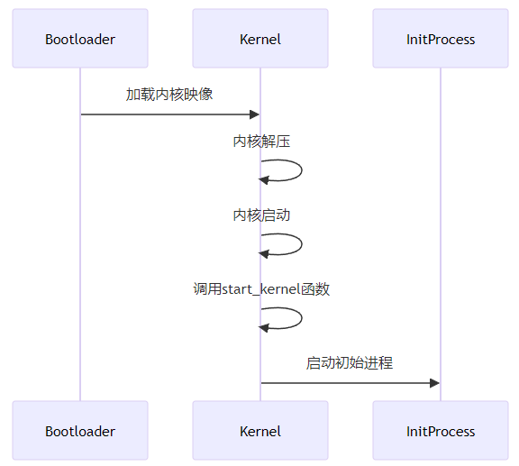
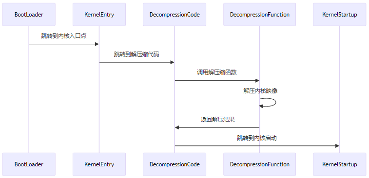
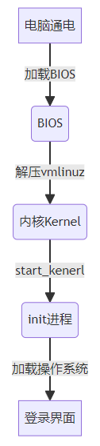

# Linux kernel boot flow

# 1. 内核启动的基本流程




## 1.1 启动加载程序 (Bootloader)

启动加载程序（如GRUB、LILO、syslinux等）负责将内核映像从存储设备加载到内存中，并准备好内核启动所需的环境。

- **加载内核映像**：启动加载程序将压缩的内核映像（如vmlinuz）从硬盘加载到内存中。内核映像通常是一个gzip或其他格式压缩的二进制文件。
- **加载initrd/initramfs**：如果使用initrd（初始RAM盘）或initramfs（初始RAM文件系统），启动加载程序也会将这些文件加载到内存中，以便内核在启动时使用。


## 1.2 内核解压阶段

在内核映像的开头，有一个小的解压缩程序，它负责解压内核的主体部分。

- **解压内核**：内核映像被加载到内存后，解压缩程序会运行并将压缩的内核映像解压到适当的内存位置。
- **跳转到解压后的内核**：一旦解压完成，控制权会被移交给解压后的内核代码的入口点。


## 1.3 内核启动（Kernel Startup）

解压后的内核代码会从一个固定的入口点开始执行，这个入口点是平台和架构相关的。对于x86架构，通常是startup_32或startup_64函数。

- **架构特定的初始化**：根据具体的硬件架构，内核会执行一些必要的初始化步骤，比如设置CPU的运行模式，初始化分页机制，建立基本的内存映射等。
- **初始化内核堆栈**：内核设置好自己的堆栈，以便后续的函数调用和操作。
- **调用`start_kernel`函数**：完成基础的硬件初始化后，内核会调用start_kernel函数，这是内核初始化的核心部分。


## 1.4 start_kernel函数

start_kernel函数位于init/main.c文件中，负责完成大部分内核的初始化工作。

- 初始化控制台：设置内核的打印机制，以便后续的输出可以显示出来。
- 初始化内存管理子系统：建立初始的内存管理结构，准备好内存分配机制。
- 检测和初始化硬件设备：内核会检测并初始化系统中的各种硬件设备和驱动程序。
- 启动中断处理机制：设置和启动中断处理机制，使得内核可以响应硬件中断。
- 初始化内核调度器：初始化内核调度器，以便管理进程调度。
- 加载初始进程：内核创建并启动第一个用户空间进程，通常是/sbin/init。


## 1.5 启动初始进程

init进程是用户空间的第一个进程，负责进一步的系统初始化工作，包括启动系统服务和守护进程。

- init进程的初始化：init进程执行系统初始化脚本，设置各种系统参数和启动服务。
- 启动用户空间服务：最终，init进程启动配置的所有用户空间服务和守护进程，从而完成系统的启动过程。


# 2. 内核文件加载及解压缩

## 2.1 为什么是压缩文件

Linux内核映像通常是一个压缩文件，主要有以下原因：

- **减少存储空间**: 压缩内核映像可以显著减少其在存储设备上的占用空间。这对嵌入式系统、存储资源有限的设备以及需要快速分发和更新内核的环境尤其重要。
- **加快加载速度**:  压缩文件占用的空间更小，这意味着启动加载程序从磁盘读取文件到内存中的时间会更短。虽然解压缩内核映像需要一些时间，但现代处理器的解压缩速度非常快，通常解压缩的时间比从存储设备读取更多数据的时间要少。这会整体上加快启动过程。
- **提高传输效率**: 在网络上传输内核映像时，压缩文件可以显著减少带宽使用量。这对于需要远程更新内核的系统（OTA）非常有利。
- **便于管理和分发**: 压缩内核映像更便于在各种介质上分发，比如光盘、U盘等。一个较小的文件更容易管理、备份和分发。
- **标准化处理**: 使用压缩内核映像是一种标准做法，启动加载程序（如GRUB）已经能够很好地支持这种格式，能自动识别并处理压缩的内核映像。这使得系统启动过程更简单可靠。


## 2.2 文件类型vmlinuxz和bzImage

在连接压缩映像文件之前，我们先来了解一下未经压缩的编译文件`vmlinux`。


### 2.2.1 什么是vmlinux？

`vmlinux`是`内核编译过程`中生成的一个包含所有内核代码和数据的`二进制文件`。它是未经压缩和未经过处理的内核映像，通常位于内核源码目录的根目录下,特性如下：

- **未压缩**：vmlinux 是内核的未压缩映像。它包含所有内核代码、内核模块以及相关的数据结构。
- **ELF 格式**：vmlinux 通常是一个 ELF（Executable and Linkable Format）文件，这是一个标准的可执行文件格式，用于存储可执行文件、目标代码和共享库等。
- **符号信息**：vmlinux 文件中包含调试符号和符号表信息，这些信息对内核调试和分析非常重要。
- **没有文件后缀**：虽然 vmlinux 通常没有文件后缀，但它是一个标准的 ELF 文件，可以通过文件头信息识别其格式。


### 2.2.2 vmlinux的生成过程

编译Linux内核时，vmlinux是在链接阶段生成的。以下是一个简化的生成过程：

- **编译各个源文件**：内核的各个源文件（`.c` 和 `.S` 文件）首先被编译为目标文件（.o 文件）。
- **链接目标文件**：所有目标文件通过链接器（如`ld`）链接在一起，生成一个完整的内核映像，这个映像就是 vmlinux。

> 链接命令举例:`ld -o vmlinux [object files] [linker scripts]`


### 2.2.3 vmlinuxz和bzImage的生成过程

在获得编译文件vmlinux后，通常使用压缩工具做进一步处理。

- **压缩内核映像**：将 vmlinux 压缩生成 vmlinuz。通常使用 gzip 或其他压缩工具。

> 压缩命令: `gzip -c vmlinux > vmlinuz`

- **生成引导加载程序格式的内核映像**：一些系统需要特定格式的内核映像，例如 bzImage（适用于 x86 架构）。

> 生成命令：`make bzImage`


### 2.2.4 其他压缩格式

`vmlinuz`、`bzImage`、`zImage` 和 `uImage` 都是不同的 Linux 内核映像文件格式，它们各自有不同的用途和特性。

- **vmlinuz**：通用的压缩内核映像名称，主要用于各种 Linux 发行版。通常使用 gzip 压缩。
- **bzImage**：大内核映像，解决了早期 zImage 的内存限制问题。用于 x86 架构，支持较大的内核映像。
- **zImage**：较老的内核映像格式，适用于小内核映像，受限于低内存地址空间。
- **uImage**：U-Boot 使用的内核映像格式，广泛用于嵌入式系统。包含 U-Boot 头部信息，支持多种压缩算法。


### 2.2.5 Android系统文件

在 Android 系统中，内核的压缩文件格式通常是`zImage`或`Image.gz`，具体取决于所使用的启动加载程序和设备的要求。

- **zImage**：在一些早期的 Android 设备上，内核映像可能采用 zImage 格式。这种格式的内核映像通常会被启动加载程序直接加载并解压，然后启动内核。
- **Image.gz**：Image.gz 是指经过 gzip 压缩的内核映像。这种格式的内核映像通常是 Linux 内核编译过程中生成的 vmlinuz 文件，只是在 Android 系统中可能被重新命名为 Image.gz。启动加载程序会加载这个压缩的内核映像，并在加载到内存后解压缩，然后启动内核。


## 2.3 内核加载过程




### 2.3.1 内核映像加载到内存中

启动加载程序（Bootloader）负责将压缩的内核映像加载到内存中，并准备好启动内核的环境。

- **加载内核和initrd**：GRUB 会根据配置文件（通常是 grub.cfg）加载压缩的内核映像和可选的 initrd/initramfs 文件。
- **设置内核参数**：GRUB 会设置内核启动参数，这些参数可以通过命令行传递给内核。
- **跳转到内核入口点**：GRUB 将控制权转移到内核映像的入口点。对于 x86 架构，这个入口点通常在内核映像的开头。


#### 2.3.1.1 启动BootLoader

以BIOS为例:

- CPU在重置后执行的第一条指令的内存地址`0xfffffff0`，它包含一个 jump 指令，这个指令通常指向BIOS入口点。
- BIOS会进行一系列硬件初始化和自检，然后根据设置（例如启动顺序）选择一个启动设备（如硬盘、光盘、USB 等）。
- 将控制权转移到启动设备的启动扇区代码。


#### 2.3.1.2 加载内核文件

- 启动设备的启动扇区代码被执行，通常这段代码非常小，只占用一个扇区（512字节）。
- 启动扇区代码负责完成一些基本的初始化操作，然后跳转到更复杂的引导加载程序，如 GRUB 的核心映像（`core image`）。
- 核心映像开始执行，它负责进一步的初始化操作，如加载GRUB的模块和配置文件（grub.cfg）。
- 根据`grub.cfg`文件中的配置，GRUB加载压缩的内核映像（`vmlinuz`）和可选的`initrd/initramfs`文件。
- 内核映像加载完成后，GRUB 将控制权转移给内核的入口点代码，完成控制权从 BIOS 到内核的转移。


### 2.3.2 内核解压

以下以x86系统为例:


#### 2.3.2.1 关键文件和代码路径

- arch/x86/boot/header.S：启动代码的汇编部分，定义了内核入口点。
- arch/x86/boot/compressed/head_64.S 和 arch/x86/boot/compressed/misc.c：解压缩代码。
- arch/x86/kernel/head_64.S 和 arch/x86/kernel/head.c：解压后的内核启动代码。


#### 2.3.2.2 主要步骤

1. 启动加载程序跳转到内核入口点：

- BootLoader根据`grub.cfg`文件中的配置加载内核映像（`vmlinuz`）到内存，并跳转到内核映像的入口点，即内核代码的起始地址。

2. 解压缩程序的初始化：

- 内核入口点代码（在 header.S 中）会设置初始的 CPU 状态和内存环境，然后跳转到解压缩代码的入口。
- 32位方法`startup_32`，64位方法`startup_64`。（长模式的32到64转换这里不做讨论，有兴趣的可以自行查阅资料）

```c
ENTRY(startup_32)
// 设置 CPU 状态和内存环境
jmp decompress_kernel // 跳转到解压缩代码
```

3. 解压缩代码执行：

- 解压缩代码的入口点在 arch/x86/boot/compressed/head_64.S 中。
- arch/x86/boot/compressed/head_64.S 会设置解压环境，如设置段寄存器、建立临时堆栈等。

```c
ENTRY(decompress_kernel)
// 设置硬件环境
// 调用解压缩函数入口方法
jmp decompress_kernel_method
```

4. 调用解压缩函数：

- 在arch/x86/boot/compressed/misc.c 中，decompress_kernel 函数负责选择解压算法并解压内核映像。

```c
void decompress_kernel(...) {
    // 选择解压算法
    // 调用相应的解压函数
    decompress_method(); // 调用特定的解压算法，如 inflate()
}
```

5. 解压缩完成后跳转到内核入口：

- 解压完成后，解压缩代码会跳转到解压后的内核入口点。
- arch/x86/boot/compressed/head_64.S中定义了一个跳转指令，内核入口点的地址加载到寄存器中（例如 %eax），通常是内核主函数（`start_kernel`），跳转后即将控制权转移到解压后的内核代码。

```c
jmp *%eax
```


#### 2.3.2.3 名词解释

1. 跳转入口点和控制权转移

- 在技术实现上跳抓入口点和控制权转移是一致的，都是通过改变程序计数器（Program Counter，PC）或指令指针（Instruction Pointer，IP）的值来实现的。

>  程序计数器或指令指针是一个特殊的寄存器，用于存储正在执行的指令的内存地址。当处理器执行一条指令时，程序计数器会自动递增到下一条指令的地址，从而控制执行流程。这样就实现了执行流程的转移，从而使得程序执行从一个代码段转移到另一个代码段。

- "跳转到入口点"强调了执行流程从某个特定的位置（入口点）开始执行，而"控制权转移"则更加广泛地描述了执行流程从一个执行上下文到另一个执行上下文的转移过程。
- 在内核加载和启动的上下文中，这两个术语通常可以互换使用，因为在设置了内核入口点后，执行流程的转移也意味着控制权的转移。

2. initrd/initramfs文件

加载 vmlinuz（Linux 内核映像）时，通常还会加载 initrd（initial ramdisk）或 initramfs（initial ram filesystem）文件。initrd 和 initramfs 文件的主要作用是在内核启动的早期阶段提供一个临时的根文件系统，帮助内核完成启动过程。

**特性如下**：

- 硬件驱动支持： 在系统启动时，内核可能需要加载某些硬件驱动程序（如文件系统驱动、磁盘驱动、网络驱动等）来访问根文件系统。这些驱动程序可能并未内置在内核映像中，而是作为模块存在。initrd/initramfs 提供了一个早期的文件系统，内核可以从中加载必要的模块。
- 根文件系统挂载：在一些复杂的存储配置中，如 LVM（Logical Volume Manager）、RAID、加密文件系统等，内核需要在挂载实际根文件系统之前进行一些初始化操作。这些操作通常通过 initrd/initramfs 中的脚本完成。
- 通用内核：发行版通常提供通用内核以支持多种硬件配置。使用 initrd/initramfs 可以在启动时动态加载适配不同硬件配置的模块，而无需为每种硬件配置编译一个特定的内核。

**加载过程**：

- 启动加载程序(BootLoader)将内核映像和initrd/initramfs文件加载到内存中，并将控制权交给内核。
- 内核启动时会识别并加载initrd/initramfs文件，将其作为初始根文件系统挂载。
- 内核从临时根文件系统中加载必要的模块并运行初始化脚本。
- 初始化脚本完成必要的硬件初始化和配置后，会挂载实际的根文件系统（如 /dev/sda1）。
- 初始化脚本切换到实际根文件系统，然后移除initrd/initramfs文件。


# 3. 内核启动（start_kernel）

`start_kernel`是Linux内核中非常重要的一个函数，它是整个内核初始化的核心函数，负责初始化内核的各个子系统、驱动程序以及其他关键组件，并最终将控制权转移到用户空间。


## 3.1 start_kernel方法介绍

### 3.1.1 第一个C函数的位置

`start_kernel`方法的定义通常位于`init/main.c`文件中，也是Linux启动过程中执行的第一个C函数。


### 3.1.2 主要功能

- **初始化内核的基本设置**：如内存管理、进程管理等。
- **初始化各个子系统**：如文件系统、网络子系统、设备驱动程序等。
- **启动第一个用户进程**：将控制权从内核转移到用户空间。


# 3.2 start_kernel源码解析

```c
asmlinkage __visible void __init start_kernel(void)  
{  
    char *command_line;  
    extern const struct kernel_param __start___param[], __stop___param[];  
  
    /* ... 其他初始化代码 ... */  
  
    /* 设置页表和内存管理 */  
    paging_init();  
    mem_init();  
    kmem_cache_init();  
  
    /* 设备和驱动程序初始化 */  
    driver_init();  
    init_irq_proc();  
    softirq_init();  
    time_init();  
    console_init();  
  
    /* 文件系统初始化 */  
    vfs_caches_init_early();  
    mnt_init();  
    init_rootfs();  
    init_mount_tree();  
  
    /* 初始化进程 */  
    pid_cache_init();  
    proc_caches_init();  
    /* 启动 init 进程 */
    rest_init();  
  
    /* ... 其他初始化代码 ... */  
  
    /* 调用内核参数解析函数 */  
    kernel_param_init(karg_strings, num_args);  
  
    /* ... 其他初始化代码 ... */  
  
    /* 永远不会返回 */  
    cpu_idle();  
}
```


# 4. 启动初始进程(init process)

## 4.1 进程概念介绍

### 4.1.1 内核进程（Kernel Thread）和用户进程（User Process）

#### 4.1.1.1 内核进程（Kernel Thread）

内核进程是由内核创建和调度的线程，运行在内核态，用于处理内核的各类任务。与用户进程不同，内核进程不直接与用户空间交互，主要用于执行内核内部的工作，如处理中断、管理设备、调度任务等。

- **运行空间**：内核进程运行在内核地址空间，而普通用户进程运行在用户地址空间。
- **权限**：内核进程可以直接访问内核数据结构，而用户进程通过系统调用与内核交互。
- **交互**：内核进程通常不与用户交互，其生命周期完全由内核管理。
- **创建方式**：内核进程的创建通常通过kernel_thread函数实现。

> 注意内核进程是独立的，与0、1、2号进程无关


#### 4.1.1.2 用户进程（User Process）

用户进程是在用户空间中执行的进程，用户通过编写和执行应用程序来创建用户进程。用户进程通过系统调用与内核交互，进行资源分配、文件操作、网络通信等。

- **运行空间**：用户进程运行在用户态，受限于用户空间的权限，不能直接访问硬件和内核数据结构。
- **权限**：内核线程运行在内核态，具有更高的权限，能够直接操作内核资源。


### 4.1.2 0号进程、1号进程、2号进程

- `0号进程`：是内核进程，运行在内核态，负责在系统空闲时执行。
- `1号进程`：是用户进程，虽然最初由内核创建，但主要运行在用户态，负责系统初始化和管理用户空间的其他用户进程。
- `2号进程`：是内核进程，运行在内核态，负责创建和管理其他内核线程。这些内核线程通常用于执行内核中的异步任务，如磁盘I/O、网络操作等。


#### 4.1.2.1 0号进程（swapper/idle/空闲进程）

- 0号进程是Linux启动的第一个进程，它的task_struct的comm字段为"swapper"，也称为swapper进程、idel进程、空闲进程。
- 0号进程是在系统引导过程中由内核创建的第一个进程。它的任务是进入空闲循环，当系统中没有其他可运行的进程时，它会被调度执行，以避免CPU闲置。

> 0号进程（idle进程）是在系统引导过程中，由内核初始化代码创建的。在x86架构中，这个过程发生在汇编启动代码（通常在arch/x86/kernel/head.S中），该代码会设置基本的CPU和内存环境，然后跳转到C语言的start_kernel函数。


#### 4.1.2.2 1号进程（init进程）和2号进程（kthreadd进程）

- 1号进程和2号进程都是在`rest_init`函数中创建的。
- 1号进程通过kernel_init创建。
- 2号进程通过kthreadd创建。


## 4.2 `rest_init`函数-初始化入口

rest_init函数负责创建初始进程并进行一些进一步的初始化工作。其代码实现如下：

```c
static noinline void __ref rest_init(void)
{
    // 通知RCU（Read-Copy Update）子系统，调度器即将开始。这是确保RCU在调度器开始运行前正确初始化的关键步骤。
    rcu_scheduler_starting();
    // 创建pid=1的1号进程
    pid = kernel_thread(kernel_init, NULL, CLONE_FS);
    /** 处理1号进程相关代码 **/
    
    // 创建pid=2的2号进程
    pid = kernel_thread(kthreadd, NULL, CLONE_FS | CLONE_FILES);
    /** 处理2号进程相关代码 **/
    /** 其他初始化代码 **/
}
```


### 4.2.1 `kernel_thread`函数

```c
int kernel_thread(int (*fn)(void *), void *arg, unsigned long flags)
{
    return do_fork(flags | CLONE_VM | CLONE_UNTRACED, (unsigned long)fn,
                   (unsigned long)arg, NULL, NULL, 0);
}
```

- `do_fork`：这是内核中实现创建新进程（或线程）的核心函数。通过该函数，内核可以复制当前进程的上下文，生成一个新的进程（或线程）。


### 4.2.2 `kernel_init`函数 - 初始化1号进程（init）

kernel_init负责启动初始用户空间进程（/sbin/init或指定的init进程）。

```c
static int __ref kernel_init(void *unused)
{
    /** 其他初始化代码 **/
    // 启动用户空间进程
    if (ramdisk_execute_command) {
        run_init_process(ramdisk_execute_command);
    } else if (execute_command) {
        run_init_process(execute_command);
    } else {
        run_init_process("/sbin/init");
    }
 
    return 0;
} 
```


## 4.3 系统启动

init进程启动后，通过后续工作完成了操作系统的加载和启动。


### 4.3.1 系统初始化脚本

init进程读取系统的初始化脚本（如/etc/inittab、/etc/init.d/脚本）或systemd的单元文件（unit files），执行系统初始化任务。这包括设置系统环境、挂载文件系统、启动网络服务、启动守护进程等。


### 4.3.2 启动用户界面

- `图形登录管理器`：如果系统配置为使用图形界面，init进程会启动图形登录管理器（如GDM、LightDM、SDDM）。这些登录管理器负责提供图形化的登录界面，供用户输入用户名和密码。
- `启动桌面环境`：用户登录成功后，登录管理器会启动用户的桌面环境（如GNOME、KDE、Xfce）。桌面环境提供完整的图形用户界面，允许用户运行应用程序、管理文件、设置系统等。


### 4.3.3 图形界面启动流程（systemd示例）

- **systemd初始化**：systemd作为init进程启动，读取其配置文件（通常在/lib/systemd/system/和/etc/systemd/system/）。
- **启动目标（target）**：systemd根据配置文件启动系统目标（如graphical.target）。graphical.target包含了启动图形界面所需的所有服务。
- **启动显示管理器**：systemd启动图形显示管理器服务（如gdm.service、lightdm.service）。
- **显示管理器运行**：显示管理器提供图形登录界面，用户登录后启动用户会话。
- **启动桌面环境**：用户会话启动后，显示管理器启动桌面环境，用户进入图形用户界面。


# 5. 流程图总结

前面使用了大量文字来说明，这里使用一张流程图来做概要总结:


