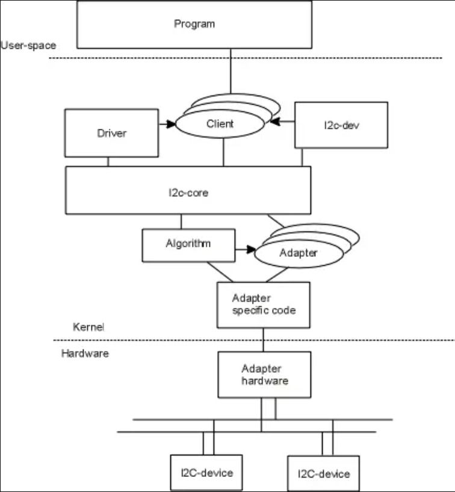
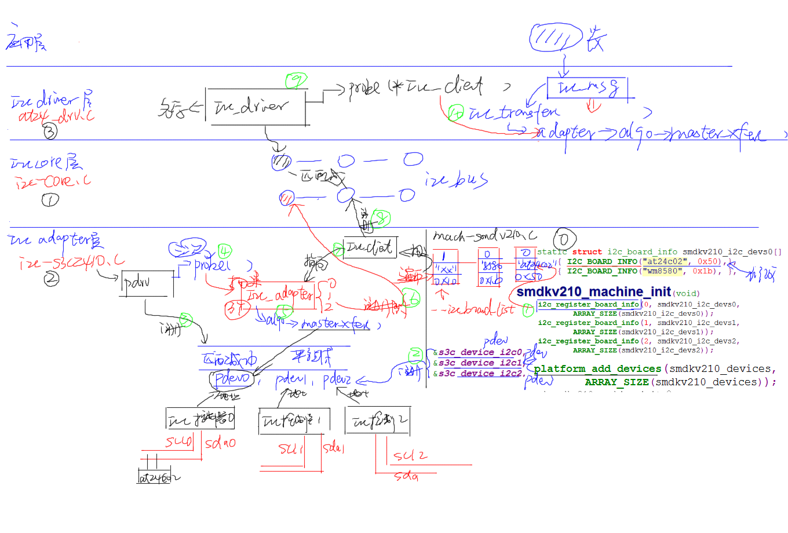

# I2C Architecture

# 1. Architecture

参考上图，i2c驱动可以大致上分为3部分：

|             |
| ----------- |
| i2c 驱动层   |
| i2c 核心层   |
| i2c 适配器层 |

其中，一般对于具体硬件驱动编程主要关注`i2c驱动层`，在驱动层实现具体的硬件逻辑，比如i2c eeprom。

核心层，由内核原生提供，适配器层由芯片原厂提供(通用外设驱动程序)。

# 2. Flow

i2c subsystem flow:

