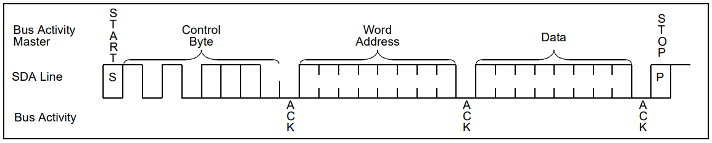
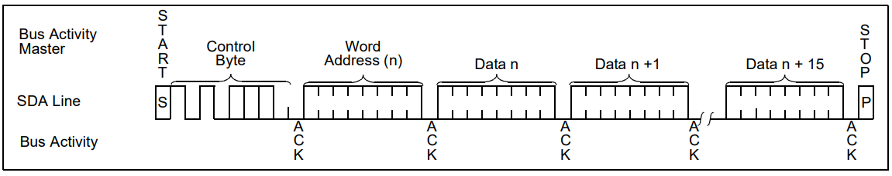
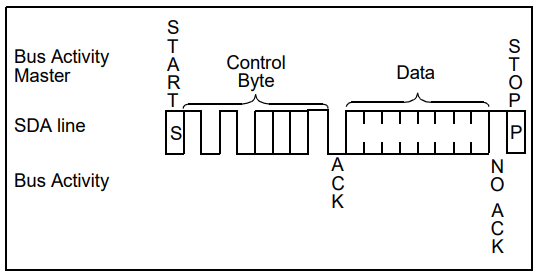
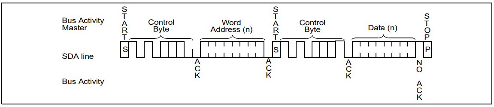
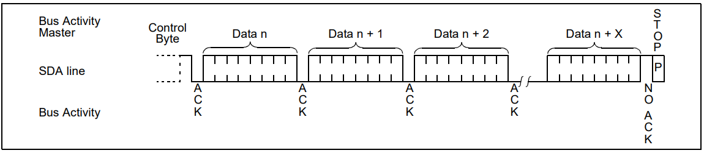

# 1. EEPROM

EEPROM(Electrically Erasable Programmable ROM)是电可擦除存储器。EEPROM 可以重复擦写，它的擦除和写入都是直接使用电路控制，不需要再使用外部设备来擦写。而且可以按字节为单位修改数据，无需整个芯片擦除。数据掉电不丢失。

EEPROM芯片的设备地址一般是 7 位，其中高 4 位固定为：1010 b，低 3 位则由信号线A0/A1/A2的电平决定：

| 7 | 6 | 5 | 4 | 3 | 2 | 1 | 0   |
| - | - | - | - | - | - | - | --- |
| 1 | 0 | 1 | 0 | x | x | x | R/W |

假设低3位接地，那么地址为：101 0000b，即0x50，传地址的时候，把地址左移1位，最低位则代表读写位，r/w = 0，表示写，r/w = 1，表示读。
读的时候地址是：1010 0001b == 0xA1，写的时候地址是：1010 0000b == 0xA0。

# 2. 24C02

以下内容参考自 Microchip 相关产品的数据手册：

24C02 是一个可以存储 2K bit（256 byte）的串行EEPROM，工作电压 24c02: 4.5v~5.5v，24c64：1.8v到5.5v，100万次数据擦写，数据可以保持200年。有一个16 byte的页写缓冲器和一个写保护功能，通过i2c协议进行数据读写，通信时钟频率可达400 KHz。24c32 可存储 32K bit，24c64 可存储 64K bit。

24c02 从外部看来，上电即可运行，无需进行初始化操作。

24c02 的芯片寻址地址是 0xa1（读）和0xa0（写），片内寻址是 256 个寻址单位，即 0x00~0xFF，所以发送一次8位的地址数据，即可完成一次数据寻址操作，在更大容量的芯片，如24c64，寻址空间为 8192 个寻址单位，需要 13 bit 地址才能满足，则是发送两次 8 bit 地址数据，第一次发送高5位（bit8~bit12），第二次发送低8位（bit0~bit7），具体二进制逻辑是：

| 7    | 6    | 5    | 4    | 3    | 2    | 1    | 0    | 7    | 6    | 5    | 4    | 3    | 2    | 1    | 0    |
| ---- | ---- | ---- | ---- | ---- | ---- | ---- | ---- | ---- | ---- | ---- | ---- | ---- | ---- | ---- | ---- |
| x    | x    | x    | bit12| bit11| bit10| bit9 | bit8 | bit7 | bit6 | bit5 | bit4 | bit3 | bit2 | bit1 | bit0 |

管脚定义：

| Pin ID | Name    | Comments                                              |
| ------ | ------- | ----------------------------------------------------- |
| 1      | A0      | 地址引脚                                               |
| 2      | A1      | 地址引脚                                               |
| 3      | A2      | 地址引脚                                               |
| 4      | GND     | 地线                                                   |
| 5      | VCC     | 电源线                                                 |
| 6      | WP      | 写保护，高电平禁止写操作，接地或不连接(内部下拉)允许写操作  |
| 7      | SCL     | i2c时钟线                                              |
| 8      | SDA     | i2c数据线                                              |

官方手册链接：

- [24c02](https://ww1.microchip.com/downloads/en/DeviceDoc/21202J.pdf)
- [24c32/24c64](https://ww1.microchip.com/downloads/en/DeviceDoc/doc0336.pdf)

这里，还是以相对操作简单的24c02进行深入研究.

## 2.1 写操作：

**字节写操作**

在主机发出启动信号之后，主机发送器将设备代码（4 位）、片选位（3 位）和 R/W 位（逻辑低）放置到总线上。 器件将在第九个时钟脉冲期间确认该控制字节。 主机发送的下一个字节是字地址，将被写入 24C02C 的地址指针。
在收到来自 24C02C 的另一个应答信号后，主设备将发送要写入寻址存储器位置的数据字。 24C02C 再次确认，主机产生停止条件。 这将启动内部写周期，在此期间 24C02C 将不会生成应答信号。 如果在启用硬件写保护的情况下尝试写入阵列的受保护部分，则设备将确认该命令，但不会写入任何数据。 即使启用了写保护，也必须遵守写周期时间。

**页写操作**

写控制字节、字地址和第一个数据字节以与字节写相同的方式传输到 24C02C。 但主器件并不生成停止条件，而是向 24C02C 发送最多 15 个附加数据字节，这些数据字节暂时存储在片上页缓冲区中，并在主器件发送停止条件后写入存储器。 接收到每个字后，四个低阶地址指针位在内部递增 1。 字地址的高四位保持不变。 如果主机在生成停止条件之前传输超过 16 个字节，则地址计数器将翻转，并且先前接收到的数据将被覆盖。

与字节写操作一样，一旦收到停止条件，内部写周期就会开始。 如果在启用硬件写保护的情况下尝试写入阵列的受保护部分，设备将确认该命令，但不会写入任何数据。 即使启用了写保护，也必须遵守写周期时间。

## 2.2 读操作：

读操作的启动方式与写操作相同，不同之处在于从地址的 R/W 位设置为 1。 读操作有三种基本类型：当前地址读、随机读和顺序读。

**当前地址读操作**

24C02C 包含一个地址计数器，用于维护最后访问的字的地址，并在内部递增 1。 因此，如果先前的读访问是针对地址 n，则下一个当前地址读操作将从地址 n + 1 访问数据。在收到 R/W 位设置为 1 的从机地址后，24C02C 发出应答并发送 八位数据字。 主设备不会确认传输，但会生成一个停止条件，并且 24C02C 会中断传输。

**随机读操作**

随机读取操作允许主设备以随机方式访问任何存储位置。 要执行此类读取操作，首先必须设置字地址。 这是通过将字地址发送到 24C02C 作为写操作的一部分来完成的。 发送字地址后，主机在确认后生成一个启动条件。 这会终止写操作，但不会在设置内部地址指针之前终止。 然后主机再次发出控制字节，但 R/W 位设置为 1。 然后 24C02C 将发出应答并发送 8 位数据字。 主设备不会确认传输，但会生成一个停止条件，并且 24C02C 会中断传输。 执行此命令后，内部地址计数器将指向刚刚读取的地址单元之后的地址单元。

**顺序读操作**

顺序读取的启动方式与随机读取相同，只是在 24C02C 发送第一个数据字节后，主机发出确认，而不是随机读取中的停止条件。 这指示 24C02C 发送下一个按顺序寻址的 8 位字。

为了提供顺序读取，24C02C 包含一个内部地址指针，每次操作完成时该指针都会加一。 该地址指针允许在一次操作期间串行读取整个存储器内容。 内部地址指针将自动从地址 FF 翻转到地址 00。

# 3. Source

- [EEPROM Application](i2c_eeprom_src.md#1-eeprom-application)

- [EEPROM Driver](i2c_eeprom_src.md#2-eeprom-driver)
