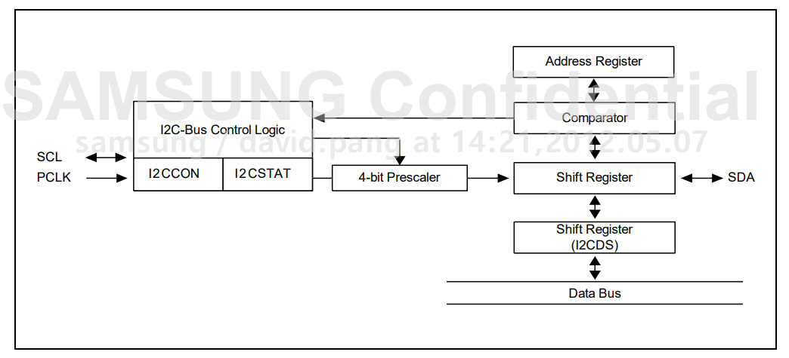

# I2C Peripheral

# 1. ST
--------

ST STM32F10X:

MCU: ARM Cortex-M3 * 1, 32 bit.

## 1.1 i2c 功能描述

I2C模块接收和发送数据，并将数据从串行转换成并行，或并行转换成串行。可以开启或禁止中断。接口通过数据引脚(SDA)和时钟引脚(SCL)连接到I2C总线。允许连接到标准模式(100kHz)或快速模式(400kHz)的I2C总线。提供对SMBus 2.0的兼容。

## 1.2 模式选择

接口可以下述4种模式中的一种运行：

- 从发送器模式
- 从接收器模式
- 主发送器模式
- 主接收器模式

该模块默认地工作于从模式。接口在生成起始条件后自动地从从模式切换到主模式；当仲裁丢失或产生停止信号时，则从主模式切换到从模式。允许多主机功能。

**通信流**

主模式时，I2C接口启动数据传输并产生时钟信号。串行数据传输总是以起始条件开始并以停止条件结束。起始条件和停止条件都是在主模式下由软件控制产生。

从模式时，I2C接口能识别它自己的地址(7位或10位)和广播呼叫地址。软件能够控制开启或禁止广播呼叫地址的识别。

数据和地址按8位/字节进行传输，高位在前。跟在起始条件后的1或2个字节是地址(7位模式为1个字节，10位模式为2个字节)。地址只在主模式发送。

在一个字节传输的8个时钟后的第9个时钟期间，接收器必须回送一个应答位(ACK)给发送器。

## 1.3 i2c 从模式

默认情况下，I2C接口总是工作在从模式。在从模式下TRA位指示当前是处于接收器模式还是发送器模式。

### 1.3.1 从发送器

在接收到地址和清除ADDR位后，从发送器将字节从DR寄存器经由内部移位寄存器发送到SDA线上。

从设备保持SCL为低电平，直到ADDR位被清除并且待发送数据已写入DR寄存器。

当收到应答脉冲时: 

- TxE位被硬件置位，如果设置了ITEVFEN和ITBUFEN位，则产生一个中断。

如果TxE位被置位，但在下一个数据发送结束之前没有新数据写入到I2C_DR寄存器，则BTF位被置位，在清除BTF之前I2C接口将保持SCL为低电平；读出I2C_SR1之后再写入I2C_DR寄存器将清除BTF位。

### 1.3.2 从接收器

在接收到地址并清除ADDR后，从接收器将通过内部移位寄存器从SDA线接收到的字节存进DR寄存器。I2C接口在接收到每个字节后都执行下列操作: 

- 如果设置了ACK位，则产生一个应答脉冲
- 硬件设置RxNE=1。如果设置了ITEVFEN和ITBUFEN位，则产生一个中断。

如果RxNE被置位，并且在接收新的数据结束之前DR寄存器未被读出，BTF位被置位，在清除BTF之前I2C接口将保持SCL为低电平；读出I2C_SR1之后再写入I2C_DR寄存器将清除BTF位。

### 1.3.3 关闭通信

在传输完最后一个数据字节后，主设备产生一个停止条件， I2C接口检测到这一条件时：

- 设置STOPF=1，如果设置了ITEVFEN位，则产生一个中断。

然后I2C接口等待读SR1寄存器，再写CR1寄存器。

## 1.4 i2c 主模式

在主模式时，I2C接口启动数据传输并产生时钟信号。串行数据传输总是以起始条件开始并以停止条件结束。当通过START位在总线上产生了起始条件，设备就进入了主模式。

以下是主模式所要求的操作顺序：

- 在I2C_CR2寄存器中设定该模块的输入时钟以产生正确的时序;
- 配置时钟控制寄存器;
- 配置上升时间寄存器;
- 编程I2C_CR1寄存器启动外设;
- 置I2C_CR1寄存器中的START位为1，产生起始条件.

### 1.4.1 起始条件

当BUSY=0时，设置START=1，I2C接口将产生一个开始条件并切换至主模式(M/SL位置位)。

一旦发出开始条件: 

- SB位被硬件置位，如果设置了ITEVFEN位，则会产生一个中断。

然后主设备等待读SR1寄存器，紧跟着将从地址写入DR寄存器。

### 1.4.2 从地址的发送

从地址通过内部移位寄存器被送到SDA线上。

- 在10位地址模式时，发送一个头段序列产生以下事件：
    - ADD10位被硬件置位，如果设置了ITEVFEN位，则产生一个中断。然后主设备等待读SR1寄存器，再将第二个地址字节写入DR寄存器。
    - ADDR位被硬件置位，如果设置了ITEVFEN位，则产生一个中断。随后主设备等待一次读SR1寄存器，跟着读SR2寄存器。

- 在7位地址模式时，只需送出一个地址字节。一旦该地址字节被送出，
    - ADDR位被硬件置位，如果设置了ITEVFEN位，则产生一个中断。随后主设备等待一次读SR1寄存器，跟着读SR2寄存器。

根据送出从地址的最低位，主设备决定进入发送器模式还是进入接收器模式。

- 在7位地址模式时，
    - 要进入发送器模式，主设备发送从地址时置最低位为’0’。
    - 要进入接收器模式，主设备发送从地址时置最低位为’1’。

- 在10位地址模式时
    - 要进入发送器模式，主设备先送头字节(11110xx0)，然后送最低位为’0’的从地址。(这里xx代表10位地址中的最高2位。) 
    - 要进入接收器模式，主设备先送头字节(11110xx0)，然后送最低位为’1’的从地址。然后再重新发送一个开始条件，后面跟着头字节(11110xx1)(这里xx代表10位地址中的最高2位。) 

TRA位指示主设备是在接收器模式还是发送器模式。

### 1.4.3 主发送器

主发送器发送流程及事件说明如下：

1. 控制产生起始信号(S)，当发生起始信号后，它产生事件“EV5”，并会对 SR1 寄存器的“SB”位置 1，表示起始信号已经发送；
2. 紧接着发送设备地址并等待应答信号，若有从机应答，则产生事件“EV6”及“EV8”，这时 SR1 寄存器的“ADDR”位及“TXE”位被置 1，ADDR 为 1 表示地址已经发送，TXE 为 1 表示数据寄存器为空；
3. 以上步骤正常执行并对 ADDR 位清零后，我们往 I2C 的“数据寄存器 DR”写入要发送的数据，这时TXE位会被重置0，表示数据寄存器非空，I2C外设通过SDA
信号线一位位把数据发送出去后，又会产生“EV8”事件，即 TXE 位被置 1，重复这个过程，就可以发送多个字节数据了；
4. 当我们发送数据完成后，控制 I2C 设备产生一个停止信号(P)，这个时候会产生EV8_2 事件，SR1 的 TXE 位及 BTF 位都被置 1，表示通讯结束。

假如我们使能了 I2C 中断，以上所有事件产生时，都会产生 I2C 中断信号，进入同一个中断服务函数，到 I2C 中断服务程序后，再通过检查寄存器位来判断是哪一个事件。

### 1.4.4 主接收器

主接收器接收流程及事件说明如下：

1. 同主发送流程，起始信号(S)是由主机端产生的，控制发生起始信号后，它产生事件“EV5”，并会对 SR1 寄存器的“SB”位置 1，表示起始信号已经发送；
2. 紧接着发送设备地址并等待应答信号，若有从机应答，则产生事件“EV6”这时SR1 寄存器的“ADDR”位被置 1，表示地址已经发送。
3. 从机端接收到地址后，开始向主机端发送数据。当主机接收到这些数据后，会产生“EV7”事件，SR1 寄存器的 RXNE被置 1，表示接收数据寄存器非空，我们读取该寄存器后，可对数据寄存器清空，以便接收下一次数据。此时我们可以控制I2C 发送应答信号(ACK)或非应答信号(NACK)，若应答，则重复以上步骤接收数据，若非应答，则停止传输；
4. 发送非应答信号后，产生停止信号(P)，结束传输。

在发送和接收过程中，有的事件不只是标志了我们上面提到的状态位，还可能同时标志主机状态之类的状态位，而且读了之后还需要清除标志位，比较复杂。

## 1.5 外设逻辑

### 1.5.1 时钟控制逻辑

SCL 线的时钟信号，由 I2C 接口根据时钟控制寄存器(CCR)控制，控制的参数主要为时钟频率。配置 I2C 的 CCR 寄存器可修改通讯速率相关的参数：

- 可选择 I2C 通讯的“标准/快速”模式，这两个模式分别 I2C 对应 100/400Kbit/s 的通讯速率。

- 在快速模式下可选择 SCL 时钟的占空比，可选 Tlow/Thigh=2 或 Tlow/Thigh=16/9模式，我们知道 I2C 协议在 SCL 高电平时对 SDA 信号采样，SCL 低电平时 SDA准备下一个数据，修改 SCL 的高低电平比会影响数据采样，但其实这两个模式的比例差别并不大，若不是要求非常严格，这里随便选就可以了。

- CCR 寄存器中还有一个 12 位的配置因子 CCR，它与 I2C 外设的输入时钟源共同作用，产生 SCL 时钟，STM32 的 I2C 外设都挂载在 APB1 总线上，使用 APB1 的时钟源 PCLK1。

通过公式计算结果得出CCR为30，向该寄存器位写入此值则可以控制IIC的通讯速率为400KHz，其实即使配置出来的 SCL 时钟不完全等于标准的 400KHz，IIC 通讯的正确性也不会受到影响，因为所有数据通讯都是由 SCL 协调的，只要它的时钟频率不远高于标准即可。

### 1.5.2 数据控制逻辑

I2C 的 SDA 信号主要连接到数据移位寄存器上，数据移位寄存器的数据来源及目标是数据寄存器(DR)、地址寄存器(OAR)、PEC 寄存器以及 SDA 数据线。当向外发送数据的时候，数据移位寄存器以“数据寄存器”为数据源，把数据一位一位地通过 SDA 信号线发送出去；当从外部接收数据的时候，数据移位寄存器把 SDA 信号线采样到的数据一位一位地存储到“数据寄存器”中。若使能了数据校验，接收到的数据会经过 PCE 计算器运算，运算结果存储在“PEC 寄存器”中。当 STM32 的 I2C 工作在从机模式的时候，接收到设备地址信号时，数据移位寄存器会把接收到的地址与 STM32 的自身的“I2C 地址寄存器”的值作比较，以便响应主机的寻址。STM32 的自身 I2C 地址可通过修改“自身地址寄存器”修改，支持同时使用两个 I2C 设备地址，两个地址分别存储在 OAR1 和 OAR2 中。

### 1.5.3 整体控制逻辑

整体控制逻辑负责协调整个 I2C 外设，控制逻辑的工作模式根据我们配置的“控制寄存器(CR1/CR2)”的参数而改变。在外设工作时，控制逻辑会根据外设的工作状态修改“状态寄存器(SR1 和 SR2)”，我们只要读取这些寄存器相关的寄存器位，就可以了解 I2C的工作状态。除此之外，控制逻辑还根据要求，负责控制产生 I2C 中断信号、DMA 请求及各种 I2C 的通讯信号(起始、停止、响应信号等)。

# 2. Samsung
--------

Samsung Exynos 4412:

CPU: ARM Cortex-A9 * 4, 32 bit.

## 2.1 Overview

要控制多主i2c总线操作，必须将值写入这些寄存器:

- 多主 I2C 总线控制寄存器 – I2CCON
- 多主 I2C 总线控制/状态寄存器 – I2CSTAT
- 多主 I2C 总线 Tx/Rx 数据移位寄存器 – I2CDS
- 多主机 I2C 总线地址寄存器 – I2CADD

如果i2c总线空闲，则SDA和SCL线都应该处于高电平。SDA从高到低的转换将启动所有启动条件。SDA从低到高的转换启动一个停止条件，而SCL保持稳定在高电平。

放在SDA线上的每个数据字节总共应该是8位。在总线传输操作期间，发送或接收字节没有限制。12C主设备和从设备总是首先从最高有效位(MSB)发送数据，然后在每个字节之后立即发送确认位(ACK)。

- 9 通道多主、从 I2C 总线接口（8 通道通用，1 通道专用于高清多媒体接口 (HDMI)。）。
- 7位寻址模式。
- 串行、8 位、双向数据传输。
- 标准模式下支持高达 100 kbit/s。
- 在快速模式下支持高达 400 kbit/s。
- 支持主发送、主接收、从发送和从接收操作。
- 支持中断或轮询事件。

Exynos 4412 SCP I2C 总线接口的四种操作模式是：

- 主机发送模式
- 主机接收模式
- 从机发送模式
- 从机接收模式

## 2.2 Bus Arbitration Procedures

仲裁发生在 SDA 线上，以防止两个主设备之间的总线冲突。 如果一个SDA高电平的主机检测到另一个SDA低电平有效的主机，它不会发起数据传输。 这是因为总线上的当前电平不对应于发起数据传输。 仲裁程序一直持续到 SDA 线变为高电平为止。

当两个或多个主设备同时将 SDA 线置为低电平时，每个主设备都会评估自己是否具有主控权。 为了评估的目的，每个主机检测地址位。 当每个主机生成从机地址时，它会检测 SDA 线上的地址位。 这是因为 SDA 线变为低电平而不是高电平。

让我们假设一个主机生成低电平作为第一个地址位，而另一个主机保持高电平。 在这种情况下，两个主机都会检测到总线上的低电平。 这是因为低状态的权力优于高状态。 当这种情况发生时，生成主控的低位（作为地址的第一位）获得主控权，而生成主控的高位（作为地址的第一位）撤回主控权。

当两个主机都产生低电平作为地址的第一位时，再次对第二个地址位进行仲裁。 该仲裁持续到最后一个地址位的末尾。

## 2.3 Configuring I2C-Bus

要控制 SCL 的频率，应将 4 位预分频器值写入 I2CCON 寄存器。 I2C 总线接口地址存储在 I2C 总线地址 (I2CADD) 寄存器中。 默认情况下，I2C 总线接口地址具有未知值。

Master/Transmitter Mode:

Master/Receiver Mode:

Slave/Transmitter Mode:

Slave/Receiver Mode:

# 3. RockChip
--------

RockChip RK3588:

CPU: ARM Cortex-A76 * 4 + ARM Cortex-A55 * 4, 64 bit。

## 3.1 Overview

内部集成电路(I2C)是一种双线(SCL和SDA)双向串行总线，它提供了一种高效和简单的设备间信息交换方法。该I2C总线控制器只支持主模式，作为AMBA协议和通用I2C总线系统之间的桥梁。

- 支持9个独立I2C：I2C0~8，具有42对IO。
- 项目与 I2C 总线兼容。
- AMBA APB 从机接口。
- 支持I2C总线主模式。
- 软件可编程时钟频率和传输速率高达 400Kbit/秒。
- 支持7位和10位寻址模式。
- 中断或轮询驱动的多字节数据传输。
- 时钟延长和等待状态生成。
- 滤除 SCL 和 SDA 上的毛刺。

**I2C_RF**

I2C_RF 模块用于通过带有 APB 接口的主机控制 I2C 控制器的操作。 它实现了寄存器设置和中断功能。 I2C_RF 组件与 pclk 同步运行。

**I2C_PE**

I2C_PE 模块实现 I2C 主设备操作，用于向其他 I2C 设备发送数据和从其他 I2C 设备接收数据。 I2C 主控制器与 clk_i2c 同步运行。

**I2C_TOP**

I2C_TOP模块是I2C控制器的顶层模块。

## 3.2 Initialization

I2C 控制器基于 AMBA APB 总线架构，通常是 SOC 的一部分。 因此，在 I2C 运行之前，必须先确认一些系统设置和配置，其中包括：

- I2C中断连接类型：应考虑CPU中断方案。 如果I2C中断连接到额外的中断控制器模块，我们需要确定INTC向量。

- I2C 时钟速率：I2C 控制器使用 APB 时钟来配置控制器，并使用 clk_i2c 作为工作时钟。 正确的寄存器设置取决于系统要求。

## 3.3 Master Mode Programming

- SCL Clock

当 I2C 控制器编程为主模式时，SCL 频率由 I2C_CLKDIV 寄存器确定。 SCL频率由以下公式计算：

SCL Divisor = 8*(CLKDIVL + 1 + CLKDIVH + 1); clk_i2c = 100MHz~200MHz.

SCL = clk_i2c/ SCLK Divisor.

- Data Receiver Register Access

当 I2C 控制器接收到 MRXCNT 字节数据时，CPU 可以通过寄存器 RXDATA0 ~ RXDATA7 获取数据。 控制器在一次事务中最多可以接收 32 字节的数据。

当 MRXCNT 寄存器被写入时，I2C 控制器将开始驱动 SCL 接收数据。

- Transmit Transmitter Register

要发送的数据由CPU写入TXDATA0~7。 控制器在一次事务中最多可以传输 32 字节的数据。 低字节将首先被传输。

当 MTXCNT 寄存器被写入时，I2C 控制器将开始发送数据。

- Start Command

向 I2C_CON[3] 写入 1，控制器将发送 I2C 启动命令。

- Stop Command

向 I2C_CON[4] 写入 1，控制器将发送 I2C 停止命令。

- I2C Operation mode

    i2c 有四种操作模式。

    - 当 I2C_CON[2:1] 是 2’b00, 控制器将 TXDATA0~TXDATA7 中的所有有效数据逐字节发送。 控制器将首先发送低字节。
    - 当 I2C_CON[2:1] 是 2’b01, 控制器将首先发送 MRXADDR 中的设备地址（写/读位 = 0），然后发送 MRXRADDR 中的设备寄存器地址。 之后，控制器将发出重启信号并重新发送 MRXADDR（写/读位 = 1）。 最后，控制器进入接收模式。
    - 当 I2C_CON[2:1] 是 2’b10, 控制器处于接收模式，将触发时钟读取MRXCNT字节数据。
    - 当 I2C_CON[2:1] 是 2’b11, 控制器将首先发送 MRXADDR 中的设备地址（写/读位 = 1），然后发送 MRXRADDR 中的设备寄存器地址。 之后，控制器将发出重启信号并重新发送 MRXADDR（写/读位 = 1）。 最后，控制器进入接收模式。

- Read/Write Command

    - 当 I2C_OPMODE(I2C_CON[2:1]) 是 2’b01 或 2’b11, 读/写命令位由控制器本身决定。
    - 在仅 RX 模式下（I2C_CON[2:1] 是 2’b10），读/写命令位由 MRXADDR[0] 决定。
    - 在仅 TX 模式下（I2C_CON[[2:1] 是 2’b00），读/写命令位由 TXDATA[0] 决定。

- Master Interrupt Condition

    I2C_ISR寄存器中有7个与主机模式相关的中断位。

    - 字节传输完成中断（位 0）：当主机完成传输一个字节时，该位被置位。
    - 字节接收完成中断（位 1）：当主机完成接收字节时，该位被置位。
    - MTXCNT 字节数据传输完成中断（位 2）：当主机完成传输 MTXCNT 字节时，该位被置位。
    - MRXCNT 字节数据接收完成中断（位 3）：当主设备完成接收 MRXCNT 字节时，该位被置位。
    - 启动中断（位 4）：当主机完成向 I2C 总线发出启动命令时，该位被置位。
    - 停止中断（位 5）：当主机完成向 I2C 总线发出停止命令时，该位被置位。
    - NAK 接收中断（位 6）：当主设备收到 NAK 握手时，该位被置位。

- Last byte acknowledge control

    - 如果 I2C_CON[5] 为 1，则当在仅 RX 模式下接收到最后一个字节时，I2C 控制器将向从机发送 NAK 握手。
    - 如果 I2C_CON[5] 为 0，则当在仅 RX 模式下接收到最后一个字节时，I2C 控制器将向从机发送 ACK 握手。

- How to handle NAK handshake received

    - 如果 I2C_CON[6] 为 1，I2C 控制器将在收到 NAK 握手时停止所有事务。 并且软件应该负责处理这个问题。
    - 如果 I2C_CON[6] 为 0，I2C 控制器将忽略收到的所有 NAK 握手。

- I2C controller data transfer waveform

    - Bit transferring
        - Data Validity

        SDA线在SCL高电平期间必须保持稳定，并且只有当SCL处于低电平状态时才能更改SDA线上的数据。

        - START and STOP conditions

        当 SDA 变低而 SCL 处于高电平期间，启动条件发生。 当 SDA 线变高且 SCL 处于高状态时，将生成停止条件。

        - Data transfer

            - Acknowledge

            一个字节的数据传输后（时钟标记为1~8），在第9个时钟接收器必须在SDA线上断言ACK信号，如果接收器将SDA线拉至低电平，则表示“ACK”，反之，则表示“ 不确认”。

            - Byte transfer

            主设备自己的 I2C 总线可能会发起多字节传输到从设备。 传输从“START”命令开始，以“STOP”命令结束。 每次传输字节后，接收器必须向发送器回复 ACK。
