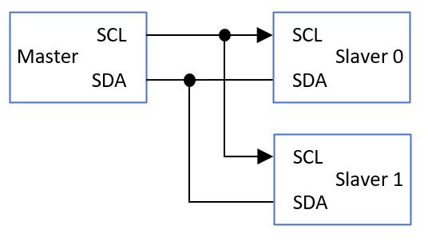
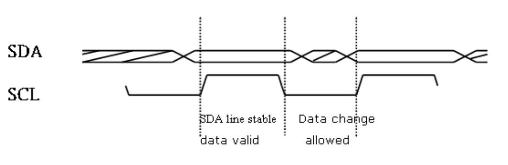
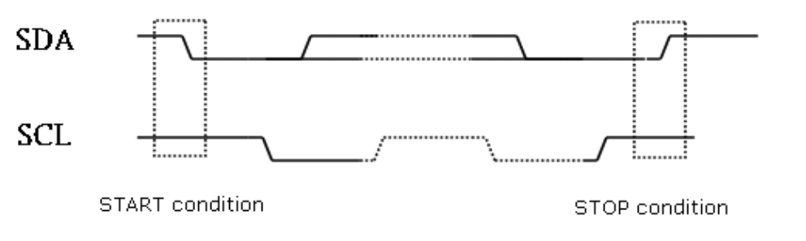
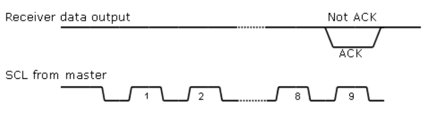
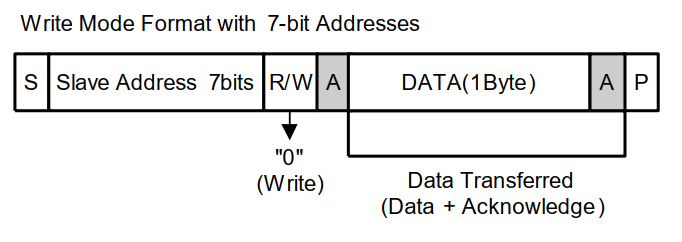
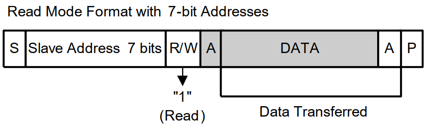
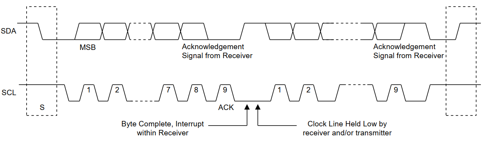

# I2C Protocol

I2C(Inter-Integrated Circuit)总线是一个半双工通信协议。由两根线组成，时钟线(SCL)和数据线(SDA)。2C可以分为主机和从机，同一 I2C总线上只能有一个主机，可以有多个从机。需要注意的是从机不能发出传输请求，并且从设备的数据传输也是由主机进行控制的。大端通信(MSB)，高位在前，低位在后。

# 1. 通信速率

- 标准模式(Standard)：  100kbps
- 快速模式(Fast)：      400kbps
- 快速模式+(Fast-Plus)：1Mbps
- 高速模式(High-speed)：3.4Mbps
- 超快模式(Ultra-Fast)：5Mbps(单向传输)

# 2. 从机地址

分为7bit/10bit两种从机地址，两种不同位数从机地址可以在同一条总线上使用。

7bit

| 0    | 1    | 2    | 3    | 4    | 5    | 6    | 7   |
| ---- | ---- | ---- | ---- | ---- | ---- | ---- | --- |
| bit6 | bit5 | bit4 | bit3 | bit2 | bit1 | bit0 | r/w |

7位从机地址 + 1个读写位组成1 byte数据，r/w = 0，表示写(即低电平)，r/w = 1，表示读(即高电平)。

10bit

| start | 0 | 1 | 2 | 3 | 4 | 5    | 6    | 7   | 8   | 9    | 10   | 11   | 12   | 13   | 14   | 15   | 16   | 17  |
| ----- | - | - | - | - | - | ---- | ---- | --- | --- | ---- | ---- | ---- | ---- | ---- | ---- | ---- | ---- | --- |
| x     | 1 | 1 | 1 | 1 | 0 | bit9 | bit8 | r/w | ack | bit7 | bit6 | bit5 | bit4 | bit3 | bit2 | bit1 | bit0 | ack |

10位从机地址，会分为两次发送，第一次发送11110保留位(识别10 bit地址) + 高2位从机地址 + r/w，第二次发送低8位从机地址。

# 3. 数据有效性

MSB大端传输，8+1个时钟周期为一个完整的传输，8个数据位和1个应答位，1次通信可连续多个完整传输(9个时钟周期)，另外，1次通信还需要1个起始信号和1个停止信号，消耗两个时钟周期，地址也需要消耗时钟周期，7bit地址消耗8+1个时钟周期，10bit地址消耗(8 + 1) * 2个时钟周期。即1次通信需要2 + (9 * n) + (8 + 1) 或2 + (9 * n) + ((8 + 1)  * 2)个周期。

数据在SCL高电平时有效，SCL低电平时允许改变SDA电平状态，如下图:

# 4. 起始信号

SCL高电平，SDA电平由高到低。

# 5. 结束信号

SCL高电平，SDA电平由低到高。

# 6. 应答信号(ACK)

第9个脉冲带来之前将SDA设置低电平，并且在时钟线为高电平期间保持SDA为低电平。

# 7. 非应答信号(NACK)

第9个脉冲带来之前将SDA设置高电平，并且在时钟线为高电平期间保持SDA为高电平。

# 8. 写时序

# 9. 读时序

 

有一些读的情况，可能需要先指定从设备的寄存器，然后再从指定寄存器读取数据，这种情况一般需要先发起写指定寄存器信息的数据，结束通信，然后重新发起读取通信。

# 10. 通信示例

