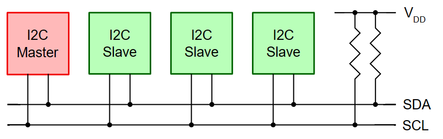

# Introduction to I2C and SMBus

# 1. Introduction

I²C（发音：I squared C，在内核文档中写为 I2C）是由 Philips 开发的协议。 它是一种慢速两线协议（可变速度，高达 400 kHz），具有高速扩展 (3.4 MHz)。 它提供了一种廉价的总线，用于连接具有不频繁或低带宽通信需求的多种类型的设备。 I2C 广泛应用于嵌入式系统。 某些系统使用不符合品牌要求的变体，因此不会宣传为 I2C，而是以不同的名称命名，例如 TWI（两线接口）、IIC。

最新的官方I2C规范是NXP Semiconductors出版的[“I2C总线规范和用户手册”(UM10204)](https://www.nxp.com/webapp/Download?colCode=UM10204)。 但是，您需要登录该网站才能访问 PDF。 旧版本的规范（修订版 6）已存档 [此处](https://web.archive.org/web/20210813122132/https://www.nxp.com/docs/en/user-guide/UM10204.pdf)。

SMBus（系统管理总线）基于 I2C 协议，并且主要是 I2C 协议和信令的子集。 许多 I2C 设备将在 SMBus 上工作，但某些 SMBus 协议添加的语义超出了实现 I2C 品牌所需的语义。 现代 PC 主板依赖 SMBus。 通过 SMBus 连接的最常见设备是使用 I2C EEPROM 配置的 RAM 模块和硬件监控芯片。

由于 SMBus 主要是通用 I2C 总线的子集，因此我们可以在许多 I2C 系统上使用其协议。 然而，有些系统不能同时满足 SMBus 和 I2C 电气限制； 以及其他无法实现所有常见 SMBus 协议语义或消息的协议。

# 2. Terminology

使用官方文档中的术语，I2C总线连接一个或多个主芯片和一个或多个从芯片。

主芯片是开始与从芯片通信的节点。 在 Linux 内核实现中，它被称为适配器或总线。 适配器驱动程序位于 drivers/i2c/busses/ 子目录中。

算法包含可用于实现一整类 I2C 适配器的通用代码。 每个特定的适配器驱动程序要么依赖于 drivers/i2c/algos/ 子目录中的算法驱动程序，要么包含其自己的实现。

从芯片是当主芯片寻址时响应通信的节点。 在 Linux 中它被称为客户端。 客户端驱动程序保存在特定于其提供的功能的目录中，例如用于 GPIO 扩展器的 drivers/media/gpio/ 和用于视频相关芯片的 drivers/media/i2c/。

对于图中的示例配置，您将需要 I2C 适配器的驱动程序和 I2C 设备的驱动程序（通常每个设备一个驱动程序）。

引用: <https://www.kernel.org/doc/html/latest/i2c/index.html>
