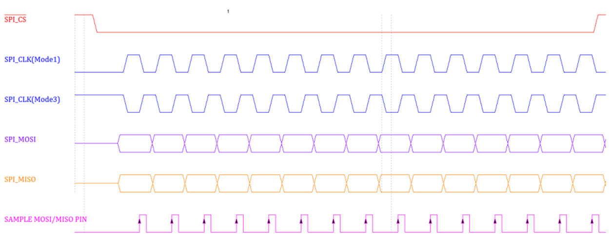

# SPI

SPI(Serial Peripheral Interface)是一种可以全双工/半双工/单工通信的接口协议，由2(单工)/3(双工)条信号线和1+条(每个从设备1条)片选信号线组成。支持MSB/LSB传输模式，支持4/8/16/32 bit数据长度(大部分SPI设备一般支持8/16 bit，其它bit一般需要硬件指定支持)。

# 1. 通信速率

速率没有硬性规定，一般3Kbps~100Mbps。

# 2. SPI接口

(1) MISO – Master Input Slave Output，主设备数据输入，从设备数据输出；
(2) MOSI – Master Output Slave Input，主设备数据输出，从设备数据输入；
(3) SCLK – Serial Clock，时钟信号，由主设备产生；
(4) CS – Chip Select，从设备使能信号，由主设备控制，每个从设备一条CS线，低电平被有效选中，相当于从设备地址。

# 3. 数据有效性

条件1：CS低电平有效.

对应从设备的CS信号线低电平时，从设备被选中，通信数据有效。

条件2：模式选择.

| SPI Mode | CPOL | CPHA | 空闲时SCK时钟 | 采样时刻 |
| -------- | ---- | ---- | ------------ | -------- |
| 0        | 0    | 0    | 低电平       | 奇数边沿 |
| 1        | 0    | 1    | 低电平       | 偶数边沿 |
| 2        | 1    | 0    | 高电平       | 奇数边沿 |
| 3        | 1    | 1    | 高电平       | 偶数边沿 |

CPOL时钟极性，CPHA时钟相位，根据寄存器中这两者的不同配置，会有不同采样电平和边沿。

# 4. 起始信号

对应从设备的CS信号线电平由高变低，和对应从设备通信开始。

# 5. 结束信号

对应从设备的CS信号线电平由低变高，和对应从设备通信结束。

# 6. SPI模式

**2-wire模式**

单工模式，

(1) CLK + MOSI，只写模式。

(2) CLK + MISO，只读模式。

**3-wire模式**

CLK + MOSI + MISO布局，

(1) 半双工，读/写不可同时进行，一般通过改变寄存器对应配置寄存器来实现，读完写，写完读。

(2) 全双工，读/写可同时进行。

**2倍读/写模式**

CLK + MOSI + MISO布局，并非所有器件都支持这种模式，需要厂商的控制器支持，

(1) 2倍读模式，MOSI和MISO均做为MISO使用。

(2) 2倍写模式，MOSI和MISO均做为MOSI使用。

**4倍读/写模式**

CLK + MOSI + MISO + (WP#) + (HOLD#)布局，并非所有器件都支持这种模式，需要厂商的控制器支持，

在四倍输入/四倍输出SPI中，命令、地址和虚拟字节通过SPI_MOSI线以串行方式以1 bit为单位输出。只有数据字节是通过SPI_MOSI、SPI_MISO、SPI_WP#和SPI_HOLD#以4 bit为单位的输出(写)和输入(读)。
